## 1. 架构设计

```mermaid
graph TD
    subgraph "Frontend (React + Vite)"
        A["UI Layer (React Components)"] --> B["State Management (Zustand)"]
        B --> C["Game Engine Layer"]
        C --> D["Data Layer"]
        D --> E["Storage (LocalStorage)"]
    end
    
    subgraph "Game Engine"
        C1["Grid System"] --> C2["Circuit Simulator"]
        C2 --> C3["Path Finding (A*)"]
        C3 --> C4["Short Circuit Diffusion"]
        C4 --> C5["Scoring Engine"]
    end
    
    subgraph "Data Processing"
        D1["CSV Parser"] --> D2["Data Validator"]
        D2 --> D3["Bad Row Isolator"]
        D3 --> D4["Anomaly Filter"]
    end
    
    style A fill:#4da6ff
    style C1 fill:#00ff88
    style D1 fill:#ff6b35
```



---

## 2. 技术栈描述

### 2.1 核心技术栈
- **前端框架**: React@18.2.0 + TypeScript
- **构建工具**: Vite@5.0.0
- **样式方案**: TailwindCSS@3.4.0 + CSS Variables
- **状态管理**: Zustand@4.4.0（轻量级，适合游戏状态）
- **路由**: React Router@6.20.0
- **图标**: Lucide React（线性电路风格图标）

### 2.2 游戏引擎核心依赖
- 无第三方游戏引擎，全部自研轻量级引擎
- 使用原生 Canvas API 进行网格渲染和粒子动画
- 内置 BFS/DFS 电路连通性检测、A* 寻路算法

### 2.3 数据处理
- **CSV解析**: Papaparse@5.4.1（处理故障卡和电量表导入）
- **导出**: 原生 Blob + FileSaver 实现 CSV/JSON 导出

### 2.4 无后端设计
- 全部逻辑在前端实现
- 数据存储使用 LocalStorage
- 支持离线运行

---

## 3. 目录结构设计

```
src/
├── components/           # React 组件
│   ├── game/            # 游戏相关组件
│   │   ├── CircuitGrid.tsx       # 电路网格渲染
│   │   ├── ControlPanel.tsx      # 操作面板
│   │   ├── StatusBar.tsx         # 状态栏
│   │   ├── ReplayTimeline.tsx    # 复盘时间轴
│   │   └── Cell.tsx              # 单个网格单元
│   ├── menu/            # 主菜单组件
│   ├── settlement/      # 结算页组件
│   └── datamanage/      # 数据管理组件
├── engine/               # 游戏引擎核心
│   ├── types.ts          # 类型定义
│   ├── GridSystem.ts     # 网格系统
│   ├── CircuitSimulator.ts  # 电路模拟器
│   ├── PathFinder.ts     # 寻路算法
│   ├── ShortCircuit.ts   # 短路扩散
│   └── ScoringEngine.ts  # 得分引擎
├── store/                # 状态管理
│   └── useGameStore.ts   # 游戏状态
├── utils/                # 工具函数
│   ├── csvParser.ts      # CSV解析与校验
│   ├── dataValidator.ts  # 数据校验
│   ├── anomalyFilter.ts  # 异常筛选
│   └── exporter.ts       # 成绩导出
├── data/                 # 预置数据
│   ├── levels.ts         # 关卡配置
│   └── sampleFaults.ts   # 示例故障数据
├── hooks/                # 自定义Hooks
│   ├── useGameLoop.ts    # 游戏循环
│   └── useReplay.ts      # 复盘控制
├── styles/               # 全局样式
├── App.tsx
└── main.tsx
```

---

## 4. 路由定义

| 路由 | 页面 | 组件 | 功能 |
|------|------|------|------|
| `/` | 主菜单 | `MainMenu` | 游戏入口、难度选择、数据管理入口 |
| `/game/:levelId` | 游戏主页面 | `GamePage` | 核心游戏玩法 |
| `/settlement/:gameId` | 结算复盘页 | `SettlementPage` | 得分明细、故障追溯、导出 |
| `/data` | 数据管理页 | `DataManagementPage` | 数据导入、坏行列示、异常筛选 |

---

## 5. 核心数据模型

### 5.1 网格单元类型定义

```typescript
// 网格单元状态
type CellType = 'empty' | 'wire' | 'power' | 'load' | 'fault' | 'short' | 'blocked';
type CellStatus = 'normal' | 'damaged' | 'repaired' | 'isolated' | 'short_circuited';

interface GridCell {
  id: string;
  x: number;
  y: number;
  type: CellType;
  status: CellStatus;
  voltage: number;      // 电压
  current: number;      // 电流
  connections: string[]; // 连接的相邻单元ID
  isPowered: boolean;   // 是否通电
  shortCircuitLevel: number; // 短路扩散等级 0-3
}

// 游戏状态
interface GameState {
  grid: GridCell[][];
  powerNodes: string[];     // 电源节点ID列表
  loadNodes: string[];      // 负载节点ID列表
  totalPower: number;       // 总电量
  consumedPower: number;    // 已消耗电量
  timeElapsed: number;      // 已用时间（秒）
  shortCircuitTimer: number; // 短路扩散计时器
  isPaused: boolean;
  isGameOver: boolean;
  gameResult: 'win' | 'lose' | null;
  operationMode: 'repair' | 'connect' | 'isolate';
  operationLog: OperationRecord[]; // 操作日志链
  anomalies: AnomalyRecord[];      // 异常记录
}

// 操作记录
interface OperationRecord {
  timestamp: number;
  type: 'repair' | 'connect' | 'isolate' | 'use_item';
  cellId: string;
  beforeState: Partial<GridCell>;
  afterState: Partial<GridCell>;
  powerSnapshot: number;    // 操作时电量快照
}

// 异常记录
interface AnomalyRecord {
  id: string;
  type: 'short_circuit' | 'low_power' | 'path_blocked';
  timestamp: number;
  cellIds: string[];
  description: string;
  source: 'game' | 'imported'; // 来源：游戏中产生/导入数据
  isReviewed: boolean;      // 是否已复核
}

// 导入数据校验结果
interface ImportResult {
  validRows: any[];
  badRows: BadRow[];
  source: 'fault_card' | 'power_meter';
}

interface BadRow {
  rowIndex: number;
  rawContent: string;
  errorType: 'empty' | 'comment' | 'missing_columns' | 'invalid_data';
  source: string;
  description: string;
}

// 得分明细
interface ScoreDetail {
  baseScore: number;
  deductions: {
    reason: string;
    amount: number;
    cells: string[];
  }[];
  bonuses: {
    reason: string;
    amount: number;
  }[];
  totalScore: number;
  resourceAllocation: {
    repairKits: { used: number; allocated: number };
    powerUnits: { used: number; allocated: number };
  };
}
```

### 5.2 电源节点到成绩导出链路数据结构

```typescript
// 完整链路追踪数据
interface PowerToScoreChain {
  powerNodeStates: {
    nodeId: string;
    stateHistory: { timestamp: number; voltage: number; status: string }[];
  }[];
  circuitStates: {
    timestamp: number;
    connectivityMatrix: boolean[][];
    poweredCells: string[];
  }[];
  shortCircuitEvents: {
    timestamp: number;
    startCell: string;
    diffusionPath: string[];
  }[];
  operationChain: OperationRecord[];
  anomalyEvents: AnomalyRecord[];
  scoreCalculation: {
    formula: string;
    parameters: Record<string, number>;
    stepResults: number[];
  };
  finalScore: ScoreDetail;
  exportTimestamp: number;
}
```

---

## 6. 核心算法模块

### 6.1 电路连通性检测 (BFS)
```typescript
// 从电源节点出发，BFS遍历所有连通的导线单元
function checkCircuitConnectivity(grid: GridCell[][], powerNodes: string[]): {
  connected: boolean;
  poweredCells: Set<string>;
  paths: Map<string, string[]>; // 每个单元到电源的路径
}
```

### 6.2 A* 寻路算法 (维修路径规划)
```typescript
// 计算从维修站到故障点的最优维修路径
function findRepairPath(
  grid: GridCell[][], 
  start: { x: number; y: number }, 
  end: { x: number; y: number },
  blockedCells: Set<string>
): { x: number; y: number }[] | null
```

### 6.3 短路扩散模拟
```typescript
// 每N秒执行一次短路扩散
function simulateShortCircuit(
  grid: GridCell[][], 
  shortCells: string[], 
  deltaTime: number
): {
  newShortCells: string[];
  diffusionPath: string[];
  shouldGameOver: boolean;
}
```

### 6.4 电量消耗计算
```typescript
// 根据路径长度和负载计算电量消耗
function calculatePowerConsumption(
  path: string[], 
  load: number, 
  wireResistance: number
): number
```

---

## 7. 状态管理设计

使用 Zustand 管理全局游戏状态，状态分层清晰：

```typescript
// 游戏状态切片
interface GameStore {
  // 核心状态
  gameState: GameState;
  currentLevel: LevelConfig;
  
  // 操作
  setOperationMode: (mode: 'repair' | 'connect' | 'isolate') => void;
  handleCellClick: (cellId: string) => void;
  useRepairKit: (cellId: string) => void;
  connectCells: (cellId1: string, cellId2: string) => void;
  isolateCell: (cellId: string) => void;
  
  // 游戏控制
  startGame: (levelId: string) => void;
  pauseGame: () => void;
  resumeGame: () => void;
  restartGame: () => void;
  endGame: (result: 'win' | 'lose') => void;
  
  // 复盘
  replayIndex: number;
  isReplaying: boolean;
  startReplay: () => void;
  stepReplay: (direction: 'forward' | 'backward') => void;
  jumpToReplayIndex: (index: number) => void;
  
  // 数据管理
  importData: (file: File, source: 'fault_card' | 'power_meter') => Promise<ImportResult>;
  filterAnomalies: (type?: 'short_circuit' | 'low_power' | 'path_blocked') => AnomalyRecord[];
  markAsReviewed: (anomalyId: string) => void;
  
  // 导出
  exportScore: (format: 'csv' | 'json') => Blob;
  exportFullChain: (format: 'csv' | 'json') => Blob;
}
```

---

## 8. 数据导入与校验流程

### 8.1 CSV格式要求

**故障卡格式 (fault_card.csv)**:
```
# 这是备注行（会被识别为备注）
id,x,y,fault_type,severity,source
F001,2,3,wire_damage,high,故障卡A
F002,5,7,connection_loss,medium,故障卡A

（空行会被识别）
F003,3,5,overload,low,故障卡B
```

**电量表格式 (power_meter.csv)**:
```
node_id,timestamp,power_voltage,power_current,consumption,source
P001,0,12.0,0.5,6.0,电量表1
P001,10,11.8,0.48,5.66,电量表1
```

### 8.2 校验规则
- 空行 → `errorType: 'empty'`
- 以 `#` 开头 → `errorType: 'comment'`
- 列数少于表头 → `errorType: 'missing_columns'`
- 数据格式错误 → `errorType: 'invalid_data'`

坏行**不混入**正常数据，单独存储在 `badRows` 数组中。

---

## 9. 性能优化策略

1. **网格渲染优化**: 使用 Canvas 批量绘制网格，而非单个 DOM 元素
2. **短路扩散节流**: 每 3 秒计算一次，而非每帧
3. **状态变更优化**: 只有真正变化的单元才触发重渲染
4. **操作日志压缩**: 对重复操作进行合并存储
5. **复盘性能**: 使用快照 + 增量计算，避免全量状态拷贝
