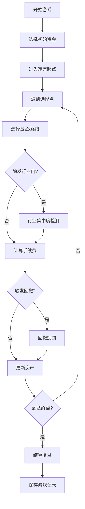
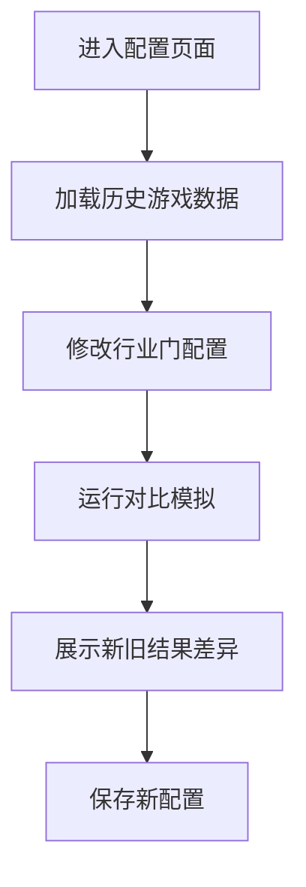

## 1. 产品概述

"基金组合迷宫"是一款投教游戏，通过迷宫路线选择的形式让投资者直观感受回撤、分散投资和手续费对最终收益的影响。玩家每次操作都会影响路线走向，游戏结束后通过详细复盘揭示为什么赢或输。

### 核心价值
- 解决投资者"只看收益排行就追涨"的盲目投资行为
- 通过沉浸式体验理解风险控制的重要性
- 提供可操作的修正建议，而非模糊结论

## 2. 核心功能

### 2.1 用户角色
| 角色 | 登录方式 | 核心权限 |
|------|----------|----------|
| 玩家 | 无需登录 | 进行游戏、查看个人复盘 |
| 投教产品经理 | 无需登录 | 修改游戏配置、对比新旧结果、查看决策路径 |

### 2.2 功能模块
1. **游戏主页**：开始游戏、历史记录、配置入口
2. **迷宫游戏**：实时路线选择、基金卡片选择、状态面板
3. **结算复盘**：成绩展示、决策路径回放、错因分析、修正建议
4. **配置对比**：行业门配置修改、新旧结果对比视图

### 2.3 页面详情
| 页面名称 | 模块名称 | 功能描述 |
|-----------|-------------|---------------------|
| 游戏主页 | 开始区域 | 游戏介绍、开始按钮、历史记录列表 |
| 迷宫游戏 | 迷宫地图 | 可视化路线、分支选择点、行业门标识 |
| 迷宫游戏 | 基金卡片 | 展示基金信息（含备注）、收益、风险、所属行业 |
| 迷宫游戏 | 状态面板 | 当前资产、持仓组合、已扣手续费、回撤记录 |
| 结算复盘 | 成绩总览 | 最终收益、排名、通关评价 |
| 结算复盘 | 决策回放 | 步骤时间线、每步选择触发的路线分支 |
| 结算复盘 | 错因分析 | 行业集中度分析、回撤触发点、手续费漏扣提示 |
| 配置对比 | 配置编辑器 | 行业门字段编辑、基金参数调整 |
| 配置对比 | 结果对比 | 旧配置 vs 新配置的游戏结果差异 |

## 3. 核心流程

### 3.1 游戏主流程

### 3.2 投教经理流程

## 4. 用户界面设计

### 4.1 设计风格
- **主色调**：深蓝 (#1a365d) 代表专业金融，搭配金色 (#d4af37) 代表收益
- **辅助色**：红色 (#e53e3e) 表示回撤风险，绿色 (#38a169) 表示安全分散
- **按钮风格**：圆角矩形，带有微妙阴影，悬停时有上浮动效
- **字体**：标题使用 Playfair Display（优雅衬线），正文使用 Lato（清晰无衬线）
- **布局风格**：卡片式布局，迷宫采用棋盘格可视化，强调数据可视化
- **图标风格**：线性图标，金融主题（金币、图表、迷宫、盾牌）

### 4.2 页面设计概览
| 页面名称 | 模块名称 | UI元素 |
|-----------|-------------|-------------|
| 游戏主页 | Hero区域 | 大标题、迷宫动画背景、开始按钮 |
| 迷宫游戏 | 迷宫地图 | 网格布局、路径高亮、节点动画、行业门标记 |
| 迷宫游戏 | 基金卡片 | 渐变背景、收益标签、风险指示器、行业标签 |
| 结算复盘 | 时间线 | 垂直时间线、步骤标记、可点击展开详情 |
| 配置对比 | 对比视图 | 左右分栏、差异高亮、数据表格 |

### 4.3 响应式
- 桌面端优先，支持平板适配
- 迷宫地图在移动端采用自适应缩放
- 触摸操作优化，确保选择点可点击

### 4.4 动效设计
- 迷宫路径逐步揭示动画
- 选择基金时卡片翻转效果
- 回撤触发时屏幕震动+红色闪烁
- 手续费扣除时金币飞行动画
- 复盘时间线逐步展开
