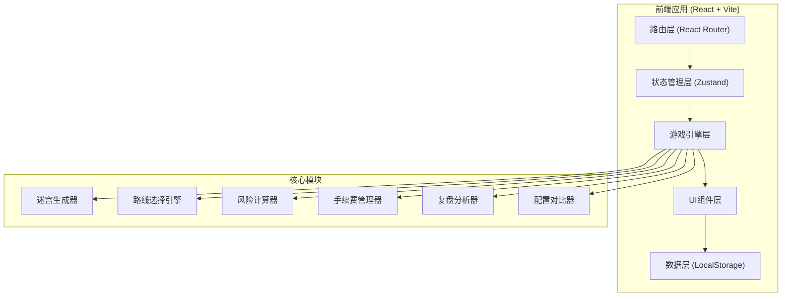
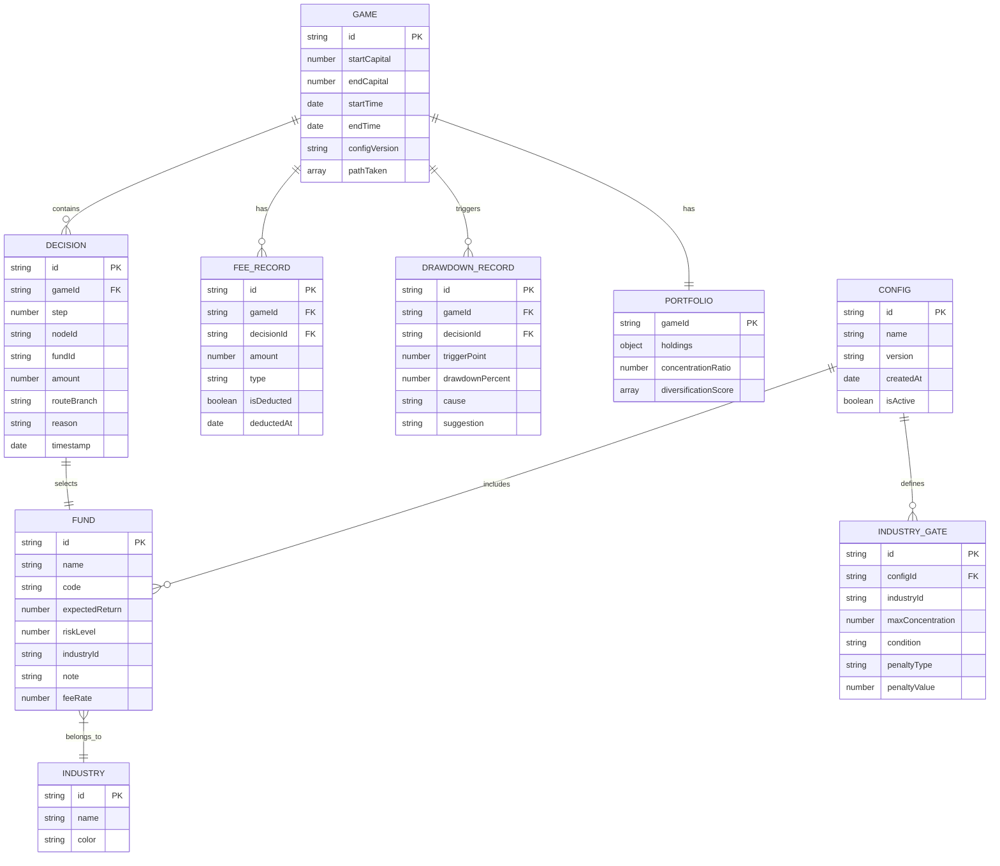

## 1. 架构设计



## 2. 技术选型

- **前端框架**: React@18 + TypeScript
- **构建工具**: Vite@5
- **路由管理**: React Router@6
- **状态管理**: Zustand@4（轻量级，适合游戏状态）
- **样式方案**: TailwindCSS@3 + CSS Variables
- **图表可视化**: Recharts@2（收益曲线、回撤图）
- **动画库**: Framer Motion@11（复杂交互动画）
- **数据持久化**: LocalStorage + 版本化数据结构
- **无后端**: 纯前端应用，所有数据本地存储

## 3. 路由定义

| 路由 | 页面 | 功能描述 |
|------|------|----------|
| `/` | 首页 | 游戏介绍、开始游戏、历史记录入口 |
| `/game` | 迷宫游戏 | 主游戏界面、路线选择、基金操作 |
| `/review/:gameId` | 结算复盘 | 成绩展示、决策回放、错因分析 |
| `/config` | 配置对比 | 行业门配置、新旧结果对比 |
| `/history` | 历史记录 | 所有游戏记录列表 |

## 4. 核心数据模型

### 4.1 数据模型定义



### 4.2 TypeScript 类型定义

```typescript
// 基金类型
interface Fund {
  id: string;
  name: string;
  code: string;
  expectedReturn: number;
  riskLevel: 1 | 2 | 3 | 4 | 5;
  industryId: string | null;
  note: string;
  feeRate: number;
}

// 行业门配置
interface IndustryGate {
  id: string;
  industryId: string | null;
  industryName?: string;
  maxConcentration: number;
  condition: 'exceed' | 'reach';
  penaltyType: 'drawdown' | 'fee' | 'route_block';
  penaltyValue: number;
  missingFieldHandling: 'block' | 'warn' | 'allow';
}

// 游戏决策
interface Decision {
  step: number;
  nodeId: string;
  fundId: string | null;
  amount: number;
  routeBranch: 'A' | 'B' | 'C';
  triggerReason: string;
  timestamp: number;
}

// 回撤记录
interface DrawdownRecord {
  step: number;
  triggerPoint: string;
  drawdownPercent: number;
  cause: string;
  suggestion: string;
}

// 手续费记录
interface FeeRecord {
  step: number;
  amount: number;
  type: 'buy' | 'sell' | 'transfer';
  isDeducted: boolean;
  deductedAt?: number;
}

// 游戏状态
interface GameState {
  id: string;
  configVersion: string;
  startCapital: number;
  currentCapital: number;
  currentStep: number;
  currentNode: string;
  decisions: Decision[];
  portfolio: Record<string, number>;
  drawdowns: DrawdownRecord[];
  fees: FeeRecord[];
  isCompleted: boolean;
}

// 复盘分析
interface ReviewAnalysis {
  finalReturn: number;
  maxDrawdown: number;
  industryConcentration: Record<string, number>;
  totalFees: number;
  missedFees: FeeRecord[];
  keyMistakes: {
    step: number;
    type: string;
    description: string;
    impact: number;
    suggestion: string;
  }[];
  routeEfficiency: number;
}
```

## 5. 游戏引擎核心算法

### 5.1 路线选择算法
```
输入: 当前节点, 选择的基金, 当前持仓
输出: 下一个节点, 分支方向

1. 计算当前行业集中度
2. 检查是否触发行业门条件
3. 评估基金风险等级
4. 根据以下规则确定路线:
   - 高收益高风险 + 行业集中 → 回撤路线
   - 分散投资 + 低风险 → 稳健路线
   - 追涨热门基金 → 手续费增加路线
5. 返回路线分支和下一个节点
```

### 5.2 回撤触发机制
```
当满足以下任一条件时触发回撤:
1. 单一行业持仓 > 行业门配置阈值 → 回撤 = 集中度 × 风险系数
2. 连续选择同行业基金 → 回撤递增
3. 高风险基金占比 > 60% → 随机回撤 5-20%
4. 到达迷宫特定节点 → 强制回撤事件
```

### 5.3 手续费计算
```
买入手续费 = 金额 × 基金费率 × (1 + 频繁交易加成)
频繁交易加成 = 近3步交易次数 × 0.1

手续费延迟机制:
- 70% 手续费即时扣除
- 30% 手续费延迟 2-3 步后扣除
- 记录漏扣情况并在复盘时提示
```

## 6. 目录结构

```
src/
├── components/          # UI组件
│   ├── game/           # 游戏相关组件
│   ├── review/         # 复盘相关组件
│   ├── config/         # 配置相关组件
│   └── common/         # 通用组件
├── hooks/              # 自定义Hooks
├── store/              # Zustand状态管理
├── engine/             # 游戏引擎核心
│   ├── maze.ts         # 迷宫生成
│   ├── route.ts        # 路线选择
│   ├── risk.ts         # 风险计算
│   ├── fee.ts          # 手续费管理
│   └── review.ts       # 复盘分析
├── data/               # 初始数据和配置
│   ├── funds.ts        # 基金数据
│   └── config.ts       # 行业门配置
├── types/              # TypeScript类型定义
├── utils/              # 工具函数
├── pages/              # 页面组件
└── App.tsx             # 应用入口
```

## 7. 关键技术点

1. **配置版本化**: 每次修改行业门配置生成新版本号，所有游戏记录关联对应版本
2. **幂等性保证**: 相同输入 + 相同配置版本 = 相同游戏结果
3. **数据完整性**: 记录所有中间状态，支持完整路径回放
4. **对比分析**: 支持同一游戏ID在不同配置版本下的结果对比
5. **可扩展性**: 引擎与UI分离，便于后续增加新的风险因子和游戏机制
