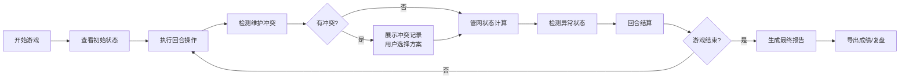

## 1. 产品概述
火星基地水循环模拟系统，用于科学课堂或培训场景的交互式试玩原型。通过回合制游戏机制，让学员理解管网维护、资源调配和冲突管理的重要性。

- 解决问题：管道断连容易遗漏、多系统报告难以同时监控、人工操作易出错
- 目标用户：科学课教师、培训讲师、学员
- 核心价值：可视化管网状态、自动化回合结算、冲突透明化、可复盘的学习体验

## 2. 核心 Features

### 2.1 用户角色
| 角色 | 注册方式 | 核心权限 |
|------|----------|----------|
| 学员/玩家 | 无需注册 | 进行游戏、查看报告、导出成绩 |
| 讲师 | 无需注册 | 查看学员成绩、复盘游戏过程 |

### 2.2 功能模块
1. **游戏主界面**：基地地图、管网可视化、资源状态面板
2. **回合控制面板**：操作执行、状态更新、结算触发
3. **冲突检测面板**：冰矿点vs回收机维护冲突展示、人工决策
4. **复盘系统**：历史回合回放、管网状态追溯、成绩导出
5. **最终报告**：非技术友好的结果说明、问题定位、改进建议

### 2.3 页面详情
| 页面名称 | 模块名称 | 功能描述 |
|---------|---------|----------|
| 游戏主页 | 基地地图 | 可视化展示冰矿点、管道、温室、回收机位置和连接状态 |
| 游戏主页 | 资源面板 | 实时显示水量、冰储量、温室湿度、基地用水量 |
| 游戏主页 | 管网状态 | 高亮显示管道断连、过载、缺水等异常状态 |
| 回合控制 | 操作面板 | 执行维护、开采、回收等操作，进入下一回合 |
| 回合结算 | 结算弹窗 | 展示本回合收益/损失、异常事件、冲突提示 |
| 冲突面板 | 冲突详情 | 并列展示冰矿点和回收机的不同维护记录，人工选择 |
| 复盘页面 | 历史记录 | 按回合浏览所有状态变化、操作记录、结算结果 |
| 复盘页面 | 异常追溯 | 点击"回收过载"、"温室缺水"直接跳转至具体记录 |
| 报告页面 | 最终报告 | 用人话解释管道断连为什么失败、问题出在哪、如何改进 |
| 报告页面 | 成绩导出 | 导出PDF/图片格式的成绩单和复盘报告 |

## 3. 核心流程

用户开始游戏 → 查看初始管网状态和资源 → 执行本回合操作（开采/维护/回收）→ 系统检测冲突 → 用户处理冲突（如有）→ 回合结算 → 检查异常（断连/过载/缺水）→ 进入下一回合或结束游戏 → 查看最终报告 → 导出成绩/复盘

## 4. 用户界面设计

### 4.1 设计风格
- 主色调：深空蓝 (#0A1628) + 火星红 (#D1462A) + 科技青 (#2DD4BF)
- 辅助色：警告黄 (#FBBF24)、危险红 (#EF4444)、成功绿 (#22C55E)
- 按钮风格：圆角矩形，科技感边框，悬停发光效果
- 字体：标题用 Orbitron（科幻感），正文用 Noto Sans SC（易读性）
- 布局：左侧地图 + 右侧信息面板的分栏布局
- 图标风格：线性科技图标，配合状态颜色变化
- 整体风格：复古未来主义 + 工业数据仪表盘

### 4.2 页面设计概览
| 页面名称 | 模块名称 | UI 元素 |
|---------|---------|---------|
| 游戏主页 | 基地地图 | SVG管网图、节点动画、状态色标、悬浮提示 |
| 游戏主页 | 资源面板 | 卡片式布局、进度条动画、实时数字跳动 |
| 回合控制 | 操作面板 | 分组按钮、操作确认、倒计时效果 |
| 冲突面板 | 冲突对比 | 左右分栏对比、差异高亮、选择按钮 |
| 复盘页面 | 时间轴 | 垂直时间线、可点击节点、状态标记 |
| 报告页面 | 问题说明 | 大号图标、通俗语言解释、改进建议列表 |

### 4.3 响应式
- 桌面端优先设计（1280px+）
- 平板适配：折叠侧边面板
- 移动端：堆叠布局，简化地图显示

### 4.4 动效设计
- 管道水流：脉冲动画表示流动
- 状态变化：颜色渐变过渡 + 轻微震动
- 回合切换：页面淡入淡出 + 数据滚动
- 异常告警：呼吸灯效果 + 边缘闪光
- 冲突出现：滑入动画 + 对比高亮
