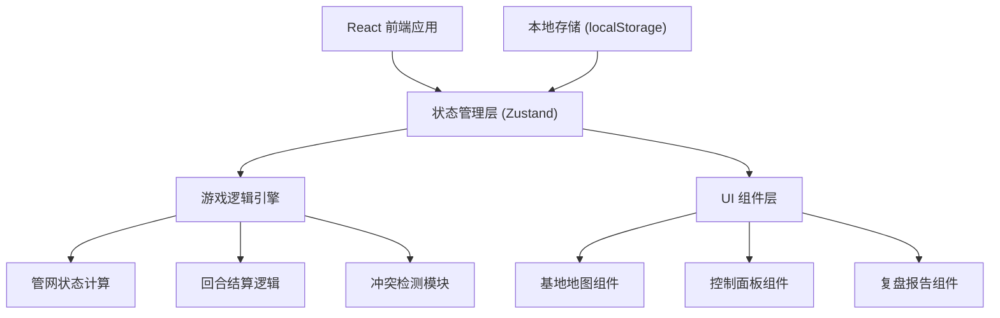
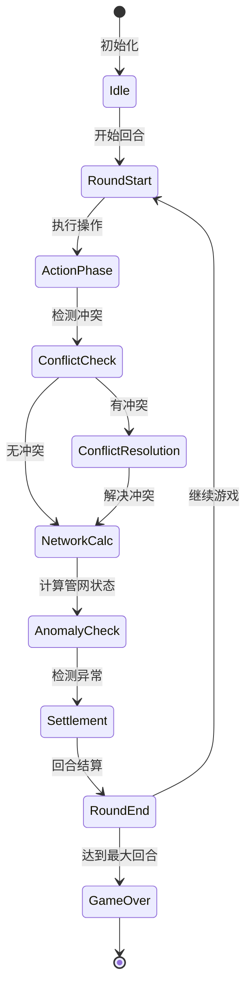

## 1. 架构设计



## 2. 技术描述
- 前端框架：React@18 + TypeScript
- 构建工具：Vite@5
- 样式方案：TailwindCSS@3
- 状态管理：Zustand
- 图表/可视化：SVG 原生 + CSS 动画
- 路由：React Router@6
- 数据持久化：localStorage
- PDF导出：html2canvas + jsPDF

## 3. 路由定义
| 路由 | 页面用途 |
|------|---------|
| / | 游戏主页 - 基地地图 + 控制面板 |
| /review | 复盘页面 - 历史记录 + 异常追溯 |
| /report | 报告页面 - 最终报告 + 成绩导出 |

## 4. 数据模型

### 4.1 核心数据结构

```typescript
// 管网节点类型
type NodeType = 'ice_mine' | 'pump' | 'pipe' | 'greenhouse' | 'recycler' | 'base';

// 管网节点
interface NetworkNode {
  id: string;
  type: NodeType;
  name: string;
  position: { x: number; y: number };
  status: 'normal' | 'warning' | 'danger' | 'disconnected';
  health: number; // 0-100
  capacity: number;
  currentLoad: number;
}

// 管道连接
interface PipeConnection {
  id: string;
  from: string; // node id
  to: string; // node id
  status: 'connected' | 'disconnected' | 'leaking';
  flowRate: number;
  maxFlow: number;
}

// 维护记录
interface MaintenanceRecord {
  id: string;
  nodeId: string;
  round: number;
  operator: 'ice_team' | 'recycle_team';
  action: string;
  effect: { health?: number; capacity?: number };
  timestamp: number;
}

// 冲突记录
interface ConflictRecord {
  id: string;
  round: number;
  nodeId: string;
  iceTeamRecord: MaintenanceRecord;
  recycleTeamRecord: MaintenanceRecord;
  resolved: boolean;
  chosenSide?: 'ice' | 'recycle';
}

// 异常事件
interface AnomalyEvent {
  id: string;
  round: number;
  type: 'pipe_disconnect' | 'recycle_overload' | 'greenhouse_drought';
  severity: 'warning' | 'critical';
  message: string;
  relatedNodeId?: string;
  relatedRecordId?: string;
}

// 回合数据
interface RoundData {
  roundNumber: number;
  actions: MaintenanceRecord[];
  conflicts: ConflictRecord[];
  anomalies: AnomalyEvent[];
  resources: {
    water: number;
    ice: number;
    greenhouseHumidity: number;
    baseUsage: number;
  };
  score: number;
  networkState: {
    nodes: NetworkNode[];
    pipes: PipeConnection[];
  };
}

// 游戏状态
interface GameState {
  currentRound: number;
  maxRounds: number;
  isGameOver: boolean;
  totalScore: number;
  nodes: NetworkNode[];
  pipes: PipeConnection[];
  resources: {
    water: number;
    ice: number;
    greenhouseHumidity: number;
    baseUsage: number;
  };
  roundHistory: RoundData[];
  pendingConflicts: ConflictRecord[];
  anomalies: AnomalyEvent[];
}
```

### 4.2 状态流转



## 5. 核心模块说明

### 5.1 游戏状态 Store (Zustand)
- 管理全局游戏状态
- 提供回合推进、操作执行、冲突解决等方法
- 自动持久化到 localStorage

### 5.2 管网计算引擎
- 计算管道连通性（BFS/DFS 算法）
- 计算水流分配和负载
- 检测断连、过载等异常

### 5.3 回合结算模块
- 根据管网状态计算资源变化
- 计算分数增减
- 生成异常事件记录

### 5.4 冲突检测模块
- 比较冰矿队和回收队的维护记录
- 识别同一节点的操作冲突
- 生成冲突对比视图

### 5.5 复盘系统
- 按回合存储完整状态快照
- 支持时间轴浏览和跳转
- 异常事件可追溯到具体记录

## 6. 组件结构

```
src/
├── components/
│   ├── game/
│   │   ├── BaseMap.tsx          # 基地地图（SVG管网）
│   │   ├── ResourcePanel.tsx    # 资源状态面板
│   │   ├── ControlPanel.tsx     # 操作控制面板
│   │   ├── ConflictModal.tsx    # 冲突解决弹窗
│   │   └── SettlementModal.tsx  # 回合结算弹窗
│   ├── review/
│   │   ├── Timeline.tsx         # 复盘时间轴
│   │   ├── RoundDetail.tsx      # 回合详情
│   │   └── AnomalyTrace.tsx     # 异常追溯
│   └── report/
│       ├── ScoreCard.tsx        # 成绩单
│       ├── IssueExplanation.tsx # 问题说明（人话版）
│       └── ExportButton.tsx     # 导出按钮
├── store/
│   └── useGameStore.ts          # 游戏状态管理
├── engine/
│   ├── network.ts               # 管网计算
│   ├── settlement.ts            # 结算逻辑
│   └── conflict.ts              # 冲突检测
├── types/
│   └── game.ts                  # 类型定义
└── data/
    └── initialState.ts          # 初始游戏数据
```
