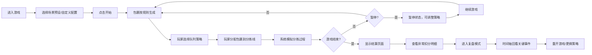

## 1. 产品概述
算法快递分拣场是一款面向编程学习者的浏览器小游戏，通过模拟快递分拣场景直观教学排序算法与优先队列的核心概念。玩家扮演分拣员，在限时内处理不同优先级的包裹，通过选择队列策略和路径来优化配送效率。

- **核心问题**：将抽象的算法概念（优先级队列、排序、饥饿问题、死锁）转化为可交互的游戏体验
- **目标用户**：编程培训学员、算法初学者、计算机科学教师
- **产品价值**：让学员在游戏决策中直观理解算法权衡，而非被动记忆理论

## 2. 核心特性

### 2.1 用户角色
| 角色 | 注册方式 | 核心权限 |
|------|----------|----------|
| 学员 | 无需注册，浏览器直接访问 | 进行游戏、调整策略、查看复盘 |
| 讲师 | 无需注册 | 准备包裹卡配置、复现教学场景 |

### 2.2 功能模块
1. **游戏主界面**：包裹队列、分拣线、路径选择、实时状态面板
2. **策略控制面板**：队列策略切换（FIFO/优先级/最短作业优先）、路径选择算法
3. **游戏控制**：开始、暂停、继续、重开、加速
4. **复盘系统**：时间轴回放、关键事件标记、异常扣分明细
5. **结算页面**：得分统计、异常分析、算法对比

### 2.3 页面详情
| 页面名称 | 模块名称 | 功能描述 |
|----------|----------|----------|
| 游戏主页面 | 包裹生成区 | 按配置生成不同类型包裹（普通件/急件/破损件），显示包裹卡片信息 |
| 游戏主页面 | 分拣线区域 | 3条分拣线，可视化显示队列状态，支持拖拽分配包裹 |
| 游戏主页面 | 控制面板 | 策略选择（队列策略/路径算法）、游戏控制（开始/暂停/重开/倍速） |
| 游戏主页面 | 实时状态 | 得分、时间、拥堵指数、急件等待时间、异常计数器 |
| 复盘页面 | 时间轴回放 | 可拖动进度条回看关键节点，标记异常发生位置 |
| 复盘页面 | 事件日志 | 按时间顺序列出所有事件，可点击定位到对应时刻 |
| 结算页面 | 得分明细 | 基础分、奖励分、扣分项的详细计算 |
| 结算页面 | 异常分析 | 急件饥饿次数、路线堵塞时长、破损件处理失败的具体原因 |
| 配置页面 | 包裹卡配置 | 自定义包裹生成规则、优先级设置、场景预设 |

## 3. 核心流程

**核心流程说明**：
1. 玩家进入后可选择预设场景或自定义包裹配置
2. 游戏开始后包裹按时间间隔生成，每张包裹卡显示：类型、优先级、目的地、截止时间、破损状态
3. 玩家需实时决策：选择哪种队列策略、将包裹分配到哪条分拣线
4. 系统实时模拟：根据玩家选择的算法进行排序和路径规划
5. 异常事件（急件饥饿、路线堵塞、破损件处理失败）会实时标记并记录
6. 游戏结束后显示详细结算，玩家可进入复盘模式回看整个过程

## 4. 用户界面设计

### 4.1 设计风格
- **主色调**：工业风深灰 (#1a1a2e) 作为背景，分拣线使用鲜明的区分色（蓝 #165DFF / 橙 #FF7D00 / 绿 #00B42A）
- **强调色**：急件红 (#F53F3F)、破损件黄 (#FFAA00)、普通件白 (#E5E6EB)
- **按钮风格**：3D 工业按钮，圆角 4px，hover 时有轻微上浮和发光效果
- **字体**：显示字体使用 Space Mono（等宽科技感），正文字体使用 Noto Sans SC
- **布局风格**：卡片式布局，模拟快递分拣场的俯视视角，分拣线横向排列
- **图标风格**：线性图标，使用 Lucide 图标库，包裹卡片使用实物风格的可视化

### 4.2 页面设计概述
| 页面名称 | 模块名称 | UI 元素 |
|----------|----------|----------|
| 游戏主页面 | 包裹队列 | 卡片堆叠，新包裹从右侧滑入，带有类型标识和倒计时进度条 |
| 游戏主页面 | 分拣线区域 | 3 条横向传送带，每个位置显示包裹，拥堵时显示红色警告动画 |
| 游戏主页面 | 控制面板 | 左侧策略选择区（单选按钮组），底部控制栏（播放/暂停/重开/倍速） |
| 游戏主页面 | 状态面板 | 右上角 HUD 样式，实时数据仪表板 |
| 复盘页面 | 时间轴 | 底部横向时间轴，可拖动滑块，关键事件用彩色标记点标注 |
| 结算页面 | 异常分析 | 卡片式展示每个异常，点击展开显示具体原因和发生时刻 |

### 4.3 响应式
- 桌面优先设计，最小支持宽度 1280px
- 平板端自适应缩放，移动端简化为竖版布局
- 触摸屏优化：包裹卡片支持触摸拖拽，按钮最小 44x44px

## 5. 教学要点设计

### 5.1 算法映射
| 游戏元素 | 算法概念 |
|----------|----------|
| 包裹队列 | 优先队列（Priority Queue） |
| FIFO 策略 | 先进先出队列 |
| 优先级策略 | 堆排序（Heap Sort） |
| 最短作业优先 | 贪心算法 |
| 急件饥饿 | 饥饿问题（Starvation） |
| 路线堵塞 | 死锁/拥塞控制 |
| 路径选择 | 最短路径算法 |

### 5.2 异常场景
1. **急件饥饿**：低优先级包裹持续占用分拣线，高优先级急件等待超时
2. **路线堵塞**：某条分拣线目的地集中，导致队列溢出
3. **破损件处理失败**：破损件需要额外处理时间，未预留足够时隙
