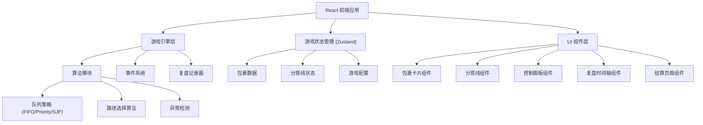

## 1. 架构设计



## 2. 技术描述

- **前端框架**: React@18 + TypeScript
- **构建工具**: Vite@5
- **样式方案**: TailwindCSS@3 + CSS Variables
- **状态管理**: Zustand（轻量级状态管理，适合游戏状态）
- **图标库**: Lucide React
- **动画**: Framer Motion（包裹移动、状态切换动画）
- **后端**: 无后端，纯前端游戏，所有逻辑在浏览器执行
- **数据持久化**: LocalStorage 存储最高分和游戏配置

## 3. 目录结构

```
src/
├── components/          # UI 组件
│   ├── game/           # 游戏主界面组件
│   │   ├── PackageCard.tsx
│   │   ├── SortingLine.tsx
│   │   ├── PackageQueue.tsx
│   │   └── GameHUD.tsx
│   ├── controls/       # 控制面板组件
│   │   ├── StrategySelector.tsx
│   │   └── GameControls.tsx
│   ├── review/         # 复盘组件
│   │   ├── Timeline.tsx
│   │   └── EventLog.tsx
│   └── settlement/     # 结算组件
│       ├── ScoreBoard.tsx
│       └── ExceptionAnalysis.tsx
├── store/              # 状态管理
│   └── useGameStore.ts
├── engine/             # 游戏引擎
│   ├── types.ts        # 类型定义
│   ├── algorithms.ts   # 算法实现
│   ├── gameLoop.ts     # 游戏主循环
│   ├── eventSystem.ts  # 事件系统
│   └── recorder.ts     # 复盘记录器
├── config/             # 游戏配置
│   ├── presets.ts      # 场景预设
│   └── constants.ts    # 常量定义
├── hooks/              # 自定义 Hooks
│   └── useGameLoop.ts
├── App.tsx
└── main.tsx
```

## 4. 核心数据模型

### 4.1 包裹 (Package)
```typescript
interface Package {
  id: string;
  type: 'normal' | 'urgent' | 'damaged';
  priority: 1 | 2 | 3 | 4 | 5;
  destination: 'A' | 'B' | 'C';
  processingTime: number;
  deadline: number;
  createdAt: number;
  startedAt?: number;
  completedAt?: number;
  status: 'waiting' | 'processing' | 'completed' | 'failed';
  assignedLine?: number;
}
```

### 4.2 分拣线 (SortingLine)
```typescript
interface SortingLine {
  id: number;
  name: string;
  color: string;
  capacity: number;
  currentLoad: number;
  queue: Package[];
  currentPackage?: Package;
  status: 'idle' | 'busy' | 'blocked';
  blockedUntil: number;
}
```

### 4.3 游戏状态 (GameState)
```typescript
interface GameState {
  status: 'idle' | 'playing' | 'paused' | 'ended' | 'reviewing';
  time: number;
  duration: number;
  speed: number;
  score: Score;
  packages: Package[];
  sortingLines: SortingLine[];
  queueStrategy: 'fifo' | 'priority' | 'sjf';
  pathStrategy: 'round-robin' | 'shortest-queue' | 'destination-match';
  events: GameEvent[];
  exceptions: Exception[];
  config: GameConfig;
}
```

### 4.4 游戏事件 (GameEvent)
```typescript
interface GameEvent {
  id: string;
  timestamp: number;
  type: 'package_created' | 'package_assigned' | 'package_started' | 
        'package_completed' | 'package_failed' | 'line_blocked' | 
        'line_unblocked' | 'strategy_changed' | 'exception_detected';
  data: Record<string, any>;
}
```

### 4.5 异常 (Exception)
```typescript
interface Exception {
  id: string;
  type: 'urgent_starvation' | 'line_congestion' | 'damaged_failure';
  timestamp: number;
  description: string;
  involvedPackageIds: string[];
  involvedLineIds: number[];
  penalty: number;
  resolved: boolean;
  resolvedAt?: number;
}
```

## 5. 算法实现要点

### 5.1 队列策略
```typescript
// FIFO - 先进先出
function fifoSort(packages: Package[]): Package[] {
  return [...packages].sort((a, b) => a.createdAt - b.createdAt);
}

// Priority - 优先级排序（高优先级先处理）
function prioritySort(packages: Package[]): Package[] {
  return [...packages].sort((a, b) => {
    if (b.priority !== a.priority) return b.priority - a.priority;
    return a.createdAt - b.createdAt;
  });
}

// SJF - 最短作业优先
function sjfSort(packages: Package[]): Package[] {
  return [...packages].sort((a, b) => {
    if (a.processingTime !== b.processingTime) return a.processingTime - b.processingTime;
    return a.createdAt - b.createdAt;
  });
}
```

### 5.2 异常检测
```typescript
// 急件饥饿检测：高优先级包裹等待时间超过阈值
function detectUrgentStarvation(packages: Package[], threshold: number): Exception[] {
  return packages
    .filter(p => p.type === 'urgent' && p.status === 'waiting')
    .filter(p => (currentTime - p.createdAt) > threshold)
    .map(p => ({
      type: 'urgent_starvation',
      description: `急件 ${p.id} 已等待 ${currentTime - p.createdAt} 秒未处理`,
      involvedPackageIds: [p.id],
      penalty: 50
    }));
}

// 路线堵塞检测：分拣线队列超过容量阈值
function detectLineCongestion(lines: SortingLine[], threshold: number): Exception[] {
  return lines
    .filter(line => line.currentLoad >= line.capacity * threshold)
    .map(line => ({
      type: 'line_congestion',
      description: `分拣线 ${line.name} 拥堵，负载率 ${Math.round(line.currentLoad / line.capacity * 100)}%`,
      involvedLineIds: [line.id],
      penalty: 30
    }));
}
```

## 6. 场景预设配置

### 6.1 默认场景
```typescript
const defaultPreset: GameConfig = {
  duration: 120,
  packageInterval: [2, 5],
  urgentRatio: 0.2,
  damagedRatio: 0.1,
  destinations: ['A', 'B', 'C'],
  priorityWeights: [0.4, 0.3, 0.15, 0.1, 0.05],
  processingTimeRange: [3, 8],
  deadlineRange: [15, 45],
  lineCapacity: 5,
  starvationThreshold: 20,
  congestionThreshold: 0.8,
};
```

### 6.2 急件饥饿教学场景
```typescript
const starvationDemo: GameConfig = {
  ...defaultPreset,
  duration: 90,
  packageInterval: [1, 3],
  urgentRatio: 0.1,
  damagedRatio: 0,
  priorityWeights: [0.6, 0.2, 0.1, 0.05, 0.05],
  processingTimeRange: [5, 10],
  starvationThreshold: 15,
};
```
