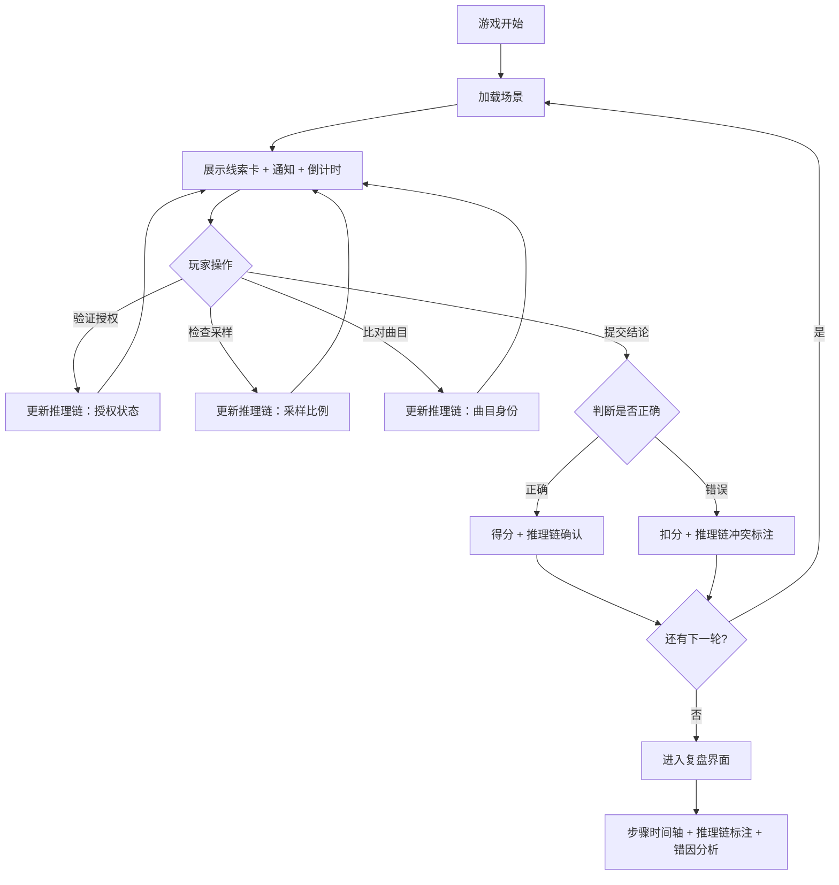

## 1. 产品概述

"音乐版权跑团"是一款面向版权法教学场景的小型叙事推理游戏。玩家扮演音乐版权审核员，在歌曲线索、平台通知、时间限制三者交织的日常对账情境中做出决策，每一次操作都实时影响线索推理链的走向。游戏结束后可回看每一步推理触发点及错因复盘，帮助版权法老师向学生讲清授权过期、采样比例超限、同名曲混淆等典型问题。

- 目标用户：版权法教师及学生
- 核心价值：将抽象的版权法条转化为可操作的推理流程，让"对账/对齐"问题可感知、可复盘

## 2. 核心功能

### 2.1 用户角色

| 角色 | 说明 |
|------|------|
| 玩家（审核员） | 在每轮操作中做出决策，推动线索推理链 |
| 教师（复盘者） | 游戏结束后查看推理链复盘，分析错因 |

### 2.2 功能模块

1. **游戏主界面**：线索卡牌展示区、平台通知栏、倒计时器、操作按钮、推理链可视化
2. **复盘界面**：步骤回放、推理链标注、错因分析、得分详情

### 2.3 页面详情

| 页面名称 | 模块名称 | 功能描述 |
|----------|----------|----------|
| 游戏主界面 | 线索卡牌区 | 展示当前轮次的歌曲线索卡（歌曲名、作者、采样来源、授权状态等） |
| 游戏主界面 | 平台通知栏 | 滚动显示平台推送的各类通知（到期提醒、侵权警告、同名曲混淆提示等） |
| 游戏主界面 | 倒计时器 | 每轮限时，超时自动进入下一轮并扣分 |
| 游戏主界面 | 操作按钮区 | 提供"验证授权""检查采样""比对曲目""提交结论"等操作，每次操作影响推理链 |
| 游戏主界面 | 推理链面板 | 实时展示当前已形成的线索推理链路，标注冲突点和已确认节点 |
| 游戏主界面 | 得分区 | 显示当前轮次得分和总得分 |
| 复盘界面 | 步骤时间轴 | 按时间顺序列出玩家每一步操作，标注哪一步触发了推理链变更 |
| 复盘界面 | 推理链标注 | 高亮显示推理链中的正确路径和错误分支 |
| 复盘界面 | 错因分析卡 | 针对每个错误操作，解释版权法层面的错因及对成绩的影响 |
| 复盘界面 | 得分明细 | 展示每个操作节点的得分/扣分明细 |

## 3. 核心流程

玩家进入游戏后依次经历若干轮次（场景），每轮包含：
1. 收到一组歌曲线索卡和平台通知
2. 在限时内选择操作（验证授权/检查采样/比对曲目等）
3. 操作结果实时反映到推理链面板
4. 做出最终判断（合规/不合规/需进一步核实）
5. 揭示正确答案并展示推理链差异
6. 所有轮次结束后进入复盘界面

## 4. 场景设计

### 4.1 场景一：顺利样例（合规歌曲）

- 线索：歌曲《晚风轻拂》- 作者：陈明 - 采样来源：无 - 授权状态：有效
- 通知：平台正常上架通知
- 正确判断：合规，可直接通过
- 目的：让玩家熟悉操作流程

### 4.2 场景二：授权过期

- 线索：歌曲《夜色温柔》- 作者：李华 - 采样来源：经典老歌《月光》（已获采样授权，但授权已于2025-12-31到期）
- 通知：平台推送"授权即将到期提醒"（但提醒时间较晚，容易错过）
- 倒计时：30秒
- 关键推理：玩家需主动点击"验证授权"才能发现授权已过期，否则提交"合规"会出错
- 错因分析：授权过期后继续使用采样构成侵权，需重新续约或下架

### 4.3 场景三：采样比例超限

- 线索：歌曲《城市脉搏》- 作者：王磊 - 采样来源：《街头节拍》（采样时长12秒，原曲时长45秒）
- 通知：版权方投诉通知（但未说明具体原因）
- 倒计时：25秒
- 关键推理：采样比例 = 12/45 = 26.7%，超过行业惯例的15%上限。玩家需点击"检查采样"计算比例
- 错因分析：采样比例超限时需获得完整授权而非简化授权，否则构成侵权

### 4.4 场景四：同名曲混淆

- 线索：歌曲《追光》- 作者：张薇 - 另有一首同名歌曲《追光》- 作者：刘洋（前者已授权，后者未授权）
- 通知：平台同时出现两首《追光》的上架请求
- 倒计时：20秒
- 关键推理：玩家需点击"比对曲目"区分两首同名歌曲，否则可能错误地将刘洋的未授权作品当作已授权作品放行
- 错因分析：同名曲混淆导致授权主体错误匹配，需通过ISRC编码或作者信息精确定位

## 5. 用户界面设计

### 5.1 设计风格

- 主色调：深灰底色 + 琥珀色强调色（营造"案卷审核"的沉稳氛围）
- 辅助色：红色（危险/冲突）、绿色（合规/确认）、蓝色（信息提示）
- 按钮风格：圆角矩形，带微光效果
- 字体：标题使用衬线体（思源宋体），正文使用无衬线体（思源黑体）
- 布局：卡牌式布局，中央为主操作区，两侧为辅助信息栏

### 5.2 页面设计概览

| 页面名称 | 模块名称 | UI 元素 |
|----------|----------|---------|
| 游戏主界面 | 线索卡牌区 | 卡牌翻转动画，悬浮显示详情 |
| 游戏主界面 | 平台通知栏 | 右侧滑入式通知条，带图标分类 |
| 游戏主界面 | 倒计时器 | 圆形进度条，最后5秒变红闪烁 |
| 游戏主界面 | 操作按钮区 | 横排按钮组，点击后带波纹反馈 |
| 游戏主界面 | 推理链面板 | 底部水平链条图，节点连线，冲突节点红圈标注 |
| 复盘界面 | 步骤时间轴 | 左侧垂直时间轴，每步可点击展开详情 |
| 复盘界面 | 推理链标注 | 正确路径绿色，错误分支红色，虚线表示未执行的操作 |
| 复盘界面 | 错因分析卡 | 卡片式布局，顶部错误类型标签，下方法条引用和解释 |

### 5.3 响应式设计

- 桌面优先设计，最小宽度 1024px
- 平板端适当缩减侧栏宽度
- 不适配手机端（教学场景以大屏为主）

## 6. 复盘机制详细设计

### 6.1 推理链记录

每次玩家操作时，系统记录：
- 操作类型和时间戳
- 该操作对推理链的影响（新增节点/修改节点/产生冲突）
- 推理链的当前状态快照

### 6.2 错因分类

| 错因类型 | 说明 | 对应场景 |
|----------|------|----------|
| 授权过期未发现 | 未能识别授权到期，放行过期采样 | 场景二 |
| 采样比例超限 | 未能计算采样比例或忽视比例超标 | 场景三 |
| 同名曲主体混淆 | 未能区分同名不同曲的授权主体 | 场景四 |
| 操作遗漏 | 限时内未完成必要操作 | 所有场景 |
| 超时 | 倒计时结束未提交结论 | 所有场景 |

### 6.3 得分规则

- 每轮基础分 100 分
- 正确操作 +20 分（如成功验证授权、正确计算采样比例）
- 错误操作 -30 分
- 超时 -50 分
- 最终得分 = 各轮得分之和
