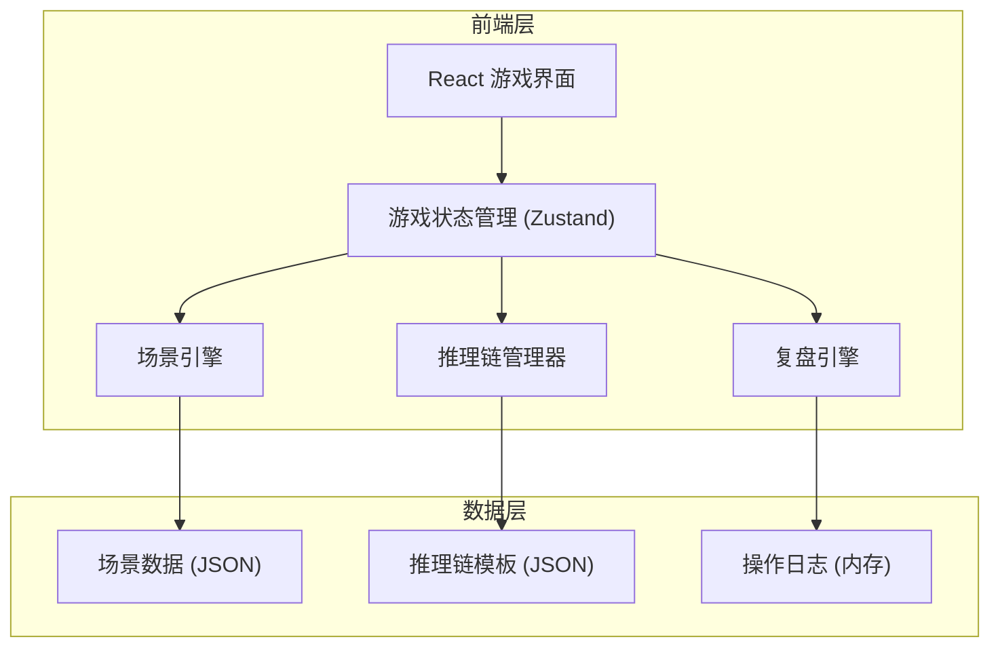
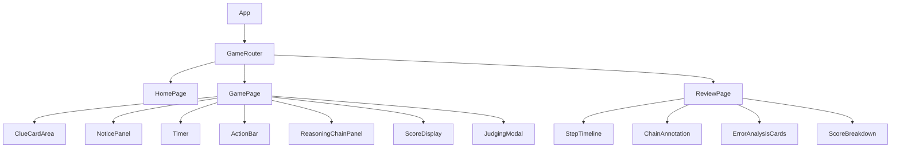

## 1. 架构设计



纯前端架构，无后端依赖。所有场景数据、推理逻辑、复盘数据均在客户端内存中管理。

## 2. 技术说明

- 前端：React@18 + TypeScript + Tailwind CSS@3 + Vite
- 状态管理：Zustand（轻量级，适合游戏状态）
- 动画：CSS transitions + keyframes（卡牌翻转、通知滑入、倒计时闪烁等）
- 初始化工具：Vite
- 后端：无
- 数据库：无（全部使用内存状态 + 静态 JSON 数据）

## 3. 路由定义

| 路由 | 用途 |
|------|------|
| `/` | 游戏首页（开始游戏按钮、简介） |
| `/game` | 游戏主界面（线索卡牌、通知、倒计时、推理链） |
| `/review` | 复盘界面（步骤时间轴、推理链标注、错因分析） |

## 4. 数据模型

### 4.1 场景数据结构

```typescript
interface ClueCard {
  id: string
  songName: string
  author: string
  sampleSource?: string
  sampleDuration?: number
  originalDuration?: number
  authStatus: 'valid' | 'expired' | 'none'
  authExpiryDate?: string
  isrc?: string
  hasConflictingTrack?: boolean
  conflictingTrackAuthor?: string
}

interface PlatformNotice {
  id: string
  type: 'warning' | 'info' | 'alert'
  title: string
  content: string
  timestamp: number
  isDistracting?: boolean
}

interface ReasoningNode {
  id: string
  label: string
  status: 'unexplored' | 'confirmed' | 'conflict'
  connectedTo: string[]
  lawReference?: string
}

interface Scenario {
  id: string
  title: string
  description: string
  clueCards: ClueCard[]
  notices: PlatformNotice[]
  timeLimit: number
  reasoningChain: ReasoningNode[]
  correctAnswer: 'compliant' | 'non-compliant' | 'needs-review'
  correctOperations: string[]
  errorAnalysis: Record<string, {
    type: string
    lawReference: string
    explanation: string
  }>
}
```

### 4.2 游戏状态结构

```typescript
interface GameState {
  currentScenarioIndex: number
  scenarios: Scenario[]
  score: number
  scenarioScores: number[]
  timeRemaining: number
  operations: OperationLog[]
  reasoningChainState: ReasoningNode[]
  phase: 'intro' | 'playing' | 'judging' | 'reveal' | 'review'
}

interface OperationLog {
  timestamp: number
  scenarioId: string
  operationType: 'verify-auth' | 'check-sample' | 'compare-track' | 'submit'
  result: string
  reasoningImpact: string[]
  scoreDelta: number
  isCorrect: boolean
}
```

### 4.3 场景数据 JSON

4 个场景的完整数据以 JSON 常量嵌入源码，无需外部 API。

## 5. 组件结构



## 6. 核心逻辑流程

### 6.1 操作-推理链联动

每个操作按钮绑定一组推理链规则：
- **验证授权**：解锁推理链中的"授权状态"节点，如过期则标注为冲突
- **检查采样**：解锁"采样比例"节点，自动计算比例并判断是否超限
- **比对曲目**：解锁"曲目身份"节点，展示同名曲的区分信息
- **提交结论**：根据当前推理链状态判断对错，未解锁的关键节点视为遗漏

### 6.2 倒计时机制

- 使用 `setInterval` 驱动，每秒更新
- 超时自动提交"超时"结论，扣 50 分
- 最后 5 秒计时器变红闪烁

### 6.3 复盘引擎

- 遍历 `OperationLog` 数组，逐条渲染时间轴节点
- 对比 `reasoningChainState` 与正确推理链，标注差异
- 根据 `errorAnalysis` 字段生成错因分析卡
