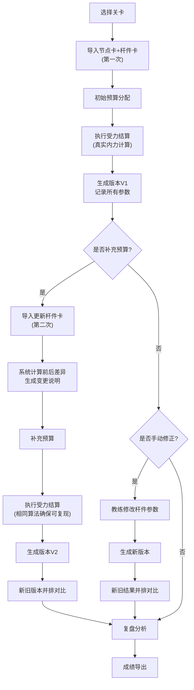
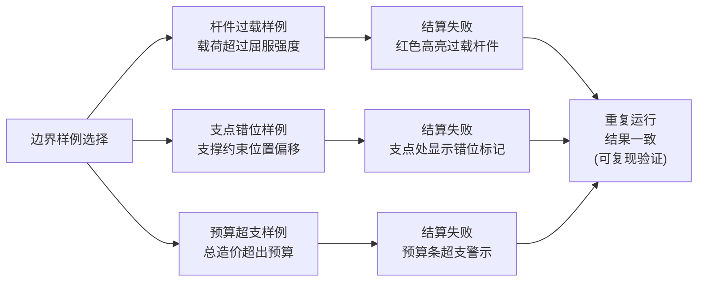

## 1. 产品概述

桥梁受力塔防是面向物理竞赛教练的教学原型系统，用于模拟桥梁结构在动态载荷下的受力分析。系统解决了教练担心"补预算时旧结论被悄悄覆盖"的痛点，通过版本化管理、前后对比、结果可复现等机制，让物理竞赛教学中桥梁受力分析过程透明化、可追溯。

- 核心用户：物理竞赛教练、参赛学生
- 核心价值：真实受力结算 + 过程可追溯 + 教学复盘能力
- 差异化：载荷推进和受力可视化真正参与结算，而非装饰性展示

## 2. 核心功能

### 2.1 用户角色

| 角色 | 登录方式 | 核心权限 |
|------|----------|----------|
| 物理竞赛教练 | 本地登录/无需注册 | 导入节点杆件卡、预算管理、手动修正、复盘分析、成绩导出 |
| 参赛学生 | 本地登录/无需注册 | 试玩关卡、查看受力分析、对比学习 |

### 2.2 功能模块

1. **关卡选择页**：3个教学关卡（简支梁、悬臂梁、桁架桥），每个关卡预置边界样例
2. **桥梁构建页**：导入节点卡、杆件卡，预算分配，手动修正入口
3. **受力模拟页**：载荷推进动画、实时受力可视化、结算判定
4. **复盘对比页**：新旧版本并排对比、受力回放、成绩导出
5. **版本管理页**：历史版本列表、变更说明、版本切换

### 2.3 页面详情

| 页面名称 | 模块名称 | 功能描述 |
|----------|----------|----------|
| 关卡选择页 | 关卡列表 | 3个教学关卡卡片，显示难度、预置边界样例类型 |
| 关卡选择页 | 边界样例区 | 杆件过载、支点错位、预算超支三个样例快速入口 |
| 桥梁构建页 | 节点卡导入 | 导入CSV/JSON格式的桥梁节点坐标数据 |
| 桥梁构建页 | 杆件卡导入 | 导入杆件规格、弹性模量、截面积等参数 |
| 桥梁构建页 | 预算管理 | 第一次导入基础预算，第二次补充预算，系统自动计算差异 |
| 桥梁构建页 | 手动修正入口 | 教练可直接修改杆件参数，自动生成新版本 |
| 受力模拟页 | 载荷推进 | 载荷从左到右逐步推进，每步真实计算内力 |
| 受力模拟页 | 受力可视化 | 杆件颜色映射受力大小（蓝-绿-黄-红），显示轴力数值 |
| 受力模拟页 | 结算判定 | 杆件过载/支点错位/预算超支实时判定，结果确定性输出 |
| 复盘对比页 | 并排对比 | 左右分屏显示新旧版本的桥梁结构和受力结果 |
| 复盘对比页 | 受力回放 | 可拖动进度条回放载荷推进全过程 |
| 复盘对比页 | 成绩导出 | 导出CSV格式的受力分析报告和结算成绩 |
| 版本管理页 | 变更说明 | 系统自动生成"前后变化"文字说明，高亮修改杆件 |
| 版本管理页 | 版本列表 | 显示每次导入/修正的时间、预算变化、关键参数变更 |

## 3. 核心流程

### 3.1 主流程描述
教练首次进入系统，选择关卡后导入桥梁节点卡和杆件卡，系统分配初始预算并执行第一次受力结算。当需要补充预算时，教练进行第二次导入，系统自动对比前后版本，高亮显示杆件参数变化和预算差异，生成新版本。教练可通过手动修正入口调整杆件参数，系统再次结算并提供新旧版本并排对比。整个过程中，载荷推进和受力可视化实时参与结算，结果可复现。

### 3.2 主流程图

### 3.3 边界样例流程

## 4. 用户界面设计

### 4.1 设计风格
- **主色调**：工程蓝 (#165DFF) 作为主色，搭配结构灰 (#1D2129) 背景
- **警示色**：受力过载红 (#F53F3F)，预算超支橙 (#FF7D00)，安全绿 (#00B42A)
- **字体**：标题使用 JetBrains Mono（等宽工程字体），正文使用 Noto Sans SC
- **按钮风格**：直角硬边按钮，带细微阴影，hover时边框高亮
- **布局风格**：工业控制面板风格，左右分栏布局，数据网格展示
- **图标风格**：线性工程图标，节点用圆点、杆件用线段、载荷用向下箭头

### 4.2 页面设计概述

| 页面名称 | 模块名称 | UI元素 |
|----------|----------|--------|
| 关卡选择页 | 关卡卡片 | 3D悬浮卡片，hover时展示关卡示意图，点击有按压反馈 |
| 桥梁构建页 | 画布区域 | 深色背景网格，节点可拖拽，杆件颜色随参数变化 |
| 桥梁构建页 | 参数面板 | 右侧折叠面板，杆件参数表格，可编辑单元格 |
| 受力模拟页 | 进度控制 | 底部时间轴，播放/暂停/步进按钮，载荷位置滑块 |
| 受力模拟页 | 受力图例 | 左侧颜色条，蓝-绿-黄-红渐变，标注应力阈值 |
| 受力模拟页 | 数据面板 | 右上角实时数据面板，显示最大应力、预算使用、当前载荷位置 |
| 复盘对比页 | 双栏布局 | 左右各一个独立画布，中间可拖动分割线 |
| 复盘对比页 | 同步控制 | 顶部同步开关，开启后两边载荷进度同步推进 |
| 版本管理页 | 时间线 | 左侧垂直时间线，每个节点显示版本号和变更摘要 |
| 版本管理页 | 差异对比 | 右侧diff视图，红色删除线/绿色高亮显示参数变化 |

### 4.3 响应式设计
- **设计原则**：桌面优先，适配1280px及以上宽度
- **平板适配**：双栏布局改为上下堆叠，参数面板改为底部抽屉
- **移动端**：仅保留核心模拟和复盘功能，画布自适应缩放
- **触摸优化**：节点拖拽增加触摸热区，按钮最小尺寸48px

### 4.4 受力可视化设计
- **杆件颜色映射**：轴力小于30%极限值显示蓝色，30-60%显示绿色，60-90%显示黄色，90%以上显示红色，超过100%闪烁警示
- **节点显示**：支点用三角形标记，载荷点用向下箭头，普通节点用圆点
- **变形动画**：载荷推进时，桥梁结构按计算结果显示放大10倍的变形效果
- **数值标签**：鼠标悬停杆件时显示轴力数值、应力百分比、安全系数

## 5. 核心业务规则

### 5.1 真实受力结算规则
1. **计算方法**：采用矩阵位移法计算平面桁架内力，考虑节点坐标、杆件截面积、弹性模量、边界约束
2. **载荷模型**：移动载荷按固定步长推进，每步重新计算所有杆件内力
3. **判定条件**：
   - 杆件过载：σ > σ_s（屈服强度）→ 结算失败
   - 支点错位：约束反力方向与约束方向偏差 > 15° → 结算失败
   - 预算超支：Σ(杆件长度 × 单位造价) > 总预算 → 结算失败
4. **结果可复现**：所有随机因素（如初始缺陷）使用固定种子，相同输入必产生相同输出

### 5.2 版本管理规则
1. 每次导入/手动修正自动生成新版本，版本号递增
2. 系统自动记录：变更时间、操作人、修改的杆件ID、参数前后值、预算变化
3. 生成自然语言变更说明："版本V1→V2：杆件#3截面积由20cm²增至30cm²，预算增加¥1,200，最大应力由120MPa降至85MPa"

### 5.3 边界样例预置数据
| 样例名称 | 触发条件 | 预期结果 |
|----------|----------|----------|
| 杆件过载 | 载荷推进至跨中时，杆件#7应力达到1.2σ_s | 结算失败，杆件#7红色闪烁，显示应力1.2σ_s |
| 支点错位 | 左支点约束设置为水平可动，但实际受水平力 | 结算失败，支点处显示错位标记，约束反力偏差23° |
| 预算超支 | 选用3根高强度合金钢杆件，总造价超出预算15% | 结算失败，预算条显示橙色超支，差额¥3,500 |
