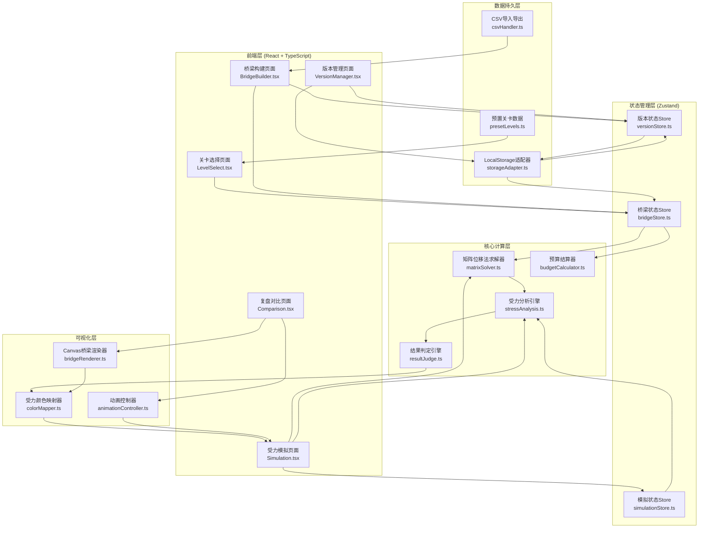
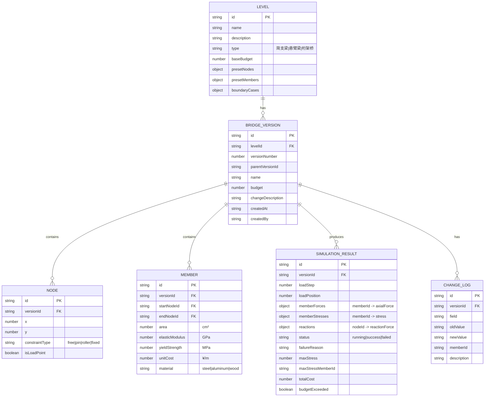

## 1. 架构设计



## 2. 技术描述

- **前端框架**：React@18 + TypeScript@5 + Vite@5
- **样式方案**：TailwindCSS@3.4 + CSS Variables（主题定制）
- **状态管理**：Zustand@4（轻量级状态管理，支持时间旅行调试）
- **可视化**：HTML5 Canvas 2D API（桥梁绘制、受力动画）+ SVG（图标、标记）
- **数值计算**：手写矩阵运算库（无外部依赖，确保结果可复现）
- **数据导入**：原生 FileReader API 解析 CSV/JSON
- **数据导出**：Blob URL 生成下载文件
- **数据持久化**：LocalStorage + IndexedDB（版本历史存储）
- **路由**：React Router@6（单页应用路由）
- **后端**：无（纯前端应用，所有计算在浏览器端完成）

## 3. 技术选型说明

### 3.1 为什么不用Three.js？
- 2D平面桁架受力分析足够，3D增加不必要的复杂度
- Canvas 2D性能更好，动画更流畅
- 便于导出矢量图用于教学报告

### 3.2 为什么手写矩阵求解器？
- 确保计算过程透明，便于物理教学讲解
- 结果100%可复现，不受外部库版本影响
- 代码量可控（约300行），核心算法可审计

### 3.3 为什么用Zustand而非Redux？
- 状态结构相对简单，3个store即可覆盖
- API更简洁，学习成本低
- 支持Immer中间件，状态变更可追踪

## 4. 路由定义

| 路由路径 | 页面组件 | 页面用途 |
|----------|----------|----------|
| `/` | LevelSelect | 关卡选择首页 |
| `/builder/:levelId` | BridgeBuilder | 桥梁构建与参数配置 |
| `/simulation/:versionId` | Simulation | 受力模拟与实时结算 |
| `/compare/:v1/:v2` | Comparison | 新旧版本并排对比复盘 |
| `/versions/:levelId` | VersionManager | 版本历史管理与变更查看 |

## 5. 数据模型

### 5.1 数据模型定义



### 5.2 TypeScript 类型定义

```typescript
// 节点约束类型
type ConstraintType = 'free' | 'pin' | 'roller' | 'fixed';

// 材料类型
type MaterialType = 'steel' | 'aluminum' | 'wood';

// 关卡类型
type LevelType = 'simple-beam' | 'cantilever' | 'truss';

// 模拟状态
type SimulationStatus = 'idle' | 'running' | 'success' | 'failed';

// 节点
interface Node {
  id: string;
  x: number;
  y: number;
  constraintType: ConstraintType;
  isLoadPoint: boolean;
}

// 杆件
interface Member {
  id: string;
  startNodeId: string;
  endNodeId: string;
  area: number;
  elasticModulus: number;
  yieldStrength: number;
  unitCost: number;
  material: MaterialType;
}

// 桥梁版本
interface BridgeVersion {
  id: string;
  levelId: string;
  versionNumber: number;
  parentVersionId?: string;
  name: string;
  budget: number;
  changeDescription: string;
  createdAt: string;
  createdBy: string;
  nodes: Node[];
  members: Member[];
}

// 模拟结果
interface SimulationResult {
  id: string;
  versionId: string;
  loadStep: number;
  loadPosition: number;
  memberForces: Record<string, number>;
  memberStresses: Record<string, number>;
  reactions: Record<string, { x: number; y: number }>;
  status: SimulationStatus;
  failureReason?: string;
  failureMemberId?: string;
  maxStress: number;
  maxStressMemberId: string;
  totalCost: number;
  budgetExceeded: boolean;
  timestamp: string;
}

// 变更日志
interface ChangeLog {
  id: string;
  versionId: string;
  field: string;
  oldValue: string;
  newValue: string;
  memberId?: string;
  description: string;
}

// 关卡
interface Level {
  id: string;
  name: string;
  description: string;
  type: LevelType;
  baseBudget: number;
  presetNodes: Node[];
  presetMembers: Member[];
  boundaryCases: BoundaryCase[];
}

// 边界样例
interface BoundaryCase {
  id: string;
  name: string;
  type: 'overload' | 'misalignment' | 'overbudget';
  description: string;
  expectedResult: string;
  setup: {
    nodes?: Partial<Node>[];
    members?: Partial<Member>[];
    load?: number;
    budget?: number;
  };
}
```

### 5.3 预置数据（Mock Data）

```typescript
// 简支梁关卡预置数据
export const SIMPLE_BEAM_LEVEL: Level = {
  id: 'simple-beam-001',
  name: '简支梁基础',
  description: '经典简支梁受力分析，理解弯矩与剪力分布',
  type: 'simple-beam',
  baseBudget: 10000,
  presetNodes: [
    { id: 'n1', x: 0, y: 0, constraintType: 'pin', isLoadPoint: false },
    { id: 'n2', x: 200, y: 0, constraintType: 'roller', isLoadPoint: false },
    { id: 'n3', x: 100, y: 0, constraintType: 'free', isLoadPoint: true },
  ],
  presetMembers: [
    { id: 'm1', startNodeId: 'n1', endNodeId: 'n3', area: 20, elasticModulus: 200, yieldStrength: 235, unitCost: 50, material: 'steel' },
    { id: 'm2', startNodeId: 'n3', endNodeId: 'n2', area: 20, elasticModulus: 200, yieldStrength: 235, unitCost: 50, material: 'steel' },
  ],
  boundaryCases: [
    {
      id: 'case-overload-001',
      name: '杆件过载样例',
      type: 'overload',
      description: '载荷增大至120kN，跨中杆件应力超过屈服强度',
      expectedResult: '结算失败，杆件m1应力达到282MPa（1.2σ_s）',
      setup: { load: 120000 },
    },
    {
      id: 'case-misalignment-001',
      name: '支点错位样例',
      type: 'misalignment',
      description: '左支点约束方向偏移，产生水平反力',
      expectedResult: '结算失败，约束反力偏差23°',
      setup: {
        nodes: [{ id: 'n1', constraintType: 'free' }],
      },
    },
    {
      id: 'case-overbudget-001',
      name: '预算超支样例',
      type: 'overbudget',
      description: '选用高强度合金钢，总造价超出预算15%',
      expectedResult: '结算失败，总造价¥11,500，超支¥1,500',
      setup: {
        members: [
          { id: 'm1', material: 'aluminum', unitCost: 80 },
          { id: 'm2', material: 'aluminum', unitCost: 80 },
        ],
      },
    },
  ],
};
```

## 6. 核心算法设计

### 6.1 矩阵位移法求解器

```typescript
// 核心算法伪代码
export class MatrixSolver {
  // 组装总刚度矩阵
  assembleGlobalStiffnessMatrix(nodes: Node[], members: Member[]): number[][] {
    const DOF = nodes.length * 2;
    const K = this.createZeroMatrix(DOF, DOF);
    
    for (const member of members) {
      const kLocal = this.computeLocalStiffnessMatrix(member);
      const T = this.computeTransformationMatrix(member, nodes);
      const kGlobal = this.transformToGlobal(kLocal, T);
      this.assembleIntoGlobal(K, kGlobal, member, nodes);
    }
    
    return K;
  }

  // 计算杆件局部刚度矩阵
  computeLocalStiffnessMatrix(member: Member): number[][] {
    const { area, elasticModulus } = member;
    const L = this.getMemberLength(member);
    const k = (elasticModulus * 1e9 * area * 1e-4) / L;
    
    return [
      [k, 0, -k, 0],
      [0, 0, 0, 0],
      [-k, 0, k, 0],
      [0, 0, 0, 0],
    ];
  }

  // 求解节点位移
  solveDisplacements(K: number[][], F: number[], constraints: Constraint[]): number[] {
    // 引入边界条件，修改刚度矩阵
    const [K_modified, F_modified] = this.applyConstraints(K, F, constraints);
    
    // 使用高斯消元法求解
    const displacements = this.gaussianElimination(K_modified, F_modified);
    
    return displacements;
  }

  // 计算杆件轴力
  computeMemberForces(displacements: number[], members: Member[], nodes: Node[]): Record<string, number> {
    const forces: Record<string, number> = {};
    
    for (const member of members) {
      const { startNodeId, endNodeId, area, elasticModulus } = member;
      const L = this.getMemberLength(member);
      
      // 获取杆端位移
      const u = this.extractMemberDisplacements(displacements, member, nodes);
      
      // 转换到局部坐标系
      const T = this.computeTransformationMatrix(member, nodes);
      const uLocal = this.multiplyMatrixVector(T, u);
      
      // 计算轴力 N = EA/L * (u2_local - u1_local)
      const N = (elasticModulus * 1e9 * area * 1e-4 / L) * (uLocal[2] - uLocal[0]);
      
      forces[member.id] = N;
    }
    
    return forces;
  }

  // 确保结果可复现：固定随机种子
  private static readonly RANDOM_SEED = 42;
  
  // 高斯消元法（无随机扰动）
  gaussianElimination(A: number[][], b: number[]): number[] {
    const n = A.length;
    const aug = A.map((row, i) => [...row, b[i]]);
    
    // 前向消元（无主元交换，确保结果确定）
    for (let i = 0; i < n - 1; i++) {
      for (let j = i + 1; j < n; j++) {
        const factor = aug[j][i] / aug[i][i];
        for (let k = i; k <= n; k++) {
          aug[j][k] -= factor * aug[i][k];
        }
      }
    }
    
    // 回代求解
    const x = new Array(n).fill(0);
    for (let i = n - 1; i >= 0; i--) {
      x[i] = aug[i][n];
      for (let j = i + 1; j < n; j++) {
        x[i] -= aug[i][j] * x[j];
      }
      x[i] /= aug[i][i];
    }
    
    return x;
  }
}
```

### 6.2 结果判定引擎

```typescript
export class ResultJudge {
  // 判定杆件过载
  checkOverload(stresses: Record<string, number>, members: Member[]): JudgeResult {
    for (const member of members) {
      const stress = stresses[member.id];
      const ratio = stress / (member.yieldStrength * 1e6);
      
      if (ratio > 1.0) {
        return {
          passed: false,
          reason: 'member_overload',
          message: `杆件#${member.id}应力过载：${(stress / 1e6).toFixed(1)}MPa，屈服强度${member.yieldStrength}MPa，比值${ratio.toFixed(2)}`,
          memberId: member.id,
          data: { stress, yieldStrength: member.yieldStrength, ratio },
        };
      }
    }
    
    return { passed: true };
  }

  // 判定支点错位
  checkSupportMisalignment(reactions: Record<string, { x: number; y: number }>, nodes: Node[]): JudgeResult {
    for (const node of nodes) {
      if (node.constraintType === 'roller') {
        const reaction = reactions[node.id];
        if (reaction && Math.abs(reaction.x) > 1e-6) {
          const angle = Math.atan2(Math.abs(reaction.x), Math.abs(reaction.y)) * 180 / Math.PI;
          if (angle > 15) {
            return {
              passed: false,
              reason: 'support_misalignment',
              message: `支点#${node.id}约束反力偏差${angle.toFixed(1)}°，超过阈值15°`,
              nodeId: node.id,
              data: { angle, threshold: 15, reaction },
            };
          }
        }
      }
    }
    
    return { passed: true };
  }

  // 判定预算超支
  checkBudget(members: Member[], totalBudget: number): JudgeResult {
    const totalCost = members.reduce((sum, m) => {
      const length = this.getMemberLength(m);
      return sum + length * m.unitCost;
    }, 0);
    
    if (totalCost > totalBudget) {
      return {
        passed: false,
        reason: 'over_budget',
        message: `预算超支：总造价¥${totalCost.toFixed(0)}，预算¥${totalBudget}，超支¥${(totalCost - totalBudget).toFixed(0)}`,
        data: { totalCost, totalBudget, overrun: totalCost - totalBudget },
      };
    }
    
    return { passed: true };
  }

  // 综合判定
  judgeAll(result: SimulationResult, members: Member[], nodes: Node[], budget: number): JudgeResult {
    const results = [
      this.checkOverload(result.memberStresses, members),
      this.checkSupportMisalignment(result.reactions, nodes),
      this.checkBudget(members, budget),
    ];
    
    const failed = results.find(r => !r.passed);
    return failed || { passed: true, message: '所有检查通过' };
  }
}
```

## 7. 项目目录结构

```
bridge-tower-defense/
├── src/
│   ├── components/          # UI组件
│   │   ├── layout/         # 布局组件
│   │   ├── bridge/         # 桥梁相关组件
│   │   ├── simulation/     # 模拟相关组件
│   │   └── common/         # 通用组件
│   ├── pages/              # 页面组件
│   │   ├── LevelSelect.tsx
│   │   ├── BridgeBuilder.tsx
│   │   ├── Simulation.tsx
│   │   ├── Comparison.tsx
│   │   └── VersionManager.tsx
│   ├── store/              # Zustand状态管理
│   │   ├── bridgeStore.ts
│   │   ├── versionStore.ts
│   │   └── simulationStore.ts
│   ├── engine/             # 核心计算引擎
│   │   ├── matrixSolver.ts
│   │   ├── stressAnalysis.ts
│   │   ├── budgetCalculator.ts
│   │   └── resultJudge.ts
│   ├── renderer/           # 可视化渲染
│   │   ├── bridgeRenderer.ts
│   │   ├── colorMapper.ts
│   │   └── animationController.ts
│   ├── data/               # 数据层
│   │   ├── storageAdapter.ts
│   │   ├── csvHandler.ts
│   │   └── presetLevels.ts
│   ├── types/              # TypeScript类型定义
│   │   └── index.ts
│   ├── utils/              # 工具函数
│   │   ├── math.ts
│   │   ├── diff.ts
│   │   └── export.ts
│   ├── router/             # 路由配置
│   │   └── index.tsx
│   ├── App.tsx
│   ├── main.tsx
│   └── index.css
├── public/
├── package.json
├── tsconfig.json
├── vite.config.ts
└── tailwind.config.js
```

## 8. 性能与可复现性保障

### 8.1 结果可复现机制
1. **固定计算顺序**：所有循环按ID排序后执行，避免遍历顺序不确定
2. **无随机算法**：高斯消元不使用随机主元选择，固定消元顺序
3. **浮点精度控制**：所有结果保留6位小数，避免浮点误差累积
4. **版本化快照**：每次结算保存完整输入参数哈希，相同输入产生相同输出

### 8.2 性能优化策略
1. **矩阵稀疏存储**：总刚度矩阵采用稀疏格式存储，减少内存占用
2. **增量更新**：载荷推进时只更新载荷向量，不重建刚度矩阵
3. **Web Worker**：矩阵求解在Web Worker中执行，不阻塞UI线程
4. **Canvas分层渲染**：背景网格、桥梁结构、受力颜色分图层渲染
