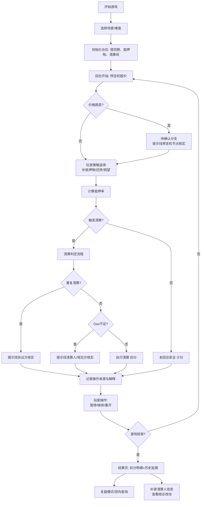

## 1. 产品概述
"DeFi清算守卫"是一款面向Web3新人的教育策略游戏，通过模拟借贷协议清算场景，帮助用户理解抵押率管理、预言机风险、清算流程等核心概念。玩家在回合制游戏中做出策略选择，应对价格波动和各种异常场景，最终目标是守住仓位不被清算。

- 核心目标：教育用户理解DeFi借贷清算规则，建立风险意识
- 目标用户：Web3新人、DeFi学习者、借贷协议使用者
- 产品价值：将抽象的清算规则转化为可交互的游戏体验，通过试错学习建立深刻认知

## 2. 核心特征

### 2.1 用户角色
| 角色 | 注册方式 | 核心权限 |
|------|----------|----------|
| 玩家 | 无需注册，浏览器直接访问 | 进行游戏、查看复盘、追溯数据 |

### 2.2 功能模块
1. **游戏主界面**：仓位概览、抵押率监控、预言机价格面板、操作控制面板
2. **回合系统**：回合报价、策略选择、事件触发、清算判定
3. **异常处理**：价格跳变待确认分支、重复清算提示、gas不足处理指引
4. **来源追溯**：每笔操作记录来源和解释，支持补录清算人信息后查看改动
5. **复盘系统**：游戏历史回放、操作轨迹、扣分明细
6. **结算页**：最终结果、仓位历史扣分说明、双向查询入口
7. **数据查询**：借贷仓位→最终结果→抵押物的双向追溯

### 2.3 页面详情
| 页面名称 | 模块名称 | 功能描述 |
|---------|----------|----------|
| 游戏大厅 | 开局配置 | 选择难度、预设场景、开始游戏 |
| 游戏主界面 | 仓位监控 | 实时显示借贷仓位、抵押物价值、抵押率、清算线 |
| 游戏主界面 | 价格面板 | 预言机价格走势、待确认价格跳变分支 |
| 游戏主界面 | 操作面板 | 补充抵押物、偿还借贷、暂停、重开按钮 |
| 游戏主界面 | 事件日志 | 回合事件、操作记录、来源解释 |
| 异常弹窗 | 价格跳变 | 显示待确认分支，说明下一步找谁核实 |
| 异常弹窗 | 重复清算 | 提示重复清算风险，说明核实路径 |
| 异常弹窗 | Gas不足 | 提示gas不足，说明处理流程 |
| 结算页 | 结果展示 | 最终状态、总分、各项扣分明细 |
| 结算页 | 历史追溯 | 仓位历史操作、双向查询入口 |
| 复盘页 | 历史回放 | 逐回合回放、操作轨迹高亮 |
| 数据补录 | 清算人补录 | 补充清算人信息，标记结论改动 |

## 3. 核心流程



## 4. 界面设计

### 4.1 设计风格
- **主色调**：深科技蓝 (#0A1628) 搭配警示橙 (#FF6B35) 和安全绿 (#00D09C)
- **辅助色**：预言机紫 (#8B5CF6)、清算红 (#EF4444)
- **按钮风格**：圆角矩形，微悬浮效果，状态色区分（操作/确认/警告）
- **字体**：展示字体用 Space Mono（等宽科技感），正文字体用 Noto Sans SC
- **布局**：三栏仪表盘布局，左侧仓位信息、中间价格走势、右侧操作面板
- **视觉元素**：霓虹边框、玻璃态卡片、数据可视化图表、状态指示灯

### 4.2 页面设计概览
| 页面名称 | 模块名称 | UI元素 |
|---------|----------|--------|
| 游戏大厅 | 开局配置 | 场景卡片、难度滑块、开始按钮、规则说明折叠面板 |
| 游戏主界面 | 仓位监控 | 抵押率仪表盘（环形进度条）、数值卡片、状态标签、清算线预警 |
| 游戏主界面 | 价格面板 | K线图走势、当前价格标记、待确认价格虚线分支、预言机来源标签 |
| 游戏主界面 | 操作面板 | 策略按钮组、数值输入框、暂停/重开按钮、倒计时进度条 |
| 游戏主界面 | 事件日志 | 时间线列表、来源标签、解释文字、可追溯链接 |
| 结算页 | 结果展示 | 大字结果、分数圆环、扣分明细列表、历史操作时间轴 |
| 复盘页 | 历史回放 | 回合滑块、播放控制、关键事件标记、数据对比面板 |

### 4.3 响应式
- 桌面端优先（1280px+）：三栏仪表盘布局
- 平板端（768-1279px）：上下布局，图表区和操作区分开
- 移动端（<768px）：单栏滚动布局，核心指标固定顶部

### 4.4 动效设计
- 抵押率变化：平滑过渡动画，临近清算线时脉动闪烁
- 价格跳变：闪烁+虚线分支展开动画
- 清算触发：红色警报闪烁+震动效果
- 操作反馈：按钮点击涟漪+状态变更淡入
- 页面切换：淡入淡出+轻微缩放

## 5. 数据追溯设计

### 5.1 双向查询链路
```
借贷仓位ID → 操作历史 → 清算事件 → 最终结果 → 抵押物明细
抵押物ID → 关联仓位 → 价格历史 → 清算触发点 → 最终结果
```

### 5.2 来源记录字段
- 操作类型：补抵押物/还债/观望/清算
- 触发来源：玩家操作/系统判定/预言机报价/清算人执行
- 时间戳：精确到毫秒
- 解释说明：自动生成+人工补录
- 版本标记：补录清算人信息后标记为"已修订"
