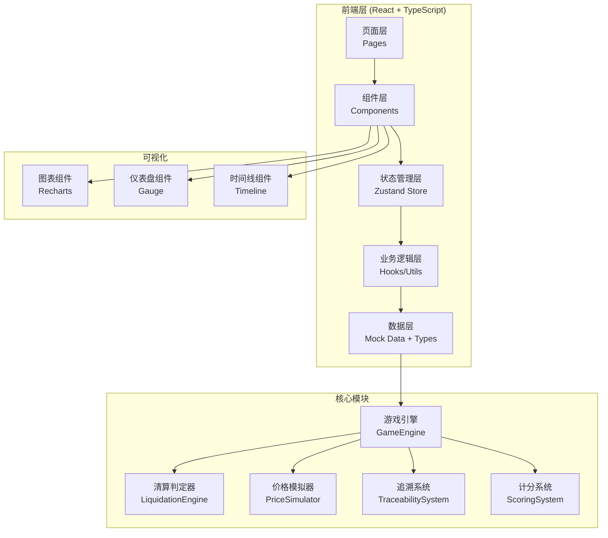

## 1. 架构设计



## 2. 技术选型

- **前端框架**: React 18 + TypeScript
- **构建工具**: Vite 5
- **样式方案**: TailwindCSS 3
- **状态管理**: Zustand
- **路由管理**: React Router DOM 6
- **图表库**: Recharts
- **图标库**: Lucide React
- **日期处理**: date-fns
- **后端**: 无后端，纯前端Mock数据

## 3. 目录结构

```
src/
├── pages/
│   ├── Lobby.tsx          # 游戏大厅
│   ├── Game.tsx           # 游戏主界面
│   ├── Settlement.tsx     # 结算页
│   └── Review.tsx         # 复盘页
├── components/
│   ├── PositionPanel.tsx  # 仓位监控面板
│   ├── PriceChart.tsx     # 价格走势图
│   ├── ControlPanel.tsx   # 操作控制面板
│   ├── EventLog.tsx       # 事件日志
│   ├── GaugeMeter.tsx     # 抵押率仪表盘
│   ├── Modal/
│   │   ├── PriceJumpModal.tsx    # 价格跳变弹窗
│   │   ├── RepeatedLiqModal.tsx  # 重复清算弹窗
│   │   └── GasShortageModal.tsx  # Gas不足弹窗
│   └── TraceView.tsx      # 追溯视图
├── store/
│   └── useGameStore.ts    # 游戏状态管理
├── hooks/
│   ├── useGameEngine.ts   # 游戏引擎Hook
│   ├── useLiquidation.ts  # 清算判定Hook
│   └── useTraceability.ts # 追溯系统Hook
├── types/
│   └── game.ts            # 类型定义
├── utils/
│   ├── priceSimulator.ts  # 价格模拟器
│   ├── scoring.ts         # 计分逻辑
│   └── mockData.ts        # Mock数据
├── App.tsx
├── main.tsx
└── index.css
```

## 4. 路由定义

| 路由 | 页面 | 说明 |
|------|------|------|
| / | Lobby | 游戏大厅，选择场景和难度 |
| /game | Game | 游戏主界面 |
| /settlement | Settlement | 结算页，展示结果和扣分 |
| /review | Review | 复盘页，历史回放 |

## 5. 数据模型

### 5.1 核心数据结构

```typescript
// 借贷仓位
interface Position {
  id: string;
  borrowAmount: number;      // 借贷金额 (USD)
  collateralAmount: number;  // 抵押物数量
  collateralType: string;    // 抵押物类型 (ETH/BTC等)
  collateralPrice: number;   // 抵押物当前价格
  liquidationThreshold: number;  // 清算阈值 (如 150%)
  liquidationPrice: number;  // 清算价格
  currentRatio: number;      // 当前抵押率
  status: 'safe' | 'warning' | 'danger' | 'liquidated';
  createdAt: number;
}

// 预言机价格
interface PricePoint {
  timestamp: number;
  price: number;
  source: string;            // 预言机来源
  isConfirmed: boolean;      // 是否已确认
  isJump: boolean;           // 是否为跳变价格
  jumpBranch?: {             // 待确认分支
    alternativePrice: number;
    verifier: string;        // 需找谁核实
    status: 'pending' | 'confirmed' | 'rejected';
  };
}

// 操作记录
interface ActionRecord {
  id: string;
  round: number;
  type: 'add_collateral' | 'repay' | 'hold' | 'liquidation' | 'price_update';
  source: 'player' | 'system' | 'oracle' | 'liquidator';
  amount?: number;
  timestamp: number;
  explanation: string;
  positionSnapshot: Position;
  priceSnapshot: PricePoint;
  scoreChange: number;
  isRevised: boolean;        // 是否已被修订
  revisedBy?: string;        // 修订人（清算人）
  revisedAt?: number;
  revisionNote?: string;     // 修订说明
}

// 清算事件
interface LiquidationEvent {
  id: string;
  round: number;
  positionId: string;
  triggerPrice: number;
  triggerRatio: number;
  isRepeated: boolean;       // 是否重复清算
  hasGasIssue: boolean;      // 是否有Gas问题
  verifier: string;          // 需找谁核实
  status: 'pending' | 'executed' | 'cancelled';
  penaltyScore: number;
}

// 游戏状态
interface GameState {
  gameId: string;
  status: 'idle' | 'playing' | 'paused' | 'finished';
  currentRound: number;
  totalRounds: number;
  difficulty: 'easy' | 'normal' | 'hard';
  scenario: string;
  position: Position;
  priceHistory: PricePoint[];
  actionHistory: ActionRecord[];
  liquidationHistory: LiquidationEvent[];
  score: number;
  maxScore: number;
  penalties: PenaltyItem[];
  selectedTraceId: string | null;
}

// 扣分项
interface PenaltyItem {
  id: string;
  round: number;
  type: string;
  description: string;
  score: number;
  linkedActionId: string;
}
```

### 5.2 双向追溯索引

```typescript
// 仓位ID → 操作历史 → 清算事件 → 最终结果
// 抵押物ID → 关联仓位 → 价格历史 → 清算触发点 → 最终结果

interface TraceIndex {
  positionToResult: Record<string, string>;      // 仓位ID → 结果ID
  collateralToPosition: Record<string, string>;  // 抵押物ID → 仓位ID
  actionToLiquidation: Record<string, string>;   // 操作ID → 清算事件ID
  liquidationToResult: Record<string, string>;   // 清算事件ID → 结果ID
}
```

## 6. 核心算法

### 6.1 抵押率计算
```
抵押率 = (抵押物数量 × 当前价格) / 借贷金额 × 100%
当抵押率 ≤ 清算阈值时触发清算判定
```

### 6.2 价格跳变检测
```
价格波动率 = |当前价格 - 上一回合价格| / 上一回合价格 × 100%
波动率 > 阈值(如15%) 标记为价格跳变，进入待确认分支
```

### 6.3 清算判定流程
```
1. 检查抵押率是否 ≤ 清算阈值
2. 检查是否已被清算过（重复清算检测）
3. 模拟Gas检查（随机触发Gas不足场景）
4. 执行清算或记录异常
5. 计算扣分
```

### 6.4 计分规则
- 每回合安全存活: +10分
- 成功避开价格跳变陷阱: +20分
- 正确补充抵押物: +15分
- 正确偿还借贷: +15分
- 观望但仍安全: +5分
- 触发清算: -50分
- 未及时处理价格跳变: -30分
- 重复清算未核实: -40分
- Gas不足未处理: -25分

## 7. Mock数据预设

### 7.1 预设场景
1. **新手教程**: 10回合，价格平稳波动，1次价格跳变练习
2. **ETH暴跌**: 15回合，模拟ETH价格暴跌30%的极端行情
3. **预言机攻击**: 12回合，包含2次恶意价格报点
4. **连环清算**: 20回合，多个清算事件叠加，考验Gas管理
5. **综合挑战**: 25回合，包含所有异常场景

### 7.2 初始仓位样例
```
{
  borrowAmount: 10000,        // 借贷10000 USD
  collateralAmount: 5,        // 5个ETH
  collateralType: 'ETH',
  collateralPrice: 3000,      // ETH价格3000 USD
  liquidationThreshold: 150,  // 清算线150%
  liquidationPrice: 2000,     // 清算价格2000 USD
  currentRatio: 150           // 初始刚好在清算线
}
```
