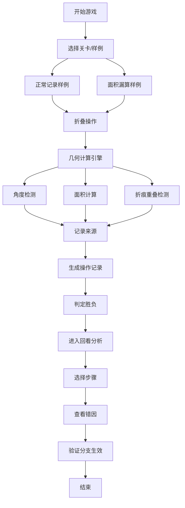

## 1. 产品概述
几何折纸闯关是一款面向数学社教学场景的互动折纸模拟游戏，通过可视化折叠过程帮助学生理解几何原理，同时帮助指导老师精准定位学生操作中的角度误差和面积漏算问题。
- 核心目标：让几何折纸操作过程可追溯、错误可解释、成绩可复盘
- 目标用户：数学社指导老师、学生学习者

## 2. 核心功能

### 2.1 用户角色
| 角色 | 使用方式 | 核心需求 |
|------|----------|----------|
| 指导老师 | 审查操作、分析错误 | 追溯错误来源、对比正常与异常案例、验证分支逻辑 |
| 学生玩家 | 操作折叠、完成关卡 | 理解折叠原理、知道为什么输或赢 |

### 2.2 功能模块
1. **游戏主界面**：折纸画布、操作面板、实时提示
2. **折叠模拟引擎**：几何计算、角度检测、面积计算
3. **操作追溯系统**：步骤记录、来源追踪、错误标记
4. **回看分析模块**：步骤回放、错因展示、成绩影响分析
5. **样例测试面板**：脏样例导入、错误合并检测、分支验证

### 2.3 页面详情
| 页面名称 | 模块名称 | 功能描述 |
|---------|----------|---------|
| 游戏主界面 | 折纸画布 | SVG交互式画布，支持点击选择折痕、拖拽折叠 |
| 游戏主界面 | 操作面板 | 折叠方向选择、角度输入、撤销重做按钮 |
| 游戏主界面 | 状态指示器 | 实时显示角度误差、面积覆盖率、折痕重叠警告 |
| 回看分析页 | 时间线 | 所有操作步骤列表，可点击跳转查看 |
| 回看分析页 | 错因面板 | 显示错误类型、原始数据来源、对成绩的具体影响 |
| 样例测试页 | 样例列表 | 预置正常记录和面积漏算样例，可一键加载对比 |
| 样例测试页 | 合并检测 | 自动检测角度误差和面积漏算是否被错误合并 |

## 3. 核心流程
玩家选择关卡后，在画布上点击选择折痕线，选择折叠方向进行操作。系统实时计算角度误差和面积变化，若出现错误即时标记来源。关卡结束后，指导老师可通过时间线回看每一步操作，点击错误步骤查看详细错因和数据来源，验证样例分支是否正确触发。

## 4. 用户界面设计

### 4.1 设计风格
- 主色调：深蓝 #1e3a5f（专业感）、青色 #00d4aa（科技感）
- 辅助色：橙色 #ff6b35（错误警告）、绿色 #2ecc71（正确标记）
- 字体：标题使用 Orbitron（几何科技感），正文使用 JetBrains Mono（代码可读性）
- 布局：左侧画布、右侧控制面板、底部时间线的三栏式布局
- 风格：极简科技风，强调几何线条和数据可视化

### 4.2 页面设计概述
| 页面名称 | 模块名称 | UI 元素 |
|---------|----------|---------|
| 游戏主界面 | 折纸画布 | 半透明网格背景、高亮折痕线、折叠动画效果 |
| 游戏主界面 | 状态指示器 | 数据卡片带进度条、错误时边框闪烁动画 |
| 回看分析页 | 时间线 | 垂直时间轴、节点颜色区分状态、悬停预览 |
| 样例测试页 | 对比面板 | 左右分栏布局、差异高亮显示 |

### 4.3 响应式
- 桌面端：三栏完整布局，1200px+ 最佳体验
- 平板端：上下布局，控制面板折叠到画布下方
- 移动端：简化操作，仅支持预置样例查看

### 4.4 交互动效
- 折叠动画：使用 SVG transform + 过渡实现纸张翻折效果
- 错误提示：边框脉冲动画 + 轻微抖动效果
- 步骤切换：时间线节点发光 + 画布内容淡入淡出
