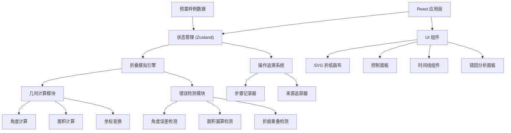

## 1. 架构设计



## 2. 技术描述
- 前端：React@18 + TypeScript + Vite
- 样式：TailwindCSS@3 + CSS Modules
- 状态管理：Zustand（轻量级，适合游戏状态）
- 图形渲染：原生 SVG（折纸几何计算的精确性）
- 动画：Framer Motion（流畅的折叠动画）
- 构建工具：Vite
- 后端：无（纯前端应用，数据本地存储）

## 3. 路由定义
| 路由 | 页面组件 | 功能说明 |
|------|----------|---------|
| / | GamePage | 游戏主界面，包含画布、控制面板、状态指示器 |
| /review | ReviewPage | 回看分析页面，时间线+错因面板 |
| /samples | SamplesPage | 样例测试页面，预置样例对比 |

## 4. 数据模型

### 4.1 核心类型定义

```typescript
// 点坐标
interface Point {
  x: number;
  y: number;
}

// 折痕线
interface FoldLine {
  id: string;
  start: Point;
  end: Point;
  angle: number;
}

// 操作步骤
interface OperationStep {
  id: string;
  timestamp: number;
  type: 'fold' | 'select' | 'undo' | 'redo';
  foldLine?: FoldLine;
  foldDirection?: 'left' | 'right' | 'up' | 'down';
  foldAngle?: number;
  source: 'user' | 'system' | 'sample';
  sourceDetail?: string;
}

// 检测结果
interface DetectionResult {
  type: 'angle_error' | 'area_miss' | 'overlap';
  severity: 'warning' | 'error';
  message: string;
  value: number;
  threshold: number;
  source: string;
  affectedScore: number;
}

// 游戏状态
interface GameState {
  paper: PaperState;
  steps: OperationStep[];
  currentStepIndex: number;
  detections: DetectionResult[];
  score: number;
  isComplete: boolean;
}

// 纸张状态
interface PaperState {
  points: Point[];
  foldedAreas: number;
  totalArea: number;
  foldLines: FoldLine[];
  transform: string;
}

// 预置样例
interface Sample {
  id: string;
  name: string;
  type: 'normal' | 'area_miss' | 'angle_error' | 'overlap';
  steps: OperationStep[];
  expectedDetections: DetectionResult[];
  description: string;
}
```

### 4.2 预置样例数据

```typescript
// 正常记录样例
const normalSample: Sample = {
  id: 'normal-001',
  name: '正常折叠记录',
  type: 'normal',
  description: '标准的三角形对折操作，无误差',
  steps: [...],
  expectedDetections: []
};

// 面积漏算样例
const areaMissSample: Sample = {
  id: 'areamiss-001',
  name: '面积漏算脏样例',
  type: 'area_miss',
  description: '折叠后角落区域未被正确计算，用于验证面积检测分支',
  steps: [...],
  expectedDetections: [{
    type: 'area_miss',
    severity: 'error',
    message: '折叠区域计算不完整，遗漏约 15% 面积',
    value: 85,
    threshold: 95,
    source: 'area-calculator:src/utils/geometry.ts#L127',
    affectedScore: -20
  }]
};
```

## 5. 核心模块说明

### 5.1 几何计算模块 (src/utils/geometry.ts)
- `calculateAngle(p1: Point, p2: Point): number` - 计算两点连线角度
- `calculateArea(points: Point[]): number` - 计算多边形面积
- `foldPoint(point: Point, foldLine: FoldLine): Point` - 计算点折叠后的新位置
- `checkOverlap(line1: FoldLine, line2: FoldLine): boolean` - 检测折痕重叠

### 5.2 错误检测模块 (src/utils/detector.ts)
- `detectAngleError(actual: number, expected: number, tolerance: number): DetectionResult | null`
- `detectAreaMiss(calculated: number, actual: number, threshold: number): DetectionResult | null`
- `detectFoldOverlap(newLine: FoldLine, existingLines: FoldLine[]): DetectionResult | null`

### 5.3 追溯系统 (src/utils/tracer.ts)
- `traceSource(module: string, functionName: string, line: number): string` - 生成来源追踪字符串
- `recordStep(step: OperationStep, state: GameState): void` - 记录操作步骤
- `getAffectedScore(detection: DetectionResult): number` - 计算对成绩的影响
