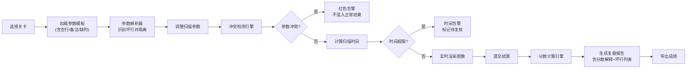
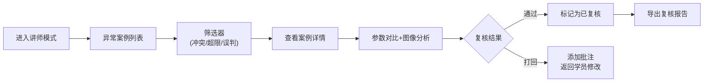

## 1. 产品概述

"核磁共振调参局"是面向医学物理专业的课堂培训原型，学员通过调整MRI扫描参数来获得高质量图像，系统实时计算图像质量评分并检测参数冲突。本产品解决了传统教学中参数调整反馈滞后、错误案例不直观的问题，让学员在试玩中理解参数间的复杂权衡关系。

- **核心价值**：将抽象的MRI参数转化为可视化的图像质量反馈，让参数冲突、时间超限等错误路径清晰可见
- **目标用户**：医学物理专业学员、放射科培训医师、医学物理讲师
- **市场定位**：课堂/培训环境的互动式教学辅助工具

---

## 2. 核心功能

### 2.1 用户角色

| 角色 | 登录方式 | 核心权限 |
|------|----------|----------|
| 学员 | 直接进入 | 选择关卡、调整参数、查看结算、导出个人成绩 |
| 讲师 | 切换入口 | 复核异常案例（参数冲突/时间超限/伪影误判）、查看全班统计 |

### 2.2 功能模块

1. **关卡选择页**：展示3个难度递进的调参关卡，显示关卡目标和时间预算
2. **调参控制台**：参数调整面板、实时图像预览、时间倒计时、参数冲突告警
3. **结算复盘页**：分数拆解、图像对比、坏行列表、分数解释、成绩导出
4. **讲师复核台**：筛选异常案例、批量复核、导出复核报告

### 2.3 页面详情

| 页面名称 | 模块名称 | 功能描述 |
|----------|----------|----------|
| 关卡选择页 | 关卡卡片 | 展示关卡名称、目标部位、时间预算、难度标签、最佳成绩 |
| 关卡选择页 | 角色切换 | 学员/讲师模式一键切换 |
| 调参控制台 | 参数面板 | 滑动条调整TR、TE、层厚、FOV、矩阵、NEX等核心参数 |
| 调参控制台 | 图像预览 | 实时渲染MRI模拟图像，叠加伪影、噪声、模糊等效果 |
| 调参控制台 | 冲突告警 | 参数冲突时红色高亮，显示冲突原因，不混入正常结果 |
| 调参控制台 | 时间预算 | 实时计算扫描时间，超限时红色告警 |
| 结算复盘页 | 分数仪表盘 | 总分、信噪比、对比度、空间分辨率、扫描时间五项得分 |
| 结算复盘页 | 分数解释 | 每项得分的具体计算依据和参数影响分析 |
| 结算复盘页 | 坏行列表 | 单独列出空行、备注、缺列、噪声条等无效数据行 |
| 结算复盘页 | 图像对比 | 最佳参数图像 vs 当前参数图像的并排对比 |
| 结算复盘页 | 成绩导出 | 导出含详细参数和分数解释的CSV报告 |
| 讲师复核台 | 异常筛选 | 按参数冲突、时间超限、伪影误判分类筛选 |
| 讲师复核台 | 复核列表 | 展示异常案例详情，支持通过/打回操作 |

---

## 3. 核心流程

### 3.1 学员调参流程

### 3.2 讲师复核流程

---

## 4. 用户界面设计

### 4.1 设计风格

**设计方向**：医学科技风，专业精密，带有数据可视化的严谨感

- **主色调**：深空蓝 `#0B1E3F`，代表专业与信赖
- **辅助色**：医疗青 `#00D4AA`（正常/通过）、警示橙 `#FF8A00`（告警）、错误红 `#FF3B5C`（冲突/失败）
- **字体**：标题使用 `Space Grotesk`，正文使用 `Inter`，数字使用 `JetBrains Mono` 等宽字体
- **按钮风格**：圆角8px，悬停时轻微上浮+阴影加深，点击时微缩反馈
- **布局风格**：三栏式控制台布局，左侧参数、中间图像、右侧数据面板
- **视觉细节**：使用扫描线纹理、网格背景、数据可视化图表、发光边框表示状态

### 4.2 页面设计概述

| 页面名称 | 模块名称 | UI元素 |
|----------|----------|--------|
| 关卡选择页 | 关卡卡片 | 渐变背景、发光边框悬停效果、难度徽章、时间进度条 |
| 调参控制台 | 参数面板 | 带刻度的滑动条、实时数值显示、单位标签、冲突时红色发光边框 |
| 调参控制台 | 图像预览 | 带网格的医学图像显示器、扫描线动画、伪影叠加效果 |
| 调参控制台 | 数据面板 | 仪表盘式分数显示、雷达图、实时参数表 |
| 结算复盘页 | 分数解释 | 瀑布流式得分拆解、每项得分的参数影响条形图 |
| 结算复盘页 | 坏行列表 | 带行号的表格，不同类型坏行用不同背景色标记 |
| 讲师复核台 | 筛选器 | 胶囊式标签筛选，选中时有发光效果 |

### 4.3 响应式设计

- **Desktop-first**：默认面向1920×1080分辨率设计
- **平板适配**：1024px以下切换为两栏布局，参数面板可折叠
- **触控优化**：滑动条增加触控热区，按钮最小高度48px

---

## 5. 数据规范

### 5.1 参数输入格式

系统支持实际工作中的原始参数表，包含：
- **空行**：完全空白或仅含空白字符的行
- **备注行**：以 `#`、`//` 或 `备注:` 开头的行
- **缺列行**：关键字段缺失的参数行
- **噪声条**：来自DICOM头的乱码或格式错误行
- **正常参数**：TR、TE、层厚、FOV、矩阵、NEX等有效参数

### 5.2 坏行分类标记

| 坏行类型 | 标记颜色 | 处理方式 |
|----------|----------|----------|
| 空行 | 灰色背景 | 忽略，列入坏行统计 |
| 备注行 | 蓝色背景 | 保留文本，不参与计算 |
| 缺列行 | 黄色背景 | 告警，不参与计算 |
| 噪声条/格式错误 | 红色背景 | 隔离，单独列出 |
| 参数冲突 | 红色发光边框 | 阻止结算，标记待复核 |

### 5.3 分数计算模型

总分 = 信噪比(25%) + 对比度(25%) + 空间分辨率(20%) + 扫描效率(20%) + 伪影抑制(10%)

- 每项得分均有明确的参数关联解释
- 参数冲突时得分为0，注明冲突原因
- 时间超限时扫描效率项得分为0
