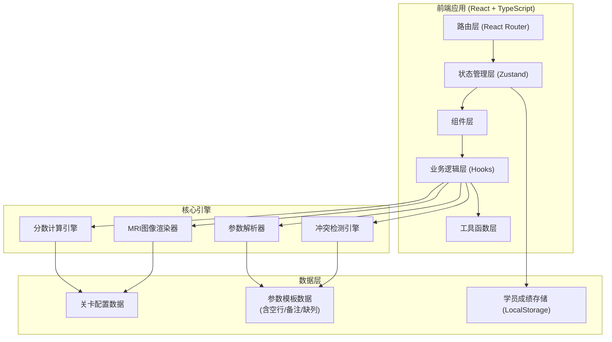

## 1. 架构设计



---

## 2. 技术栈描述

- **前端框架**：React@18 + TypeScript
- **构建工具**：Vite@5
- **路由管理**：react-router-dom@6
- **状态管理**：zustand@4
- **样式方案**：tailwindcss@3
- **图表可视化**：recharts（雷达图、条形图）
- **图标库**：lucide-react
- **后端**：无（纯前端应用，数据存储于LocalStorage）
- **数据持久化**：LocalStorage + 导出CSV

---

## 3. 路由定义

| 路由路径 | 页面名称 | 用途 |
|----------|----------|------|
| `/` | 关卡选择页 | 展示关卡列表、角色切换入口 |
| `/level/:id` | 调参控制台 | 参数调整、实时图像预览、冲突告警 |
| `/result/:id` | 结算复盘页 | 分数展示、分数解释、坏行列表、成绩导出 |
| `/review` | 讲师复核台 | 异常案例筛选、复核操作 |

---

## 4. 核心数据模型

### 4.1 TypeScript 类型定义

```typescript
// 扫描参数
interface ScanParams {
  TR: number;        // 重复时间 (ms)
  TE: number;        // 回波时间 (ms)
  sliceThickness: number;  // 层厚 (mm)
  FOV: number;       // 视野 (cm)
  matrix: number;    // 矩阵大小
  NEX: number;       // 激励次数
}

// 参数行（原始输入）
interface RawParamRow {
  lineNumber: number;
  content: string;
  type: 'normal' | 'empty' | 'comment' | 'missing_column' | 'noise' | 'conflict';
  paramName?: string;
  paramValue?: number;
  errorMessage?: string;
}

// 解析结果
interface ParseResult {
  validParams: Partial<ScanParams>;
  badRows: RawParamRow[];
  totalRows: number;
  validRows: number;
}

// 参数冲突
interface ParamConflict {
  params: string[];
  message: string;
  severity: 'warning' | 'error' | 'fatal';
}

// 分数项
interface ScoreItem {
  name: string;
  score: number;
  maxScore: number;
  weight: number;
  explanation: string;
  relatedParams: string[];
}

// 结算结果
interface SettlementResult {
  totalScore: number;
  maxScore: number;
  scoreItems: ScoreItem[];
  scanTime: number;
  timeBudget: number;
  isTimeExceeded: boolean;
  conflicts: ParamConflict[];
  badRows: RawParamRow[];
  artifactTypes: string[];
  params: ScanParams;
  timestamp: number;
}

// 关卡配置
interface Level {
  id: string;
  name: string;
  targetPart: string;
  difficulty: 'easy' | 'medium' | 'hard';
  timeBudget: number;  // 秒
  description: string;
  optimalParams: ScanParams;
  paramRanges: Record<keyof ScanParams, { min: number; max: number; step: number }>;
  rawTemplate: string;  // 含空行/备注/缺列的原始模板
}
```

### 4.2 核心引擎接口

```typescript
// 参数解析器
interface ParamParser {
  parse(rawText: string): ParseResult;
  validateParams(params: Partial<ScanParams>): ParamConflict[];
}

// 冲突检测引擎
interface ConflictDetector {
  checkConflicts(params: ScanParams, level: Level): ParamConflict[];
  checkTimeBudget(params: ScanParams, timeBudget: number): { exceeded: boolean; scanTime: number };
  checkArtifactMisjudgment(imageQuality: ImageQuality): string[];
}

// 分数计算引擎
interface ScoreCalculator {
  calculate(params: ScanParams, level: Level, conflicts: ParamConflict[], scanTime: number): SettlementResult;
}

// MRI图像渲染器
interface MriRenderer {
  render(params: ScanParams, level: Level): ImageData;
  getImageQuality(params: ScanParams, level: Level): ImageQuality;
}

interface ImageQuality {
  snr: number;       // 信噪比
  contrast: number;  // 对比度
  resolution: number; // 空间分辨率
  artifacts: string[]; // 伪影类型
}
```

---

## 5. 项目结构

```
src/
├── components/           # 可复用组件
│   ├── layout/          # 布局组件
│   ├── params/          # 参数调整相关组件
│   ├── mri/             # MRI图像相关组件
│   ├── score/           # 分数展示相关组件
│   └── ui/              # 通用UI组件（按钮、卡片等）
├── pages/               # 页面组件
│   ├── LevelSelect.tsx
│   ├── ParamConsole.tsx
│   ├── ResultReview.tsx
│   └── InstructorReview.tsx
├── hooks/               # 自定义Hooks
│   ├── useParamParser.ts
│   ├── useConflictDetector.ts
│   ├── useScoreCalculator.ts
│   └── useMriRenderer.ts
├── store/               # Zustand状态管理
│   └── useGameStore.ts
├── data/                # 静态数据
│   ├── levels.ts        # 关卡配置
│   └── paramTemplates.ts # 参数模板
├── types/               # TypeScript类型定义
│   └── index.ts
├── utils/               # 工具函数
│   ├── paramParser.ts
│   ├── conflictDetector.ts
│   ├── scoreCalculator.ts
│   ├── mriRenderer.ts
│   └── export.ts        # CSV导出工具
├── router/              # 路由配置
│   └── index.tsx
├── App.tsx
└── main.tsx
```

---

## 6. 核心算法说明

### 6.1 参数解析算法

**输入**：原始参数文本（可能包含空行、备注、缺列、噪声条）

**处理流程**：
1. 按行分割文本，记录行号
2. 逐行检测：
   - 空行：`/^\s*$/` → 标记为 `empty`
   - 备注行：`/^\s*(#|\/\/|备注:)/` → 标记为 `comment`
   - 格式校验：尝试解析 `key=value` 或 `key:value` 格式
   - 缺列检测：关键字段缺失 → 标记为 `missing_column`
   - 噪声检测：包含不可打印字符或格式完全混乱 → 标记为 `noise`
3. 正常参数行解析数值，检查是否在合理范围内
4. 汇总有效参数和坏行列表

### 6.2 冲突检测算法

**参数冲突规则**：
- **TR < TE**："重复时间(TR)必须大于回波时间(TE)" → fatal
- **TR < 2×TE**（自旋回波序列）："TR过小，无法完成质子弛豫" → error
- **层厚 > FOV/2**："层厚过大，超过视野范围" → error
- **矩阵 > 512 且 NEX > 4**："高矩阵+高激励次数，扫描时间将过长" → warning
- **TE > 100 且 TR < 500**："长TE配合短TR会导致信号严重衰减" → error

**时间超限检测**：
扫描时间 = (TR × 矩阵 × NEX) / 1000（简化模型）
若扫描时间 > 时间预算 → 标记为时间超限

### 6.3 分数计算算法

```
信噪比(SNR) = 25 × (1 - |TR_optimal - TR| / TR_range) × (1 - |NEX_optimal - NEX| / NEX_range)
对比度(Contrast) = 25 × (1 - |TE_optimal - TE| / TE_range) × (1 - |TR_optimal - TR| / TR_range)
空间分辨率(Resolution) = 20 × (1 - |matrix_optimal - matrix| / matrix_range) × (1 - |sliceThickness_optimal - sliceThickness| / sliceThickness_range)
扫描效率(Efficiency) = 20 × (1 - min(scanTime / timeBudget, 1))  （超限则为0）
伪影抑制(Artifact) = 10 × (1 - artifactCount / maxArtifacts)

总分 = SNR + Contrast + Resolution + Efficiency + Artifact
```

**分数解释生成**：
- 每项得分计算后，根据与最优值的偏差生成解释文本
- 例如："TR=3000ms（最优2500ms），偏差+20%，导致SNR损失5分"
- 参数冲突时，该项得分为0，解释为"参数冲突：xxx"

### 6.4 MRI图像模拟算法

使用Canvas 2D API模拟MRI图像：
1. 基于解剖模板生成基础灰度图像
2. 根据参数叠加效果：
   - **NEX低** → 叠加高斯噪声（噪声条效果）
   - **TE长** → 增加对比度，高亮脑脊液
   - **矩阵小** → 图像模糊（像素化）
   - **层厚大** → 部分容积效应（边缘模糊）
   - **参数冲突** → 叠加运动伪影、化学位移伪影
3. 添加扫描线动画、网格叠加层
