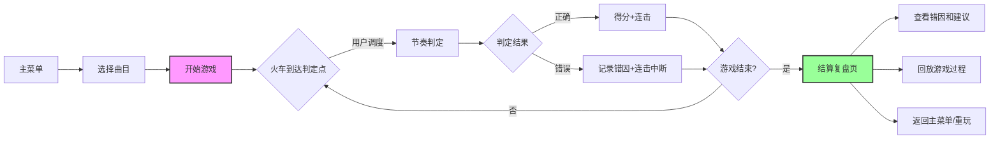

## 1. 产品概述

节拍火车调度员是一款面向音乐教学的节奏训练浏览器游戏，通过火车调度的游戏化方式帮助学生理解和掌握复杂的节拍（特别是切分音）。游戏能够处理不完美的真实教学数据，提供精确的节奏判定和可操作的修正建议。

- 目标用户：音乐老师和学生
- 核心价值：将抽象的节拍概念转化为直观的火车调度游戏，解决切分音等复杂节奏的教学难点
- 差异化：能够处理"脏数据"（备注、缺失字段、延迟），提供精确而非模糊的错因分析

## 2. 核心 Features

### 2.1 用户角色

| 角色 | 注册方式 | 核心权限 |
|------|----------|----------|
| 音乐老师/学生 | 无需注册，直接使用 | 游戏游玩、数据导入、复盘分析 |

### 2.2 Feature Module

1. **主菜单页**：曲目选择、游戏设置、帮助说明
2. **游戏页面**：节奏判定区、火车调度区、控制面板（暂停/重开/复盘）
3. **结算复盘页**：得分详情、错因分析、修正建议、回放功能

### 2.3 Page Details

| 页面名称 | 模块名称 | Feature description |
|----------|----------|---------------------|
| 主菜单页 | 曲目选择 | 显示可用曲目列表，支持预览和难度标识 |
| 主菜单页 | 游戏设置 | 调整判定灵敏度、显示/隐藏备注、启用容错模式 |
| 游戏页面 | 节拍轨道 | 动态显示节拍线和音符火车，支持备注显示 |
| 游戏页面 | 调度选择区 | 用户选择火车轨道，调度决策直接影响游戏进程 |
| 游戏页面 | 控制面板 | 实时暂停、重开本局、随时进入复盘模式 |
| 游戏页面 | 实时反馈 | 精确显示节奏偏差（早/晚多少毫秒）、当前连击数 |
| 结算复盘页 | 得分统计 | 总分、准确率、连击数、漏拍数详细统计 |
| 结算复盘页 | 错因分析 | 按错误类型分类统计：切分音漏拍、速度突变、连击误判、数据异常 |
| 结算复盘页 | 修正建议 | 针对每种错误类型提供可操作的练习建议 |
| 结算复盘页 | 回放功能 | 逐帧回放游戏过程，支持跳到错误位置 |

## 3. 核心流程

用户从主菜单选择曲目，进入游戏后通过键盘或点击进行火车调度，游戏过程中可随时暂停、重开或复盘。游戏结束后在结算页查看详细的错因分析和修正建议，支持回放巩固学习。

## 4. User Interface Design

### 4.1 Design Style

- **主色调**：深蓝色（#1a365d）作为主色，代表专业和稳重；橙红色（#ed8936）作为强调色，用于错误提示和关键操作
- **辅助色**：绿色（#48bb78）表示正确，黄色（#ecc94b）表示警告/切分音，灰色系用于中性信息
- **按钮风格**：圆角矩形，轻微阴影，悬停时有缩放和颜色变化效果
- **字体**：标题使用 Noto Sans SC Bold，正文使用 Noto Sans SC Regular，数字使用等宽字体
- **布局风格**：游戏区采用横向时间轴布局，模拟火车轨道的延伸感；信息区采用卡片式布局
- **Icon风格**：线性图标配合emoji，保持简洁直观

### 4.2 Page Design Overview

| Page Name | Module Name | UI Elements |
|-----------|-------------|-------------|
| 主菜单页 | 曲目选择 | 卡片式曲目列表，显示难度星级、时长、切分音数量；hover时有上浮动画 |
| 游戏页面 | 节拍轨道 | 横向时间轴，节拍线垂直向下移动；火车用不同颜色和形状区分音符类型；切分音有特殊标记 |
| 游戏页面 | 调度选择区 | 底部轨道选择按钮，大尺寸便于操作，选中时有高亮和动画反馈 |
| 游戏页面 | 控制面板 | 右上角紧凑布局，图标按钮，悬停显示tooltip |
| 结算复盘页 | 错因分析 | 错误类型用不同颜色标识，时间轴标记错误位置，可点击展开详情 |
| 结算复盘页 | 修正建议 | 分点列出，每条建议配具体练习方法，可折叠展开 |

### 4.3 Responsiveness

- **桌面优先**：游戏主要在桌面端使用，确保1280px以上分辨率的最佳体验
- **平板适配**：调整按钮尺寸和间距，确保触摸操作友好
- **触控优化**：所有可点击元素最小尺寸44x44px，关键操作按钮适当放大

### 4.4 动画与交互

- **火车入场动画**：从右侧滑入，带有轻微的速度感
- **判定反馈**：正确时绿色波纹扩散，错误时红色抖动效果
- **切分音强调**：到达判定区前有黄色闪烁预警
- **暂停/继续**：平滑的淡入淡出过渡
- **回放控制**：时间轴可拖动，播放时有进度指示
