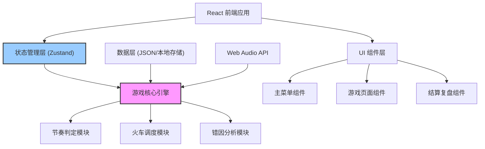
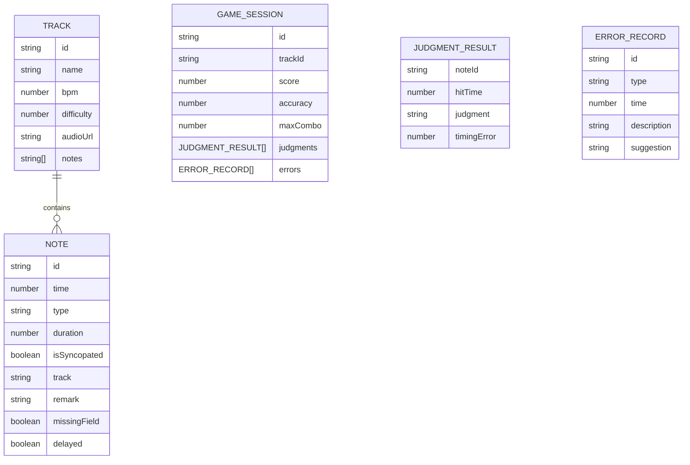

## 1. 架构设计



## 2. 技术描述

- **前端框架**: React@18 + TypeScript + Vite
- **状态管理**: Zustand (轻量级，适合游戏状态管理)
- **样式方案**: TailwindCSS@3 + CSS Modules
- **音频处理**: Web Audio API (内置，无需额外依赖)
- **路由**: React Router v6
- **动画**: Framer Motion (用于复杂动画效果)
- **数据存储**: LocalStorage + JSON 文件（曲目数据）
- **构建工具**: Vite

## 3. 目录结构

```
src/
├── components/          # 组件目录
│   ├── Menu/           # 主菜单相关组件
│   ├── Game/           # 游戏页面相关组件
│   │   ├── BeatTrack.tsx      # 节拍轨道
│   │   ├── Train.tsx          # 火车组件
│   │   ├── ControlPanel.tsx   # 控制面板
│   │   └── DispatchArea.tsx   # 调度选择区
│   └── Result/         # 结算复盘相关组件
├── hooks/              # 自定义 Hooks
│   ├── useGameEngine.ts       # 游戏引擎 Hook
│   ├── useRhythmJudge.ts      # 节奏判定 Hook
│   └── useAudioPlayer.ts      # 音频播放 Hook
├── store/              # 状态管理
│   └── gameStore.ts           # 游戏状态 Store
├── types/              # TypeScript 类型定义
│   └── index.ts               # 核心类型定义
├── data/               # 样例数据
│   ├── tracks/                # 曲目数据目录
│   └── sampleTracks.ts        # 样例曲目
├── utils/              # 工具函数
│   ├── rhythmUtils.ts         # 节奏计算工具
│   ├── errorAnalysis.ts       # 错因分析工具
│   └── dataCleaner.ts         # 脏数据处理工具
├── pages/              # 页面组件
│   ├── MenuPage.tsx
│   ├── GamePage.tsx
│   └── ResultPage.tsx
└── App.tsx             # 应用入口
```

## 4. 路由定义

| Route | 页面 | 用途 |
|-------|------|------|
| / | 主菜单页 | 曲目选择、游戏设置 |
| /game/:trackId | 游戏页面 | 核心游戏玩法 |
| /result/:trackId | 结算复盘页 | 得分统计、错因分析、回放 |

## 5. 核心数据模型

### 5.1 数据模型定义



### 5.2 TypeScript 类型定义

```typescript
// 音符类型
interface Note {
  id: string;
  time: number;           // 时间点（毫秒）
  type: 'normal' | 'syncopated' | 'rest';
  duration?: number;      // 可选：持续时间
  track: number;          // 轨道编号 1-4
  isSyncopated: boolean;  // 是否切分音
  remark?: string;        // 备注（脏数据）
  missingField?: boolean; // 是否缺失字段（脏数据）
  delayed?: boolean;      // 是否延迟到达（脏数据）
  delayAmount?: number;   // 延迟毫秒数
}

// 曲目数据
interface Track {
  id: string;
  name: string;
  bpm: number;
  difficulty: 1 | 2 | 3 | 4 | 5;
  audioUrl?: string;
  notes: Note[];
  hasDirtyData: boolean;  // 是否包含脏数据
  description?: string;
}

// 判定结果
type JudgmentType = 'perfect' | 'great' | 'good' | 'miss' | 'early' | 'late';

interface JudgmentResult {
  noteId: string;
  hitTime: number;
  judgment: JudgmentType;
  timingError: number;    // 时间偏差（毫秒）
  isSyncopated: boolean;
  correctTrack: number;
  selectedTrack?: number;
}

// 错误记录
type ErrorType = 'syncopation_miss' | 'speed_change' | 'combo_break' | 'wrong_track' | 'data_anomaly';

interface ErrorRecord {
  id: string;
  type: ErrorType;
  time: number;
  description: string;
  suggestion: string;
  noteId?: string;
}

// 游戏状态
interface GameState {
  status: 'idle' | 'playing' | 'paused' | 'finished' | 'reviewing';
  currentTime: number;
  score: number;
  combo: number;
  maxCombo: number;
  judgments: JudgmentResult[];
  errors: ErrorRecord[];
  selectedTrack: number | null;
  settings: GameSettings;
}

interface GameSettings {
  sensitivity: 'easy' | 'normal' | 'hard';
  showRemarks: boolean;
  toleranceMode: boolean;
}
```

## 6. 核心算法模块

### 6.1 节奏判定算法

```typescript
// 判定窗口配置（毫秒）
const JUDGMENT_WINDOWS = {
  easy: { perfect: 80, great: 150, good: 250 },
  normal: { perfect: 50, great: 100, good: 200 },
  hard: { perfect: 30, great: 80, good: 150 }
};

// 切分音特殊处理：判定窗口缩小20%，要求更高精度
const SYNCOPATION_PENALTY = 0.8;
```

### 6.2 错因分析逻辑

| 错误类型 | 触发条件 | 修正建议 |
|----------|----------|----------|
| 切分音漏拍 | 切分音判定为 miss/late/early，且偏差 > 100ms | 1. 提前半拍准备<br>2. 用节拍器练切分节奏<br>3. 大声数拍强调反拍 |
| 速度突变 | 连续3个音符的时间偏差方向一致且逐渐增大 | 1. 保持稳定的身体律动<br>2. 用节拍器跟练<br>3. 练习时放慢速度 |
| 连击误判 | 连击 > 5 后出现失误，且偏差 < 50ms | 1. 注意不要抢拍<br>2. 保持放松，不要过度紧张<br>3. 每组连击后做一次深呼吸 |
| 调度错误 | 选择了错误的轨道 | 1. 提前观察火车颜色<br>2. 眼睛看前方2-3个音符<br>3. 手指预先放在对应键位 |
| 数据异常 | 遇到缺失字段/延迟的音符 | 1. 保持冷静不要慌乱<br>2. 按原节奏继续<br>3. 结束后查看备注说明 |

### 6.3 脏数据处理

- **缺失字段**：使用默认值填充，在界面上显示警告标识
- **延迟到达**：动态调整判定窗口，记录数据异常错误
- **备注信息**：可选显示，不影响判定逻辑
