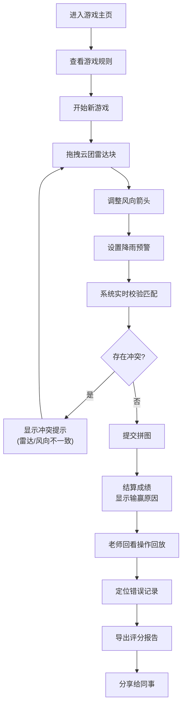

## 1. 产品概述
气象雷达拼图赛是一款面向地理科普教育的互动拼图游戏，帮助学生理解云团、风向与降雨预警之间的关联，同时为老师提供便捷的复核和评分工具。
- 解决问题：减轻地理科普老师反复核对雷达块和评分报告的工作负担，让学生通过实操理解气象原理
- 目标用户：地理科普学生（玩家）、地理科普老师（评审）
- 核心价值：将抽象的气象知识转化为可操作的拼图游戏，实现教学与评估一体化

## 2. 核心 Features

### 2.1 用户角色
| 角色 | 登录方式 | 核心权限 |
|------|----------|----------|
| 学生玩家 | 直接进入 | 进行拼图游戏、查看成绩和错因 |
| 科普老师 | 直接进入 | 查看玩家操作回放、生成评分报告 |

### 2.2 功能模块
1. **游戏主页**：游戏介绍、开始游戏、历史记录入口
2. **拼图游戏页**：雷达块拖拽区、风向箭头调整、预警设置区、实时匹配反馈
3. **结算页**：成绩展示、输赢原因分析、错因列表
4. **回放与报告页**：操作步骤回放、错因详情、评分报告导出

### 2.3 页面详情
| 页面名称 | 模块名称 | 功能描述 |
|----------|----------|----------|
| 游戏主页 | 英雄区 | 游戏标题、气象主题动效、开始按钮 |
| 游戏主页 | 规则说明 | 拼图规则、评分标准、操作指南 |
| 拼图游戏页 | 雷达拼图区 | 云团雷达块拖拽放置、位置校验、冲突提示 |
| 拼图游戏页 | 风向控制区 | 风向箭头旋转调整、方向正误实时反馈 |
| 拼图游戏页 | 预警设置区 | 降雨预警等级选择、时机判断、过早/过晚提示 |
| 拼图游戏页 | 匹配状态面板 | 实时显示各模块匹配度、冲突告警 |
| 结算页 | 成绩总览 | 最终得分、匹配率、评级 |
| 结算页 | 错因分析 | 云团错配位置、风向反判记录、预警过早详情 |
| 结算页 | 操作回放入口 | 进入回看模式 |
| 回放与报告页 | 步骤回放 | 逐帧回看每一步操作、高亮触发匹配的时刻 |
| 回放与报告页 | 错因详情 | 点击错误项定位到具体操作记录 |
| 回放与报告页 | 报告导出 | 生成可分享的评分报告（含雨量推演口径） |

## 3. 核心流程

### 3.1 游戏主流程
学生进入游戏 → 阅读规则 → 开始拼图 → 拖拽云团雷达块 → 调整风向箭头 → 设置降雨预警 → 系统实时校验匹配 → 提交拼图 → 查看成绩与错因 → 老师回看操作回放 → 导出评分报告

### 3.2 流程图

## 4. 用户界面设计

### 4.1 设计风格
- **主色调**：深邃蓝 (#0A1628) 代表夜空与气象观测
- **辅助色**：青色 (#00D4FF) 代表雷达扫描、橙红 (#FF6B35) 代表预警
- **按钮风格**：圆角矩形、微立体效果、悬停发光动效
- **字体**：标题使用 Orbitron（科技感），正文使用 Noto Sans SC（清晰易读）
- **布局风格**：卡片式布局、网格系统、分层阴影
- **视觉元素**：雷达扫描动效、云层粒子动画、风向箭头动效

### 4.2 页面设计概览
| 页面名称 | 模块名称 | UI 元素 |
|----------|----------|----------|
| 游戏主页 | 英雄区 | 雷达背景动画、发光标题、脉冲式开始按钮 |
| 拼图游戏页 | 雷达拼图区 | 网格底图、可拖拽雷达块、放置高亮、错配红色边框 |
| 拼图游戏页 | 风向控制区 | 圆形罗盘、可旋转箭头、方向指示灯 |
| 拼图游戏页 | 预警设置区 | 预警等级滑块、时间轴、预警触发标记 |
| 结算页 | 错因分析 | 时间轴式错误列表、点击展开详情、颜色编码错误类型 |
| 回放与报告页 | 步骤回放 | 播放控制条、关键帧标记、操作轨迹线 |

### 4.3 响应式设计
- 桌面端优先设计，保证大屏操作体验
- 平板端适配：调整拼图区尺寸，优化触控拖拽
- 移动端：简化界面，重点保障核心操作流程

## 5. 错误反馈机制

### 5.1 云团错配
- 错误类型：位置偏移、形状不匹配
- 反馈方式：红色边框高亮、震动动效、提示正确位置虚影
- 影响：严重扣分，需返工修正

### 5.2 风向反判
- 错误类型：方向完全相反、角度偏差过大
- 反馈方式：箭头变红闪烁、显示正确方向参考线
- 关联：可点击跳转至具体操作记录

### 5.3 预警过早/过晚
- 错误类型：时机判断错误
- 反馈方式：时间轴上标记正确时机、显示时间差
- 关联：雨量推演口径说明

### 5.4 数据冲突
- 场景：雷达块数据与风向箭头来自不同数据源产生冲突
- 处理方式：同时显示两套数据、标注冲突点、不做自动合并，由玩家或老师判断
