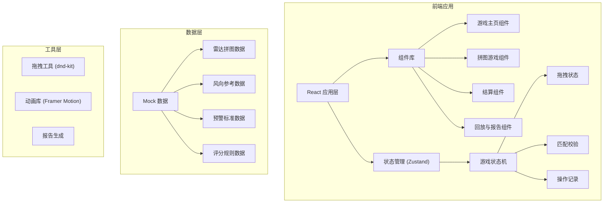
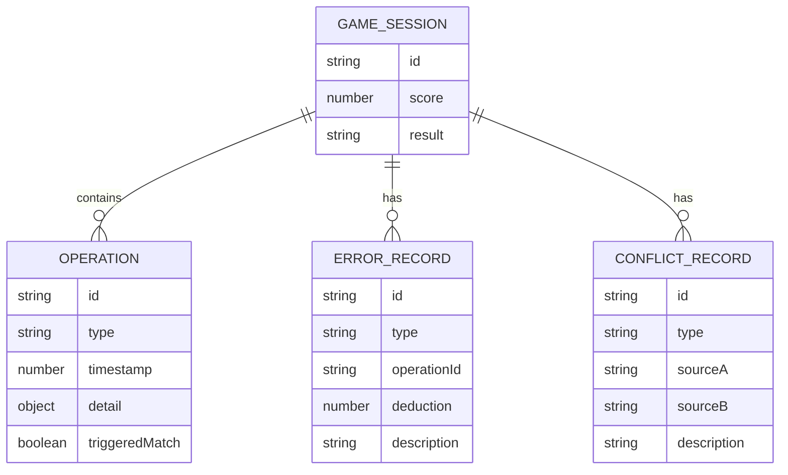

## 1. 架构设计



## 2. 技术栈说明

- **前端框架**: React@18 + TypeScript
- **构建工具**: Vite
- **样式方案**: Tailwind CSS@3
- **状态管理**: Zustand
- **拖拽交互**: @dnd-kit/core + @dnd-kit/sortable
- **动画效果**: framer-motion
- **路由管理**: react-router-dom
- **图标**: lucide-react

## 3. 路由定义

| 路由 | 页面 | 功能 |
|------|------|------|
| / | 游戏主页 | 游戏介绍、开始游戏入口 |
| /game | 拼图游戏页 | 核心游戏玩法界面 |
| /result | 结算页 | 成绩展示、错因分析 |
| /replay | 回放与报告页 | 操作回放、评分报告导出 |

## 4. 状态管理设计

### 4.1 Game Store
```typescript
interface GameState {
  phase: 'idle' | 'playing' | 'finished';
  score: number;
  radarBlocks: RadarBlock[];
  windDirection: number;
  warningLevel: WarningLevel;
  warningTime: number;
  operationHistory: OperationRecord[];
  errors: ErrorRecord[];
  conflicts: ConflictRecord[];
}

interface RadarBlock {
  id: string;
  type: 'cloud' | 'rain' | 'storm';
  position: { x: number; y: number };
  targetPosition: { x: number; y: number };
  isPlaced: boolean;
  isCorrect: boolean | null;
  dataSource: 'radar-a' | 'radar-b';
}

interface OperationRecord {
  id: string;
  timestamp: number;
  type: 'drag' | 'rotate' | 'warning';
  detail: object;
  triggeredMatch: boolean;
}

interface ErrorRecord {
  id: string;
  type: 'cloud-mismatch' | 'wind-reverse' | 'warning-early' | 'warning-late';
  operationId: string;
  description: string;
  severity: 'high' | 'medium' | 'low';
  deduction: number;
}

interface ConflictRecord {
  id: string;
  type: 'radar-wind-mismatch';
  sourceA: string;
  sourceB: string;
  description: string;
}
```

## 5. 核心模块设计

### 5.1 拼图匹配引擎
- 输入：雷达块位置、风向角度、预警设置
- 输出：匹配结果、错误记录、冲突记录
- 规则：基于气象学原理的匹配算法

### 5.2 操作回放系统
- 记录每一步操作的时间戳和状态
- 支持逐帧播放、暂停、跳转
- 高亮触发匹配的关键操作

### 5.3 评分报告生成
- 自动计算各项得分
- 生成结构化报告
- 支持导出为文本/JSON格式

## 6. 数据模型

### 6.1 ER 图


## 7. 关键技术点

### 7.1 拖拽交互
- 使用 dnd-kit 实现雷达块拖拽
- 支持碰撞检测和放置校验
- 拖拽过程实时显示匹配状态

### 7.2 实时匹配校验
- 每次操作后触发校验
- 使用防抖优化性能
- 可视化显示匹配度

### 7.3 动画效果
- 雷达扫描动画（CSS）
- 拖拽反馈动画（Framer Motion）
- 错误提示震动效果

### 7.4 报告导出
- 生成包含雨量推演口径的详细报告
- 支持复制到剪贴板
- 结构化数据便于分享
