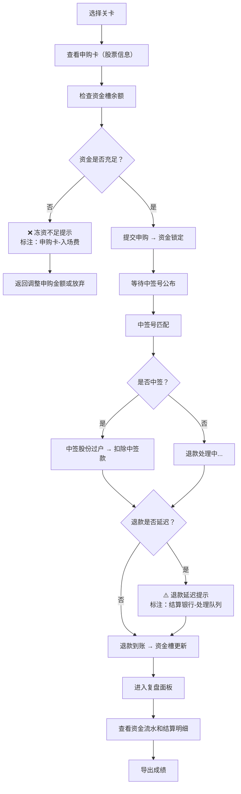

## 1. 产品概述

"港股打新排队局"是一款面向投资者教育的互动式原型，通过关卡化游戏形式教授港股打新的完整流程，重点解决申购卡、资金槽、中签号三者对齐的理解难点。

- **核心目标**：让投资者教育老师能够在课堂上使用此原型进行试玩演示，帮助学员理解资金锁定、中签结算、退款等关键环节
- **目标用户**：投资者教育老师、港股打新学习者
- **核心价值**：通过可视化的"排队"过程，直观展示冻资不足、退款延迟等常见问题的发生原因和影响

## 2. 核心功能

### 2.1 用户角色

| 角色 | 注册方式 | 核心权限 |
|------|----------|----------|
| 学员/老师 | 无需注册，直接使用 | 选择关卡、进行申购操作、查看复盘、导出成绩 |

### 2.2 功能模块

1. **关卡选择页面**：3个难度递进的关卡，每个关卡聚焦不同的知识点
2. **游戏主界面**：申购卡区、资金槽区、中签号区、结算结果区
3. **复盘面板**：完整记录每一步操作、资金变化、问题发生点
4. **成绩导出**：导出操作记录和结算明细为文本文件

### 2.3 页面详情

| 页面名称 | 模块名称 | 功能描述 |
|----------|----------|----------|
| 关卡选择页 | 关卡卡片 | 展示3个关卡，标注难度和核心知识点，点击进入对应关卡 |
| 关卡选择页 | 规则说明 | 简要说明港股打新基本规则和操作指南 |
| 游戏主界面 | 申购卡区 | 展示可申购的股票卡片，包含股票名称、申购价、入场费、申购截止时间 |
| 游戏主界面 | 资金槽区 | 实时显示可用资金、已冻结资金、待收退款，用进度条直观展示 |
| 游戏主界面 | 中签号区 | 展示配号列表、中签号公布、中签结果匹配 |
| 游戏主界面 | 操作区 | 申购按钮、确认提交、下一步等操作按钮 |
| 游戏主界面 | 问题提示区 | 醒目展示冻资不足、退款延迟等问题，标注问题来源材料 |
| 复盘面板 | 时间线 | 按时间顺序展示每一步操作和系统处理 |
| 复盘面板 | 资金流水 | 完整的资金变动记录，包含锁定、扣款、退款、手续费 |
| 复盘面板 | 成绩统计 | 申购成功率、资金利用率、问题发生率 |
| 复盘面板 | 导出按钮 | 导出完整操作记录和结算明细 |

## 3. 核心流程

## 4. 用户界面设计

### 4.1 设计风格

- **主色调**：深灰色背景 (#1a1a2e) + 金融绿 (#00d09c) 表示正常/成功 + 警示红 (#ff4757) 表示问题 + 警告黄 (#ffa502) 表示警告
- **按钮风格**：直角矩形，粗边框，点击有明显的按压效果
- **字体**：等宽字体 (JetBrains Mono) 用于数字和代码，无衬线字体用于正文，突出"排队"的秩序感
- **布局风格**：三栏式布局（左：申购卡，中：资金槽，右：中签号），底部操作区，顶部问题提示条
- **图标风格**：使用 emoji 增强可读性（💰 资金、🎫 申购卡、🎲 中签号、⚠️ 警告、❌ 错误）

### 4.2 页面设计概述

| 页面名称 | 模块名称 | UI 元素 |
|----------|----------|----------|
| 关卡选择页 | 关卡卡片 | 卡片悬停上浮效果，关卡编号大字体展示，知识点标签 |
| 游戏主界面 | 申购卡区 | 卡片堆叠效果，选中卡片高亮边框，关键信息红色标注 |
| 游戏主界面 | 资金槽区 | 液态进度条效果，资金变化时数字滚动动画，冻结部分半透明 |
| 游戏主界面 | 中签号区 | 表格展示配号，中签号闪动高亮，匹配动画 |
| 游戏主界面 | 问题提示区 | 固定在顶部的醒目横幅，红色背景闪烁，问题来源材料用箭头指向对应区域 |
| 复盘面板 | 时间线 | 垂直时间线，不同颜色节点区分操作类型，可展开查看详情 |
| 复盘面板 | 资金流水 | 表格斑马纹，负数红色，正数绿色 |

### 4.3 响应式

- 桌面端优先设计，三栏布局
- 平板端：左右两栏，中签号区移到下方
- 移动端：单栏堆叠，关键信息卡片化展示

### 4.4 问题醒目展示机制

- **冻资不足**：顶部红色闪烁横幅，文字"❌ 冻资不足！"，箭头指向申购卡的"入场费"字段和资金槽的"可用余额"，对比显示两者差额
- **退款延迟**：橙色警告横幅，文字"⚠️ 退款延迟到账！"，标注"预计延迟 T+2 日"，箭头指向资金槽的"待收退款"区域和结算银行图标
- **中签号缺列**：红色边框高亮中签号表格，在缺失列的位置显示红色占位符和文字"此处缺少XX数据列"
- **手续费晚到**：紫色提示条，文字"ℹ️ 手续费将在T+1日扣除"，在资金流水中用虚线标注预扣金额
