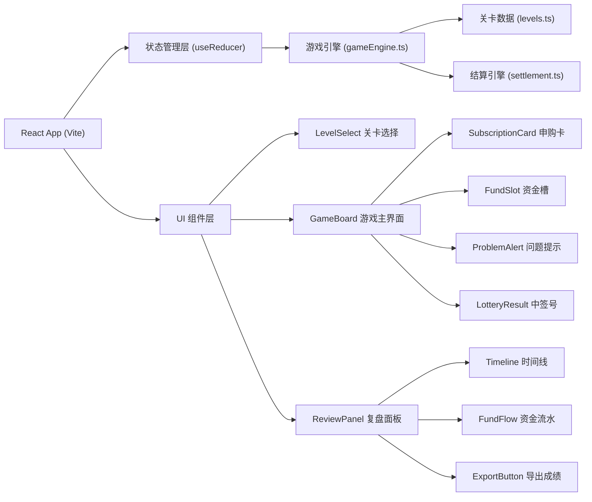
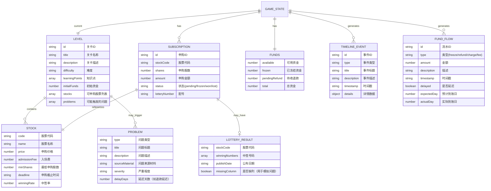

## 1. 架构设计



## 2. 技术描述

- **前端框架**: React@18 + TypeScript
- **构建工具**: Vite@5
- **样式方案**: Tailwind CSS@3 + CSS Variables（主题管理）
- **状态管理**: React useReducer + Context（轻量级，适合单页应用）
- **图标**: Lucide React（配合emoji使用）
- **数据**: 内置Mock数据，无需后端
- **导出功能**: 原生Blob + FileSaver（纯前端实现）

## 3. 路由定义

| Route | 页面组件 | 用途 |
|-------|----------|------|
| `/` | LevelSelect | 关卡选择页面 |
| `/game/:levelId` | GameBoard | 游戏主界面，根据levelId加载对应关卡 |
| `/review/:levelId` | ReviewPanel | 复盘面板，展示结算明细 |

## 4. 数据模型

### 4.1 数据模型定义



### 4.2 核心类型定义

```typescript
// types/index.ts

export type LevelId = 'level1' | 'level2' | 'level3';

export interface Level {
  id: LevelId;
  title: string;
  description: string;
  difficulty: '入门' | '进阶' | '挑战';
  learningPoints: string[];
  initialFunds: number;
  stocks: Stock[];
  possibleProblems: ProblemConfig[];
}

export interface Stock {
  code: string;
  name: string;
  price: number;
  admissionFee: number;
  minShares: number;
  maxShares: number;
  deadline: string;
  winningRate: number;
  lotteryNumbers: string[];
  winningNumbers: string[];
  missingColumn?: 'quantity' | 'price' | 'fee' | null;
}

export type ProblemType = 'insufficient_funds' | 'refund_delay' | 'missing_column' | 'fee_delay';
export type ProblemSeverity = 'error' | 'warning' | 'info';

export interface ProblemConfig {
  type: ProblemType;
  title: string;
  description: string;
  sourceMaterial: string;
  severity: ProblemSeverity;
  delayDays?: number;
  triggerCondition: (state: GameState) => boolean;
}

export interface Funds {
  available: number;
  frozen: number;
  pendingRefund: number;
  total: number;
}

export interface Subscription {
  id: string;
  stockCode: string;
  shares: number;
  amount: number;
  fee: number;
  status: 'pending' | 'frozen' | 'won' | 'lost' | 'cancelled';
  lotteryNumber: string;
  wonShares?: number;
}

export type EventType = 'subscribe' | 'freeze' | 'lottery_publish' | 'win' | 'lose' | 'refund' | 'fee_charge' | 'problem';

export interface TimelineEvent {
  id: string;
  type: EventType;
  title: string;
  description: string;
  timestamp: string;
  day: number;
  problem?: ProblemConfig;
  details?: Record<string, unknown>;
}

export type FundFlowType = 'freeze' | 'unfreeze' | 'refund' | 'charge' | 'fee' | 'dividend';

export interface FundFlow {
  id: string;
  type: FundFlowType;
  amount: number;
  balance: number;
  description: string;
  timestamp: string;
  day: number;
  delayed: boolean;
  expectedDay: number;
  actualDay: number;
}

export interface GameState {
  levelId: LevelId | null;
  currentDay: number;
  phase: 'select' | 'subscribe' | 'frozen' | 'lottery' | 'settlement' | 'review';
  funds: Funds;
  subscriptions: Subscription[];
  timeline: TimelineEvent[];
  fundFlows: FundFlow[];
  activeProblem: ProblemConfig | null;
  statistics: {
    totalSubscriptions: number;
    winningCount: number;
    problemCount: number;
    fundUtilizationRate: number;
  };
}
```

## 5. 核心模块设计

### 5.1 游戏状态管理 (useReducer)

```typescript
// store/gameReducer.ts

type GameAction =
  | { type: 'START_LEVEL'; payload: LevelId }
  | { type: 'SUBSCRIBE'; payload: { stockCode: string; shares: number } }
  | { type: 'NEXT_DAY' }
  | { type: 'CONFIRM_PROBLEM' }
  | { type: 'GO_TO_REVIEW' }
  | { type: 'RESET_GAME' };

export function gameReducer(state: GameState, action: GameAction): GameState {
  switch (action.type) {
    case 'START_LEVEL':
      return initializeLevel(action.payload);
    case 'SUBSCRIBE':
      return handleSubscription(state, action.payload);
    case 'NEXT_DAY':
      return advanceDay(state);
    case 'CONFIRM_PROBLEM':
      return { ...state, activeProblem: null };
    case 'GO_TO_REVIEW':
      return { ...state, phase: 'review' };
    case 'RESET_GAME':
      return getInitialState();
    default:
      return state;
  }
}
```

### 5.2 结算引擎 (settlement.ts)

核心功能：
- 资金锁定计算：`calculateFreezeAmount(subscription)`
- 中签匹配：`matchWinningNumbers(lotteryNumber, winningNumbers)`
- 退款计算：`calculateRefund(subscription, isDelayed)`
- 手续费计算：`calculateFee(amount, isDelayed)`
- 问题检测：`detectProblems(state, possibleProblems)`

### 5.3 关卡数据 (levels.ts)

三个关卡设计：
1. **Level 1：入门关 - 正常打新流程**
   - 初始资金：100,000 港币
   - 2只可申购股票，中签率适中
   - 无问题触发，学习完整流程

2. **Level 2：进阶关 - 冻资不足陷阱**
   - 初始资金：50,000 港币
   - 3只可申购股票，其中1只入场费较高
   - 触发问题：冻资不足，需选择申购策略

3. **Level 3：挑战关 - 多重问题叠加**
   - 初始资金：80,000 港币
   - 3只可申购股票
   - 触发问题：退款延迟 + 手续费晚到 + 中签号缺列
