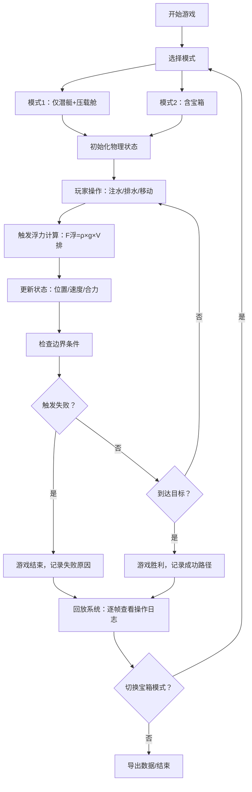

## 1. 产品概述

"浮力潜艇寻宝"是一款面向物理教师的浮力教学演示游戏，通过可视化潜艇、压载舱和宝箱的交互，直观展示阿基米德原理和浮力计算公式。玩家每一次操作都会实时影响浮力计算，游戏结束后可回放查看每一步如何影响最终结果。

- **核心目标**：让物理教学更加直观，让学生理解浮力计算的实际应用
- **目标用户**：物理教师、学生、物理爱好者
- **产品价值**：将抽象的物理公式转化为可交互的游戏体验，通过失败回放和操作日志深化理解

## 2. 核心功能

### 2.1 用户角色

| 角色 | 注册方式 | 核心权限 |
|------|----------|----------|
| 物理教师 | 无需注册，直接使用 | 游戏操作、结果回放、数据导出、宝箱补录 |
| 学生 | 无需注册，直接使用 | 游戏操作、结果查看 |

### 2.2 功能模块

1. **游戏主界面**：2D侧视图海洋场景，潜艇可视化，浮力/重力实时仪表盘
2. **操作控制面板**：压载舱注水/排水、前进/后退、下潜/上浮控制按钮
3. **浮力计算面板**：实时显示排开水量、密度、浮力、重力、合力计算公式
4. **边界样例系统**：密度突变区域、氧气倒计时、碰撞检测边界
5. **操作日志系统**：记录每一步操作触发的浮力计算变化
6. **结果回放系统**：游戏结束后可逐帧回放，标注失败原因
7. **宝箱补录功能**：第二阶段加入宝箱，对比前后浮力变化明细

### 2.3 页面详情

| 页面名称 | 模块名称 | 功能描述 |
|----------|----------|----------|
| 主游戏页面 | 海洋场景区 | 2D侧视图，显示潜艇位置、水面线、深度标记、危险区域 |
| 主游戏页面 | 潜艇可视化 | 显示潜艇、压载舱水位、宝箱（补录后可见） |
| 主游戏页面 | 实时仪表盘 | 浮力值、重力值、合力值、氧气量、当前深度、水密度 |
| 主游戏页面 | 操作控制区 | 压载舱注水/排水、水平移动、垂直控制按钮 |
| 主游戏页面 | 浮力计算面板 | 实时公式：F浮 = ρ液 × g × V排，各变量当前值 |
| 主游戏页面 | 操作日志区 | 时间线展示每次操作及对应的浮力变化 |
| 结果回放页面 | 时间轴控制 | 可拖动进度条逐帧查看游戏过程 |
| 结果回放页面 | 失败原因标注 | 高亮显示导致失败的关键操作 |
| 结果回放页面 | 数据对比 | 宝箱补录前后的浮力数据对比表格 |
| 设置页面 | 边界样例选择 | 可开启/关闭密度突变、氧气耗尽、碰撞误判等边界条件 |
| 设置页面 | 宝箱补录开关 | 切换"仅潜艇+压载舱"与"含宝箱"两种模式 |

## 3. 核心流程

玩家选择模式 → 开始游戏 → 操作潜艇（注水/排水/移动）→ 每次操作触发浮力重新计算 → 实时显示公式和结果 → 遇到边界条件（密度突变/氧气耗尽/碰撞）→ 游戏结束 → 查看操作日志 → 回放失败关键点 → 切换宝箱模式 → 对比数据差异

## 4. 用户界面设计

### 4.1 设计风格

- **主色调**：深海蓝（#0A2463）作为主色，代表海洋；金色（#E9B44C）作为强调色，代表宝箱和重要数据
- **辅助色**：浅蓝（#3E92CC）表示水和浮力，橙红（#D8315B）表示警告和失败
- **按钮风格**：圆角矩形（8px），带有轻微3D凸起效果，操作反馈有按压动画
- **字体**：标题使用 "Orbitron"（科技感等宽字体），正文使用 "Noto Sans SC"，数字显示使用 "JetBrains Mono" 等宽字体
- **布局风格**：左侧游戏主场景（70%宽度），右侧数据面板（30%宽度），底部操作控制条
- **图标风格**：使用 Lucide 图标，统一线性风格，尺寸16-24px

### 4.2 页面设计概览

| 页面名称 | 模块名称 | UI元素 |
|----------|----------|--------|
| 主游戏页面 | 海洋场景区 | 深蓝色渐变背景，水面波纹动画，深度网格线，潜艇SVG，危险区域红色闪烁 |
| 主游戏页面 | 实时仪表盘 | 半透明深色卡片，数值大号等宽字体，进度条带颜色渐变（绿→黄→红） |
| 主游戏页面 | 浮力计算面板 | 公式高亮显示，变量用不同颜色区分，数值实时更新动画 |
| 主游戏页面 | 操作控制区 | 圆形控制按钮，带按压反馈，禁用状态灰度显示 |
| 主游戏页面 | 操作日志区 | 时间线布局，重要操作高亮，可点击跳转到对应帧 |
| 结果回放页面 | 时间轴控制 | 可拖动滑块，播放/暂停按钮，帧步进按钮 |
| 结果回放页面 | 失败标注 | 红色边框高亮，弹出式解释框，公式对比 |
| 结果回放页面 | 数据对比表 | 双色对比行，差异数值标红，影响因素标注 |

### 4.3 响应式设计

- **桌面端优先**：1280px以上宽屏，左右分栏布局
- **平板适配**：768-1280px，改为上下布局，游戏场景在上，数据面板在下
- **触控优化**：按钮最小尺寸48×48px，支持滑动操作控制潜艇方向
- **打印适配**：数据面板和计算结果可单独打印输出

### 4.4 动画与交互

- **潜艇移动**：平滑过渡动画，速度与合力成正比，带轻微摇摆效果
- **压载舱水位**：水位变化带波浪动画，气泡粒子效果
- **浮力变化**：数值变化带有过渡动画，箭头指示变化方向（↑绿色/↓红色）
- **密度突变**：进入突变区域时屏幕闪烁蓝色警告，密度值跳动动画
- **氧气耗尽**：氧气低于20%时红色脉冲警告，伴有倒计时闪烁
- **碰撞检测**：碰撞时红色闪烁，震动反馈，弹出碰撞误判提示框
- **宝箱出现**：补录宝箱时金色光芒动画，数据面板新增行高亮
