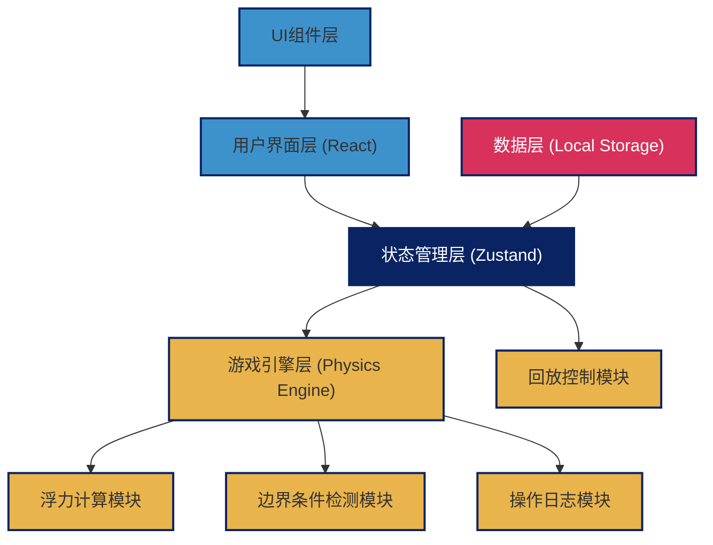
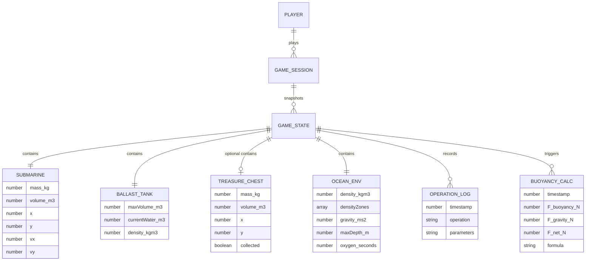

## 1. 架构设计



## 2. 技术描述

- **前端框架**：React@18 + TypeScript + Vite
- **状态管理**：Zustand
- **样式方案**：TailwindCSS@3 + CSS动画
- **图标库**：lucide-react
- **路由**：react-router-dom
- **测试框架**：Vitest
- **数据持久化**：LocalStorage（存储游戏记录和回放数据）
- **2D渲染**：Canvas API + requestAnimationFrame 游戏循环

**核心库选择理由**：
- React 18 提供并发渲染，支持流畅的游戏动画
- Zustand 轻量级状态管理，适合游戏状态快速更新
- Canvas API 提供高性能2D渲染，满足潜艇移动和粒子效果需求
- Vitest 与Vite深度集成，测试运行速度快

## 3. 路由定义

| 路由 | 页面组件 | 用途 |
|------|----------|------|
| `/` | `HomePage` | 游戏主页，模式选择 |
| `/game` | `GamePage` | 主游戏界面 |
| `/replay` | `ReplayPage` | 结果回放界面 |
| `/settings` | `SettingsPage` | 边界条件和模式设置 |

## 4. 数据模型

### 4.1 实体关系图



### 4.2 TypeScript 类型定义

```typescript
// 物理常量
export const GRAVITY = 9.8; // m/s²
export const WATER_DENSITY = 1000; // kg/m³
export const OXYGEN_MAX = 120; // 秒

// 潜艇状态
export interface Submarine {
  mass: number; // kg，不含压载水
  volume: number; // m³
  x: number; // 位置 X
  y: number; // 位置 Y (0为水面，向下为正)
  vx: number; // 水平速度
  vy: number; // 垂直速度
}

// 压载舱
export interface BallastTank {
  maxVolume: number; // m³
  currentWater: number; // m³，当前水量
  waterDensity: number; // kg/m³
}

// 宝箱
export interface TreasureChest {
  id: string;
  mass: number; // kg
  volume: number; // m³
  x: number;
  y: number;
  collected: boolean;
}

// 密度突变区域
export interface DensityZone {
  id: string;
  startY: number; // 起始深度
  endY: number; // 结束深度
  density: number; // 该区域密度
}

// 海洋环境
export interface OceanEnvironment {
  baseDensity: number; // kg/m³
  densityZones: DensityZone[];
  gravity: number; // m/s²
  maxDepth: number; // m
  oxygenRemaining: number; // 秒
}

// 浮力计算结果
export interface BuoyancyCalculation {
  id: string;
  timestamp: number;
  fluidDensity: number; // ρ
  displacedVolume: number; // V排
  gravity: number; // g
  buoyantForce: number; // F浮 = ρ × g × V排
  gravitationalForce: number; // F重 = m × g
  netForce: number; // F合 = F浮 - F重
  formula: string; // 公式字符串
  trigger: string; // 触发原因
}

// 操作类型
export type OperationType = 
  | 'BALLAST_FILL'
  | 'BALLAST_DRAIN'
  | 'MOVE_LEFT'
  | 'MOVE_RIGHT'
  | 'MOVE_UP'
  | 'MOVE_DOWN'
  | 'COLLECT_TREASURE'
  | 'TICK';

// 操作日志
export interface OperationLog {
  id: string;
  timestamp: number;
  operation: OperationType;
  parameters: Record<string, number | string>;
  buoyancyCalculationId: string;
  description: string;
}

// 边界条件类型
export type BoundaryType = 
  | 'DENSITY_CHANGE'
  | 'OXYGEN_DEPLETED'
  | 'COLLISION'
  | 'EXCEED_MAX_DEPTH'
  | 'SUCCESS';

// 游戏结果
export interface GameResult {
  boundaryType: BoundaryType | null;
  success: boolean;
  message: string;
  timestamp: number;
}

// 游戏状态快照（用于回放）
export interface GameStateSnapshot {
  frame: number;
  submarine: Submarine;
  ballastTank: BallastTank;
  treasureChest: TreasureChest | null;
  environment: OceanEnvironment;
  buoyancy: BuoyancyCalculation;
  operation: OperationLog | null;
  result: GameResult | null;
}

// 游戏会话
export interface GameSession {
  id: string;
  startTime: number;
  endTime: number | null;
  mode: 'BASIC' | 'TREASURE';
  withTreasure: boolean;
  snapshots: GameStateSnapshot[];
  operations: OperationLog[];
  calculations: BuoyancyCalculation[];
  result: GameResult | null;
}

// 游戏设置
export interface GameSettings {
  enableDensityZones: boolean;
  enableOxygen: boolean;
  enableCollision: boolean;
  withTreasure: boolean;
}
```

## 5. 核心模块说明

### 5.1 浮力计算引擎 (`src/physics/buoyancyEngine.ts`)

**核心公式**：F浮 = ρ液 × g × V排

**计算流程**：
1. 根据潜艇位置确定当前水密度（检查密度突变区域）
2. 计算总排开体积 = 潜艇体积 + 压载舱体积（含空气）
3. 计算总质量 = 潜艇质量 + 压载水质量 + 已收集宝箱质量
4. 计算浮力 F浮 = 密度 × 重力加速度 × 排开体积
5. 计算重力 F重 = 总质量 × 重力加速度
6. 计算合力 F合 = F浮 - F重
7. 根据合力更新加速度和速度

### 5.2 游戏状态管理 (`src/store/gameStore.ts`)

使用 Zustand 管理：
- 当前游戏状态（潜艇、压载舱、环境、宝箱）
- 操作日志队列
- 浮力计算历史
- 回放控制状态
- 游戏设置

### 5.3 游戏循环 (`src/hooks/useGameLoop.ts`)

使用 `requestAnimationFrame` 实现：
- 固定时间步长（16ms ≈ 60fps）
- 每次 tick 触发浮力计算
- 更新物理位置
- 检测边界条件
- 记录状态快照

### 5.4 边界检测模块 (`src/physics/boundaryDetector.ts`)

检测以下边界条件：
- **密度突变**：潜艇进入新的密度区域，触发重新计算
- **氧气耗尽**：氧气倒计时归零，游戏失败
- **碰撞误判**：潜艇碰到边界或障碍物，记录误判原因
- **超出最大深度**：潜艇超过允许的最大深度
- **成功到达**：潜艇到达目标位置

### 5.5 回放引擎 (`src/physics/replayEngine.ts`)

- 根据快照序列逐帧恢复游戏状态
- 支持暂停、播放、逐帧前进/后退
- 支持跳转到特定操作点
- 标注失败帧和关键计算点

### 5.6 一致性保证

- 所有计算使用固定时间步长，避免帧率影响
- 随机事件（如密度区域位置）使用可预测种子
- 所有操作和计算都有唯一ID和时间戳
- 提供确定性测试套件，重复运行结果一致
