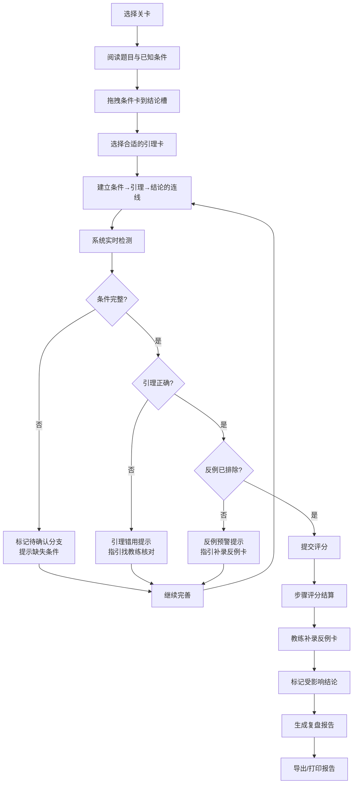

## 1. 产品概述

"数学证明拼板"是一款面向奥数学生和教练的互动学习原型，通过拼板游戏形式帮助学生掌握严谨的数学证明步骤，解决学生写证明时跳步骤、忽略反例的问题。产品强调反例提示、步骤评分和练习报告，可直接用于课堂或培训场景。

- 核心问题：学生写证明常跳步骤、未排除反例，逻辑链条不完整
- 目标用户：奥数学生（学习者）、奥数教练（指导者）
- 产品价值：将抽象的逻辑推理具象化为可操作的拼板游戏，实时反馈逻辑漏洞，生成可复盘的练习报告

## 2. 核心 Features

### 2.1 用户角色

| 角色 | 注册方式 | 核心权限 |
|------|---------|---------|
| 学生 | 无需注册，直接使用 | 进行关卡练习、查看评分、导出报告 |
| 教练 | 无需注册，直接使用 | 查看学生报告、理解评分逻辑、设计题目（扩展） |

### 2.2 功能模块

1. **关卡选择页**：关卡列表、难度标识、完成状态
2. **游戏主界面**：条件卡区、引理卡区、结论槽区、连线交互、实时提示
3. **评分结算页**：步骤评分、反例检测、错误分析、责任人指引
4. **复盘报告页**：逻辑连线图、评分明细、反例追踪、导出功能

### 2.3 页面详情

| 页面名称 | 模块名称 | 功能描述 |
|---------|---------|---------|
| 关卡选择页 | 关卡卡片 | 展示2-3个关卡，显示难度、完成状态、最高分 |
| 关卡选择页 | 关卡详情 | 点击卡片展示题目描述、已知条件、待证结论 |
| 游戏主界面 | 条件卡区 | 拖拽可用的条件卡，标记已使用/未使用 |
| 游戏主界面 | 引理卡区 | 拖拽可用的引理卡，包含正确引理和干扰项 |
| 游戏主界面 | 结论槽区 | 按顺序放置推理步骤，形成完整证明链 |
| 游戏主界面 | 连线交互 | 可视化连接条件→引理→结论的逻辑关系 |
| 游戏主界面 | 实时提示 | 条件缺失标红、引理错用提示、反例预警 |
| 游戏主界面 | 提交按钮 | 完成拼板后提交评分 |
| 评分结算页 | 步骤评分 | 每步独立评分，显示得分依据 |
| 评分结算页 | 反例检测 | 标记未排除的反例，显示反例内容 |
| 评分结算页 | 错误分析 | 区分条件缺失/引理错用/反例未排除三类错误 |
| 评分结算页 | 责任人指引 | 提示下一步该找教练核对还是自查条件 |
| 评分结算页 | 反例补录 | 教练可补录反例卡，标记受影响的结论 |
| 复盘报告页 | 逻辑连线图 | 可视化展示完整的逻辑推理链 |
| 复盘报告页 | 评分明细表 | 每步得分、扣分原因、总分计算 |
| 复盘报告页 | 反例追踪表 | 补录反例前后的结论对比，标记改动 |
| 复盘报告页 | 导出功能 | 导出完整练习报告（PDF/打印） |

## 3. 核心流程

**用户流程描述**：
1. 学生选择关卡，阅读题目背景、已知条件和待证结论
2. 将条件卡拖拽到结论槽的相应位置，选择匹配的引理卡
3. 系统实时检测：条件缺失标记为"待确认"，引理错用提示"找教练核对"
4. 提交后进行评分结算，检测反例是否排除，未排除则提示
5. 教练可补录反例卡，系统自动标记受此反例影响的结论
6. 生成复盘报告，展示逻辑连线图、评分明细、反例追踪
7. 导出完整练习报告用于课堂讲解或课后复习

## 4. 用户界面设计

### 4.1 设计风格

**设计方向**：学术严谨 × 游戏化交互 × 可视化逻辑

- **主色调**：深海蓝 #1e3a5f（代表数学的严谨与深度）
- **辅助色**：琥珀橙 #f59e0b（条件卡）、翡翠绿 #10b981（引理卡）、玫瑰红 #ef4444（错误/反例）、紫罗兰 #8b5cf6（结论槽）
- **中性色**：象牙白 #fafaf9、石板灰 #334155、墨黑 #0f172a
- **字体**：
  - 标题：Noto Serif SC（衬线字体，学术感）
  - 正文：Noto Sans SC（清晰易读）
  - 公式：KaTeX 专业数学字体
- **按钮风格**：圆角微立体，悬停有浮起效果，点击有按压反馈
- **卡片风格**：轻微阴影 + 边框区分类型，拖拽时有半透明跟随效果
- **图标风格**：简洁线性图标，配合数学符号（∵、∴、∃、∀、→）
- **特殊元素**：
  - 逻辑连线：贝塞尔曲线，不同颜色区分正确/错误/待确认
  - 反例标记：红色六边形徽章，带"反例"字样
  - 评分星级：★ 实心代表得分，☆ 空心代表失分

### 4.2 页面设计概述

| 页面名称 | 模块名称 | UI 元素 |
|---------|---------|---------|
| 关卡选择页 | 关卡卡片 | 卡片式布局，左侧难度徽章，中间题目名，右侧分数；悬停放大效果 |
| 游戏主界面 | 三区布局 | 顶部条件卡区（琥珀橙）、中部引理卡区（翡翠绿）、底部结论槽区（紫罗兰）；拖拽连线可视化 |
| 游戏主界面 | 实时提示 | 右下角浮动提示框，根据检测结果显示不同颜色和图标 |
| 评分结算页 | 评分面板 | 步骤列表 + 右侧评分侧栏；每步显示：内容、引用条件、使用引理、得分、扣分原因 |
| 评分结算页 | 反例区块 | 红色边框突出显示，包含反例内容、受影响步骤、处理建议 |
| 复盘报告页 | 逻辑连线图 | SVG 可视化，节点为卡片，连线为推理关系，可交互查看详情 |
| 复盘报告页 | 评分明细表 | 表格展示，包含步骤序、内容、条件、引理、得分、扣分原因 |
| 复盘报告页 | 反例追踪表 | 对比展示补录前/后的结论变化，用删除线和新增标记区分 |

### 4.3 响应式设计

- **设计原则**：桌面优先，平板适配，移动端简化交互
- **桌面端（≥1024px）**：完整三栏布局，拖拽交互流畅
- **平板端（768-1024px）**：上下堆叠布局，保留拖拽功能
- **移动端（<768px）**：简化为点击选择模式，连线用缩略图展示
- **触控优化**：卡片最小触控区域 48×48px，拖拽有振动反馈

## 5. 关卡设计（示例）

### 关卡1：偶数性质证明（入门级）
- **已知条件**：a是偶数，b是偶数
- **待证结论**：a+b是偶数
- **条件卡**：a=2m，b=2n，m,n为整数
- **引理卡**：
  - ✅ 正确：偶数=2×整数，整数加法封闭性
  - ❌ 干扰：偶数×偶数=偶数，奇数+奇数=偶数
- **反例**：（此题无反例，用于教学正确流程）

### 关卡2：三角形全等证明（进阶级）
- **已知条件**：△ABC中，AB=AC，AD⊥BC
- **待证结论**：BD=CD
- **条件卡**：AB=AC，AD⊥BC，AD=AD（公共边）
- **引理卡**：
  - ✅ 正确：HL全等判定，全等三角形对应边相等
  - ❌ 干扰：SSA相似判定，等边对等角
- **反例**：非等腰三角形的高不一定平分底边

### 关卡3：函数单调性证明（挑战级）
- **已知条件**：f(x)=x²，x₁>x₂>0
- **待证结论**：f(x₁)>f(x₂)
- **条件卡**：x₁>x₂>0，x₁²-x₂²=(x₁-x₂)(x₁+x₂)
- **引理卡**：
  - ✅ 正确：不等式同向正数可乘性，因式分解差比较法
  - ❌ 干扰：二次函数开口向上，导数法判定单调性
- **反例**：当x₁,x₂∈(-∞,0)时结论不成立
