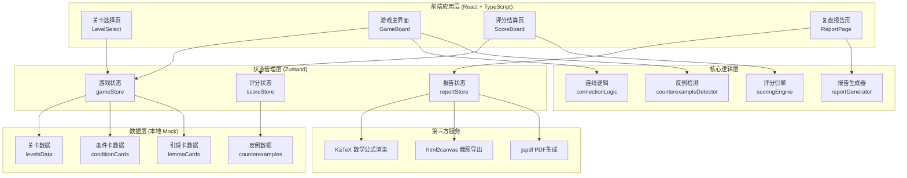
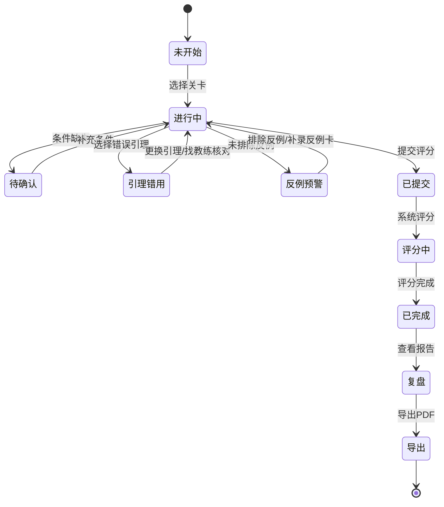

## 1. 架构设计



## 2. 技术选型说明

- **前端框架**：React@18 + TypeScript（类型安全，便于复杂逻辑维护）
- **构建工具**：Vite@5（快速开发，热更新）
- **样式方案**：TailwindCSS@3（原子化CSS，快速实现设计）
- **状态管理**：Zustand（轻量，无需Provider包裹，适合中小型应用）
- **拖拽交互**：@dnd-kit/core + @dnd-kit/sortable（现代拖拽库，性能优秀）
- **数学公式**：KaTeX（轻量快速的LaTeX渲染）
- **图表/连线**：原生SVG + 贝塞尔曲线（自定义连线效果）
- **导出功能**：html2canvas + jspdf（客户端生成PDF）
- **动画**：Framer Motion（流畅的交互动画）

## 3. 目录结构

```
src/
├── components/          # 组件目录
│   ├── layout/         # 布局组件
│   │   ├── Header.tsx
│   │   └── Navigation.tsx
│   ├── game/           # 游戏相关组件
│   │   ├── ConditionCard.tsx      # 条件卡
│   │   ├── LemmaCard.tsx          # 引理卡
│   │   ├── ConclusionSlot.tsx     # 结论槽
│   │   ├── ConnectionLine.tsx     # 逻辑连线
│   │   ├── DragDropArea.tsx       # 拖拽区域
│   │   └── RealTimeHint.tsx       # 实时提示
│   ├── score/          # 评分相关组件
│   │   ├── StepScoreItem.tsx      # 步骤评分项
│   │   ├── CounterexampleAlert.tsx # 反例警告
│   │   └── OwnerGuide.tsx         # 责任人指引
│   └── report/         # 报告相关组件
│       ├── LogicGraph.tsx         # 逻辑连线图
│       ├── ScoreTable.tsx         # 评分明细表
│       ├── CounterexampleTrack.tsx # 反例追踪表
│       └── ExportButton.tsx       # 导出按钮
├── pages/              # 页面组件
│   ├── LevelSelect.tsx
│   ├── GameBoard.tsx
│   ├── ScoreBoard.tsx
│   └── ReportPage.tsx
├── store/              # 状态管理
│   ├── gameStore.ts
│   ├── scoreStore.ts
│   └── reportStore.ts
├── engine/             # 核心逻辑
│   ├── connectionLogic.ts    # 连线验证逻辑
│   ├── scoringEngine.ts      # 评分计算引擎
│   ├── counterexampleDetector.ts # 反例检测
│   └── reportGenerator.ts    # 报告生成
├── data/               # 数据层
│   ├── levels.ts       # 关卡数据
│   ├── conditions.ts   # 条件卡数据
│   ├── lemmas.ts       # 引理卡数据
│   └── counterexamples.ts # 反例数据
├── types/              # 类型定义
│   ├── game.ts
│   ├── score.ts
│   └── report.ts
├── hooks/              # 自定义Hooks
│   ├── useDragDrop.ts
│   ├── useConnection.ts
│   └── useScoring.ts
├── utils/              # 工具函数
│   ├── math.ts         # 数学公式处理
│   ├── export.ts       # 导出工具
│   └── svg.ts          # SVG连线计算
├── styles/             # 全局样式
│   └── globals.css
├── App.tsx
├── main.tsx
└── vite-env.d.ts
```

## 4. 路由定义

| 路由 | 页面名称 | 用途说明 |
|------|---------|---------|
| `/` | 关卡选择页 | 展示可用关卡，选择进入游戏 |
| `/game/:levelId` | 游戏主界面 | 进行拼板操作，建立逻辑连线 |
| `/score/:levelId` | 评分结算页 | 查看评分结果、错误分析、反例提示 |
| `/report/:attemptId` | 复盘报告页 | 查看完整报告、导出PDF |

## 5. 数据模型定义

### 5.1 核心数据类型

```typescript
// 卡片类型
type CardType = 'condition' | 'lemma' | 'conclusion';

// 条件卡
interface ConditionCard {
  id: string;
  type: 'condition';
  content: string;           // 显示内容
  latex?: string;            // LaTeX公式
  isUsed: boolean;           // 是否已使用
  isRequired: boolean;       // 是否为必需条件
  order: number;             // 推荐使用顺序
}

// 引理卡
interface LemmaCard {
  id: string;
  type: 'lemma';
  name: string;              // 引理名称
  description: string;       // 引理描述
  isCorrect: boolean;        // 是否为正确引理
  applicableConditions: string[]; // 适用条件ID列表
  commonMistakes?: string;   // 常见错误说明
}

// 结论槽
interface ConclusionSlot {
  id: string;
  stepNumber: number;        // 步骤序号
  content: string;           // 结论内容
  requiredConditionIds: string[]; // 所需条件ID
  requiredLemmaId: string;   // 所需引理ID
  points: number;            // 此步骤分值
  hasCounterexample: boolean; // 是否存在反例
  counterexampleId?: string; // 关联反例ID
}

// 逻辑连线
interface Connection {
  id: string;
  fromId: string;            // 起点卡片ID
  toId: string;              // 终点卡片ID
  fromType: CardType;
  toType: CardType;
  isCorrect: boolean;        // 连线是否正确
  color: string;             // 连线颜色
}

// 反例
interface Counterexample {
  id: string;
  content: string;           // 反例描述
  affectedStepIds: string[]; // 受影响的步骤ID
  isExcluded: boolean;       // 是否已排除
  excludedBy?: string;       // 由哪个条件/引理排除
}

// 步骤评分
interface StepScore {
  stepId: string;
  stepNumber: number;
  content: string;
  usedConditionIds: string[];
  usedLemmaId: string;
  maxPoints: number;
  earnedPoints: number;
  deductionReason?: string;  // 扣分原因
  errorType?: 'missing_condition' | 'wrong_lemma' | 'counterexample_not_excluded';
  ownerGuide?: string;       // 责任人指引
}

// 游戏状态
interface GameState {
  currentLevelId: string | null;
  conditionCards: ConditionCard[];
  lemmaCards: LemmaCard[];
  conclusionSlots: ConclusionSlot[];
  connections: Connection[];
  placedCards: { slotId: string; cardId: string; cardType: CardType }[];
  counterexamples: Counterexample[];
  isSubmitted: boolean;
}

// 评分结果
interface ScoreResult {
  attemptId: string;
  levelId: string;
  totalPoints: number;
  maxPoints: number;
  stepScores: StepScore[];
  missingConditions: string[];
  wrongLemmas: string[];
  unexcludedCounterexamples: string[];
  completedAt: Date;
}

// 复盘报告
interface PracticeReport {
  attemptId: string;
  levelId: string;
  levelTitle: string;
  studentName?: string;
  completedAt: Date;
  scoreResult: ScoreResult;
  logicConnections: Connection[];
  counterexampleTracks: {
    counterexampleId: string;
    content: string;
    beforeConclusion: string;
    afterConclusion: string;
    affectedSteps: number[];
  }[];
  scoreDetails: StepScore[];
  totalScore: number;
  maxScore: number;
  suggestions: string[];
}
```

### 5.2 状态流转图



## 6. 评分引擎规则

### 6.1 评分计算公式

```
总分 = Σ(步骤得分) - Σ(扣分)

步骤得分计算：
- 条件完整：+ 基础分 × 0.4
- 引理正确：+ 基础分 × 0.3
- 反例排除：+ 基础分 × 0.3

扣分规则：
- 缺失必需条件：- 该步骤全部基础分
- 使用错误引理：- 该步骤基础分 × 0.5
- 未排除反例：- 该步骤基础分 × 0.3，且标记"待确认"
- 跳步骤：- 跳过步骤的基础分 × 1.5
```

### 6.2 错误类型与责任人指引

| 错误类型 | 触发条件 | 扣分比例 | 责任人指引 |
|---------|---------|---------|-----------|
| 条件缺失 | 未放置必需的条件卡 | 100% | 【待确认分支】请自查已知条件，确认是否有遗漏 |
| 引理错用 | 使用了不适用的引理卡 | 50% | 【找教练核对】此引理适用条件不符，请与教练讨论 |
| 反例未排除 | 存在反例但未标记排除 | 30% | 【反例预警】请考虑特殊情况，必要时补录反例卡 |

## 7. 核心算法

### 7.1 连线验证算法

```typescript
function validateConnection(
  fromCard: Card, 
  toCard: Card, 
  levelData: Level
): ValidationResult {
  // 1. 检查连线类型是否合法
  const validTransitions = [
    ['condition', 'lemma'],
    ['condition', 'conclusion'],
    ['lemma', 'conclusion'],
  ];
  
  // 2. 检查条件是否适用于引理
  if (fromCard.type === 'condition' && toCard.type === 'lemma') {
    const lemma = levelData.lemmas.find(l => l.id === toCard.id);
    if (!lemma.applicableConditions.includes(fromCard.id)) {
      return { isCorrect: false, reason: '此条件不适用该引理' };
    }
  }
  
  // 3. 检查引理是否适用于结论
  if (fromCard.type === 'lemma' && toCard.type === 'conclusion') {
    const conclusion = levelData.conclusions.find(c => c.id === toCard.id);
    if (conclusion.requiredLemmaId !== fromCard.id) {
      return { isCorrect: false, reason: '此引理无法推导出该结论' };
    }
  }
  
  return { isCorrect: true };
}
```

### 7.2 反例检测算法

```typescript
function detectCounterexamples(
  placedCards: PlacedCard[],
  connections: Connection[],
  levelData: Level
): CounterexampleDetectionResult {
  const unexcluded: Counterexample[] = [];
  
  for (const counterexample of levelData.counterexamples) {
    // 检查是否有条件/引理排除了此反例
    const isExcluded = placedCards.some(card => 
      counterexample.excludedBy?.includes(card.cardId)
    );
    
    if (!isExcluded) {
      unexcluded.push({
        ...counterexample,
        isExcluded: false,
      });
    }
  }
  
  return {
    hasUnexcluded: unexcluded.length > 0,
    unexcludedCounterexamples: unexcluded,
  };
}
```

## 8. 性能优化策略

1. **组件懒加载**：使用 React.lazy 按需加载评分和报告页面
2. **记忆化计算**：使用 useMemo/useCallback 缓存连线验证和评分计算
3. **虚拟渲染**：关卡选择页使用虚拟列表（如关卡较多时）
4. **动画优化**：使用 transform/opacity 属性做动画，避免重排重绘
5. **状态隔离**：Zustand 状态按领域拆分，避免不必要的重渲染
