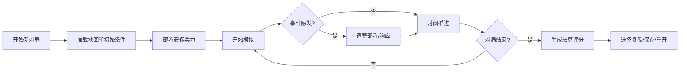

## 1. 产品概述

音乐节安保布阵是一款面向活动安保主管的策略模拟应用，帮助用户在浏览器中模拟音乐节现场的安保兵力部署，通过实时人流模拟和风险评估，训练用户应对出口拥堵、巡逻空窗、天气突变等突发状况的决策能力。

- 核心目标：将手工判断出口拥堵等安保决策转化为可量化、可复盘的模拟训练
- 目标用户：活动安保主管、应急管理演练人员
- 市场价值：提升安保决策效率，降低人工判断误差，留存决策历史用于培训

## 2. 核心特征

### 2.1 用户角色

| 角色 | 注册方式 | 核心权限 |
|------|----------|----------|
| 安保主管 | 无需注册，本地使用 | 完整游戏功能、历史记录管理、复盘分析 |

### 2.2 功能模块

1. **游戏主界面**：地图渲染、安保兵力部署面板、实时状态监控
2. **人流模拟系统**：基于时间推进的人群流动模拟、出口拥堵计算
3. **事件系统**：出口拥堵、巡逻空窗、天气突变等随机事件触发
4. **控制中心**：开始、暂停、重开、速度调节功能
5. **数据溯源面板**：每条决策关联原始来源（舞台地图、巡逻队、安保报告）
6. **复盘系统**：时间轴回放、决策标记、风险点追溯
7. **结算页面**：风险评分明细、扣分原因、最终评级
8. **历史记录**：本地持久化存储、去重机制、历史对局查询

### 2.3 页面详情

| 页面名称 | 模块名称 | 功能描述 |
|-----------|-------------|---------------------|
| 主游戏页 | 地图渲染区 | 可视化音乐节场地、舞台位置、出口、人流热力图 |
| 主游戏页 | 布阵选择面板 | 选择安保类型（固定岗/巡逻队）、拖拽部署、兵力调整 |
| 主游戏页 | 实时监控面板 | 当前风险等级、拥堵指数、巡逻覆盖率、天气状态 |
| 主游戏页 | 控制栏 | 开始/暂停/重开按钮、游戏速度调节（1x/2x/4x） |
| 主游戏页 | 事件通知栏 | 弹窗显示突发事件、关联原始数据来源 |
| 复盘页面 | 时间轴控制器 | 拖动回放对局过程、关键决策点标记 |
| 复盘页面 | 决策溯源面板 | 点击事件查看原始数据（舞台地图/巡逻记录/安保报告） |
| 结算页面 | 评分明细卡 | 分维度展示风险评分、扣分项、改进建议 |
| 结算页面 | 决策回顾 | 列出本局所有关键决策及其后果 |
| 历史记录页 | 对局列表 | 按时间排序的历史对局、去重显示、搜索过滤 |
| 历史记录页 | 详情查看 | 点击进入对应对局的复盘页面 |

## 3. 核心流程

### 3.1 游戏主流程

用户打开应用 → 选择"新对局" → 加载随机音乐节地图和初始条件 → 部署初始安保兵力 → 开始模拟 → 实时监控人流和风险 → 响应突发事件调整部署 → 对局结束 → 查看结算评分 → 可选择复盘或保存记录

### 3.2 数据溯源流程

用户点击事件/决策点 → 系统检索关联数据ID → 展示原始数据卡片 → 可切换查看舞台地图/巡逻记录/安保报告 → 支持标记为关键决策点

## 4. 用户界面设计

### 4.1 设计风格

- **设计基调**：战术指挥风格，深色主题，高对比度，强调信息密度和可读性
- **主色调**：深海军蓝 (#0F172A) 作为背景，警戒橙 (#F97316) 作为风险提示色，安全绿 (#10B981) 作为正常状态色
- **辅助色**：钢蓝色 (#3B82F6) 用于交互元素，琥珀色 (#F59E0B) 用于警告状态
- **按钮样式**：方正硬朗，轻微3D浮雕效果，悬停时有辉光反馈
- **字体**：标题使用 Rajdhani (战术感强的窄体字体)，正文使用 JetBrains Mono (等宽字体增强数据感)
- **布局风格**：网格化军事指挥界面风格，多面板信息展示，支持面板拖拽
- **图标风格**：线性图标搭配实心状态指示，使用军事/安保相关符号

### 4.2 页面设计概览

| 页面名称 | 模块名称 | UI元素 |
|-----------|-------------|-------------|
| 主游戏页 | 地图区 | 深色网格背景、舞台位置标记、出口高亮、人流热力图渐变、安保单位图标 |
| 主游戏页 | 布阵面板 | 卡片式安保单位列表、拖拽手柄、数量调节器、部署确认按钮 |
| 主游戏页 | 监控面板 | 数字仪表盘样式、进度条风险指示器、状态指示灯、实时数据滚动 |
| 主游戏页 | 事件通知 | 右侧滑入动画、分级颜色边框、来源标签、快速响应按钮 |
| 复盘页 | 时间轴 | 底部横向时间轴、关键事件标记点、播放控制按钮、速度调节 |
| 复盘页 | 溯源面板 | 半透明毛玻璃效果、标签页切换、原文引用块、数据ID水印 |
| 结算页 | 评分卡 | 大字号最终得分、雷达图维度展示、扣分列表带详情展开 |
| 历史记录页 | 列表 | 卡片式对局摘要、去重标识、时间戳、操作按钮组 |

### 4.3 响应性

- 桌面端优先设计，支持1280px及以上分辨率
- 平板端适配：面板可折叠，地图区自适应缩放
- 移动端：简化为核心决策界面，保留关键功能
- 所有交互元素最小48px触控区域

### 4.4 动效设计

- 页面加载：各面板 staggered 滑入，地图网格渐显
- 人流模拟：粒子流动效果，拥堵区域有脉动警告动画
- 事件触发：屏幕边缘闪光提示，通知卡片弹性滑入
- 部署操作：拖拽时半透明跟随，释放时缩放回弹
- 暂停状态：地图覆盖扫描线效果，数据停止更新
- 风险升级：颜色渐变过渡，数字跳动动画
