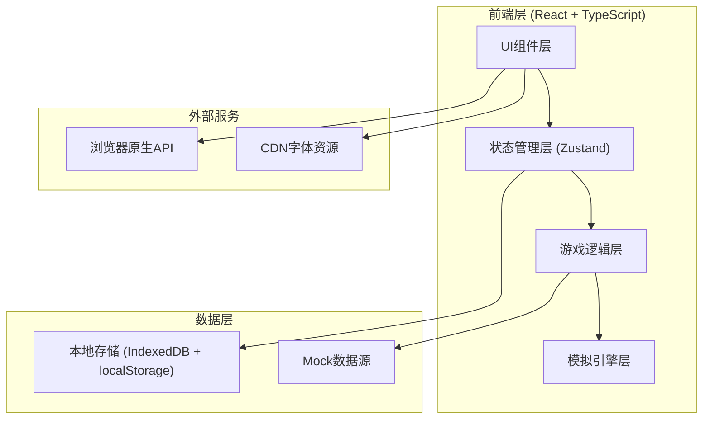
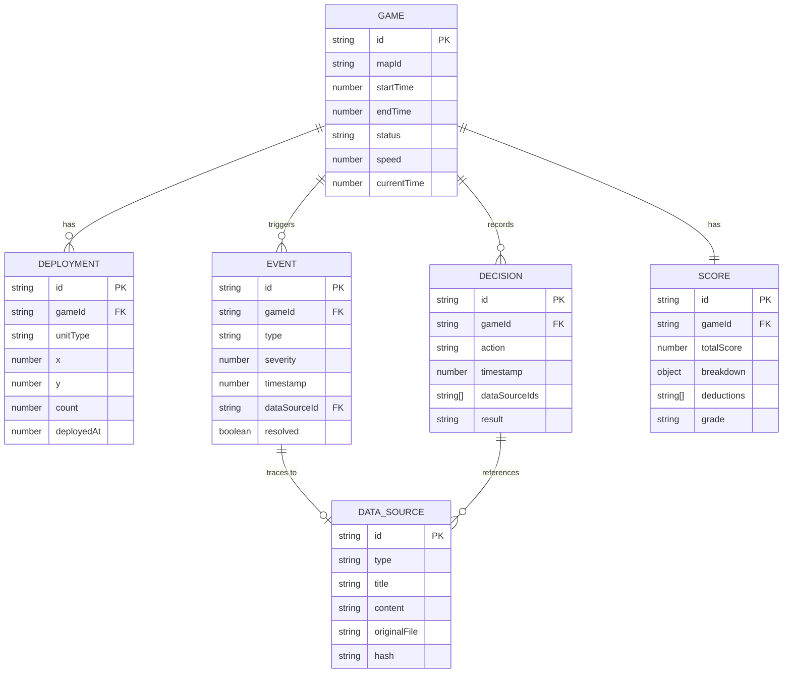

## 1. 架构设计



## 2. 技术描述

### 2.1 技术栈选择

| 层级 | 技术选择 | 版本 | 用途 |
|------|----------|------|------|
| 前端框架 | React | 18.x | UI构建 |
| 开发工具 | Vite | 5.x | 构建与开发服务器 |
| 语言 | TypeScript | 5.x | 类型安全 |
| 样式 | TailwindCSS | 3.x | 原子化CSS |
| 状态管理 | Zustand | 4.x | 全局状态管理 |
| 路由 | React Router | 6.x | 单页路由 |
| 图表 | Recharts | 2.x | 评分雷达图、趋势图 |
| 本地存储 | Dexie.js | 3.x | IndexedDB封装，历史记录持久化 |
| 动画 | Framer Motion | 11.x | 复杂动画效果 |
| 拖拽 | @dnd-kit/core | 6.x | 安保单位拖拽部署 |
| 唯一ID | uuid | 9.x | 数据溯源ID生成 |

### 2.2 项目目录结构

```
src/
├── components/          # UI组件
│   ├── game/           # 游戏主界面组件
│   ├── review/         # 复盘页面组件
│   ├── settlement/     # 结算页面组件
│   └── history/        # 历史记录组件
├── store/              # Zustand状态管理
│   ├── useGameStore.ts
│   ├── useReviewStore.ts
│   └── useHistoryStore.ts
├── engine/             # 游戏模拟引擎
│   ├── types.ts        # 类型定义
│   ├── mapGenerator.ts # 地图生成
│   ├── crowdSimulator.ts # 人流模拟
│   ├── eventSystem.ts  # 事件系统
│   └── scoring.ts      # 评分系统
├── data/               # Mock数据
│   ├── maps.ts         # 舞台地图数据
│   ├── patrols.ts      # 巡逻队数据
│   └── reports.ts      # 安保报告数据
├── hooks/              # 自定义Hooks
│   ├── useGameLoop.ts
│   └── useTraceability.ts
├── utils/              # 工具函数
│   ├── storage.ts      # 本地存储封装
│   └── deduplication.ts # 去重逻辑
├── pages/              # 页面组件
├── App.tsx
└── main.tsx
```

## 3. 路由定义

| 路由 | 页面 | 用途 |
|-------|------|------|
| `/` | 首页 | 新对局入口、历史记录入口 |
| `/game` | 游戏主界面 | 布阵、模拟、实时监控 |
| `/review/:gameId` | 复盘页面 | 时间轴回放、数据溯源 |
| `/settlement/:gameId` | 结算页面 | 评分展示、决策回顾 |
| `/history` | 历史记录 | 对局列表、搜索过滤 |

## 4. 数据模型

### 4.1 核心数据模型



### 4.2 关键类型定义

```typescript
// 安保单位类型
type SecurityUnitType = 'fixed_post' | 'patrol' | 'emergency_response';

interface SecurityUnit {
  id: string;
  type: SecurityUnitType;
  name: string;
  capacity: number;
  responseTime: number; // 秒
  coverageRadius: number; // 米
}

// 地图元素
interface MapElement {
  id: string;
  type: 'stage' | 'exit' | 'entrance' | 'barrier' | 'food' | 'restroom';
  x: number;
  y: number;
  width: number;
  height: number;
  name: string;
  capacity?: number;
}

// 人流粒子
interface CrowdParticle {
  id: string;
  x: number;
  y: number;
  targetX: number;
  targetY: number;
  speed: number;
  density: number;
}

// 事件类型
type EventType = 'exit_congestion' | 'patrol_gap' | 'weather_change' | 
                 'medical_emergency' | 'disturbance';

interface GameEvent {
  id: string;
  type: EventType;
  timestamp: number;
  severity: 1 | 2 | 3 | 4 | 5;
  title: string;
  description: string;
  dataSourceId: string;
  location?: { x: number; y: number };
  resolved: boolean;
  resolutionTime?: number;
}

// 数据源（用于溯源）
interface DataSource {
  id: string;
  type: 'stage_map' | 'patrol_report' | 'security_report' | 'weather_data';
  title: string;
  content: string;
  originalFile: string;
  hash: string; // 用于去重校验
  timestamp: number;
}

// 评分维度
interface ScoreBreakdown {
  congestionManagement: number;
  patrolCoverage: number;
  emergencyResponse: number;
  resourceAllocation: number;
  overallSituation: number;
}

interface Deduction {
  id: string;
  category: keyof ScoreBreakdown;
  points: number;
  reason: string;
  eventId?: string;
  timestamp: number;
}
```

## 5. 核心模块设计

### 5.1 游戏引擎模块

**人流模拟器 (CrowdSimulator)**
- 基于网格的流体动力学模型
- 出口拥堵计算算法：单位时间通过人数 × 拥堵系数
- 人流热点预测：基于舞台时间安排和出口位置

**事件系统 (EventSystem)**
- 基于概率的事件触发机制
- 事件严重程度动态计算：当前状态 × 随机因子
- 事件连锁反应：出口拥堵可能引发医疗紧急事件

**评分系统 (ScoringEngine)**
- 实时扣分机制：事件未及时响应每秒扣分
- 多维度加权评分
- 扣分溯源：每个扣分项关联具体事件和决策

### 5.2 数据持久化模块

**IndexedDB存储 (Dexie.js封装)**
- 对局完整快照存储（每秒记录关键状态）
- 历史记录查询：按时间、地图、评分等条件过滤

**去重机制**
- 基于内容哈希的数据源去重
- 对局重复检测：地图ID + 时间戳 + 关键决策哈希

### 5.3 数据溯源模块

**唯一标识系统**
- 每个事件、决策、数据源分配UUID
- 关联关系存储：决策 → 引用的数据源ID列表

**溯源展示**
- 点击事件显示关联的原始数据卡片
- 支持原始文件内容高亮
- 数据来源水印：文件名、导入时间、哈希值

## 6. 性能优化策略

1. **人流模拟优化**：使用requestAnimationFrame，限制最大粒子数为500
2. **状态更新**：使用Zustand的选择性订阅，避免不必要重渲染
3. **历史记录**：使用虚拟滚动处理大量历史对局
4. **动画性能**：优先使用transform和opacity属性，开启GPU加速
5. **存储优化**：对局快照使用增量存储，只记录变化的状态

## 7. 安全考虑

1. **本地存储加密**：敏感历史记录使用AES加密
2. **数据完整性**：每个存储记录附加校验哈希
3. **XSS防护**：所有用户输入和展示内容进行HTML转义
4. **导入文件校验**：只接受特定格式，扫描文件内容防止恶意代码
