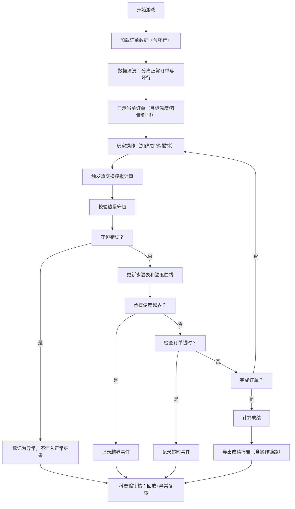
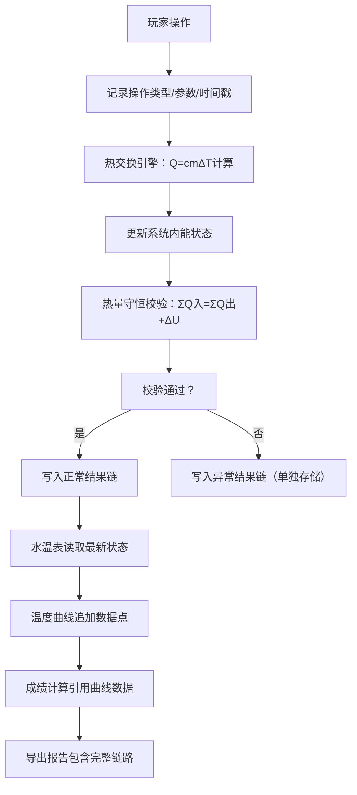

## 1. 产品概述

"热力学咖啡工坊"是一款基于真实热力学原理的科普模拟游戏，玩家通过操作咖啡制作过程中的加热、加冰、搅拌等动作，学习热交换、热量守恒等物理概念。游戏强调数据可追溯性，每一步操作都会影响热交换模拟，最终成绩与物理规律严格绑定。

- **核心目标**：通过游戏化方式教授热力学原理，让玩家直观理解温度变化的物理机制
- **目标用户**：学生、物理爱好者、科技馆参观者
- **市场价值**：寓教于乐的物理科普工具，可用于物理科普馆展示和教学

---

## 2. 核心功能

### 2.1 用户角色

| 角色 | 注册方式 | 核心权限 |
|------|----------|----------|
| 玩家 | 无需注册，直接进入 | 进行游戏操作，查看成绩，导出结果 |
| 物理科普馆管理员 | 无需注册 | 审核异常数据，回看操作过程，曲线回放分析 |

### 2.2 功能模块

1. **游戏主界面**：水温表、操作控件、顾客订单、实时温度曲线
2. **热交换模拟引擎**：实时计算热量传递、温度变化、热量守恒校验
3. **数据清洗模块**：处理原始数据中的空行、备注、缺列，分离坏行
4. **成绩计算模块**：基于温度准确度、订单完成度、热量守恒合规性计算得分
5. **操作回放系统**：记录每一步操作，支持时间轴回放和曲线分析
6. **异常审核面板**：筛选温度越界、订单超时、热量守恒错误供科普馆复核
7. **成绩导出模块**：导出完整的操作日志、温度曲线和成绩报告

### 2.3 页面详情

| 页面名称 | 模块名称 | 功能描述 |
|----------|----------|----------|
| 游戏主页 | 咖啡制作区 | 显示咖啡杯、水温表、温度曲线、操作按钮（加热/加冰/搅拌/倒咖啡） |
| 游戏主页 | 订单面板 | 显示当前顾客订单（目标温度、容量、时间限制） |
| 游戏主页 | 状态指示器 | 实时显示热量守恒状态、温度合规性、剩余时间 |
| 结算页面 | 成绩展示 | 显示最终得分、温度曲线对比、各项评分明细 |
| 结算页面 | 操作日志 | 列出每一步操作及其对热交换的影响 |
| 科普馆审核页 | 异常筛选 | 按类型筛选温度越界、订单超时、守恒错误记录 |
| 科普馆审核页 | 回放面板 | 时间轴控制、曲线叠加对比、操作触发点标记 |

---

## 3. 核心流程

### 3.1 游戏主流程



### 3.2 热交换计算链路



---

## 4. 用户界面设计

### 4.1 设计风格

- **主色调**：深咖啡色 `#4A2C2A` 作为主色，暖橙色 `#E67E22` 作为温度警示色，冰蓝色 `#3498DB` 作为冷却指示色
- **辅助色**：米白色 `#F5E6D3` 背景，深棕色 `#2C1810` 文字
- **按钮风格**：3D立体按钮，圆角8px，悬停时有轻微上浮和阴影变化
- **字体**：标题使用 `Playfair Display` 衬线字体（优雅的咖啡工坊风格），正文使用 `Source Han Sans` 无衬线字体
- **布局风格**：卡片式布局，左侧为咖啡制作区，右侧为数据面板，底部为操作栏
- **图标风格**：使用咖啡杯、温度计、冰块、火焰等拟物化图标

### 4.2 页面设计概述

| 页面名称 | 模块名称 | UI元素 |
|----------|----------|--------|
| 游戏主页 | 咖啡制作区 | 动画咖啡杯（液面随温度变色）、圆形水温表（指针随温度转动）、实时曲线图 |
| 游戏主页 | 操作栏 | 加热按钮（火焰图标）、加冰按钮（冰块图标）、搅拌按钮（漩涡图标）、倒咖啡按钮 |
| 游戏主页 | 订单面板 | 卡片式订单，显示目标温度范围、容量、倒计时进度条 |
| 游戏主页 | 状态条 | 热量守恒指示灯（绿/红）、温度合规指示灯、当前时间 |
| 结算页面 | 成绩卡片 | 总分大字显示、各项得分雷达图、温度曲线对比图 |
| 结算页面 | 操作时间轴 | 垂直时间轴，标记每个操作点和对应的温度变化 |
| 科普馆审核页 | 筛选器 | 按异常类型、时间范围、订单ID筛选 |
| 科普馆审核页 | 回放控制器 | 播放/暂停、进度条、倍速控制、曲线叠加开关 |

### 4.3 响应性

- 桌面端优先设计，三栏布局（操作区+数据区+日志区）
- 平板端自适应为两栏布局
- 移动端单列布局，操作按钮放大便于触控

### 4.4 动画与交互

- 水温表指针平滑转动动画
- 加热时咖啡杯冒热气粒子效果
- 加冰时冰块落入咖啡的溅起动画
- 搅拌时咖啡漩涡动画
- 温度曲线实时绘制动画
- 操作按钮点击反馈（缩放+波纹效果）
- 页面切换时的淡入淡出过渡

---

## 5. 数据规范

### 5.1 原始数据格式（含坏行示例）

```
订单ID,目标温度,容量(ml),时限(s),备注
ORD001,85,350,120,正常订单
ORD002,,350,120,缺目标温度
ORD003,90,,100,缺容量

ORD004,75,300,90,空行后正常订单
# 这是一条备注行，应该被过滤
ORD005,80,400,150,搅拌动作触发订单
ORD006,95,250,80,顾客加急订单
```

### 5.2 数据清洗规则

1. **空行**：完全空白的行，单独列入坏行报告
2. **备注行**：以 `#` 开头的行，单独列入坏行报告
3. **缺列**：关键字段（订单ID、目标温度、容量、时限）缺失的行，单独列入坏行报告
4. **来源标记**：搅拌动作、顾客订单等不同来源的数据分别标记

### 5.3 异常类型定义

| 异常类型 | 触发条件 | 处理方式 |
|----------|----------|----------|
| 温度越界 | 温度 < 0℃ 或 > 100℃ | 记录事件，可筛选，成绩扣分 |
| 热量守恒错误 | ΣQ入 ≠ ΣQ出 + ΔU（误差>1%） | 单独存储，不混入正常结果链 |
| 订单超时 | 完成时间 > 时限 | 记录事件，可筛选，成绩扣分 |
