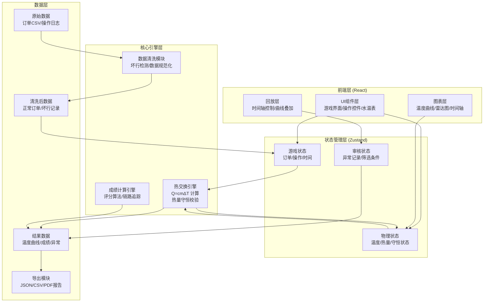

## 1. 架构设计



---

## 2. 技术描述

- **前端**：React@18 + TypeScript + Vite
- **样式**：TailwindCSS@3
- **状态管理**：Zustand
- **图表**：Recharts（温度曲线、雷达图）
- **路由**：React Router DOM
- **后端**：无（纯前端应用，数据本地存储）
- **存储**：LocalStorage（游戏记录、异常数据）
- **初始化工具**：vite-init

---

## 3. 目录结构

```
src/
├── components/          # UI组件
│   ├── game/           # 游戏相关组件
│   │   ├── CoffeeCup.tsx      # 咖啡杯动画
│   │   ├── Thermometer.tsx    # 水温表
│   │   ├── ControlPanel.tsx   # 操作控制面板
│   │   ├── OrderCard.tsx      # 订单卡片
│   │   └── StatusBar.tsx      # 状态指示器
│   ├── chart/          # 图表组件
│   │   ├── TemperatureChart.tsx  # 温度曲线
│   │   ├── ScoreRadar.tsx        # 成绩雷达图
│   │   └── Timeline.tsx          # 操作时间轴
│   ├── audit/          # 审核组件
│   │   ├── ExceptionFilter.tsx   # 异常筛选器
│   │   └── ReplayController.tsx  # 回放控制器
│   └── common/         # 通用组件
│       ├── Button.tsx
│       └── Card.tsx
├── hooks/              # 自定义Hooks
│   ├── useHeatEngine.ts      # 热交换引擎Hook
│   ├── useDataCleaner.ts     # 数据清洗Hook
│   ├── useScoreEngine.ts     # 成绩计算Hook
│   └── useReplay.ts          # 回放控制Hook
├── store/              # Zustand状态
│   ├── gameStore.ts         # 游戏状态
│   ├── physicsStore.ts      # 物理状态
│   └── auditStore.ts        # 审核状态
├── types/              # TypeScript类型定义
│   ├── game.ts
│   ├── physics.ts
│   └── audit.ts
├── utils/              # 工具函数
│   ├── physics.ts           # 物理公式计算
│   ├── dataCleaner.ts       # 数据清洗算法
│   ├── heatEngine.ts        # 热交换核心算法
│   └── export.ts            # 导出工具
├── data/               # 模拟数据
│   ├── rawOrders.csv        # 原始订单数据（含坏行）
│   └── badRows.json         # 坏行示例数据
├── pages/              # 页面组件
│   ├── GamePage.tsx         # 游戏主页
│   ├── ResultPage.tsx       # 结算页面
│   └── AuditPage.tsx        # 科普馆审核页
├── App.tsx
├── main.tsx
└── index.css
```

---

## 4. 核心数据模型

### 4.1 TypeScript 类型定义

```typescript
// 游戏相关类型
interface Order {
  id: string;
  targetTemperature: number;
  capacity: number;
  timeLimit: number;
  note?: string;
  source: 'customer' | 'stir' | 'manual';
}

interface GameAction {
  id: string;
  type: 'heat' | 'ice' | 'stir' | 'pour';
  timestamp: number;
  params: {
    power?: number;      // 加热功率
    mass?: number;       // 冰块质量
    speed?: number;      // 搅拌速度
    duration?: number;   // 持续时间
  };
  heatExchange: HeatExchangeResult;
}

interface GameState {
  currentOrder: Order | null;
  actions: GameAction[];
  startTime: number;
  elapsedTime: number;
  isComplete: boolean;
  score: Score | null;
}

// 物理相关类型
interface PhysicsState {
  temperature: number;        // 当前温度
  mass: number;               // 液体质量
  heatCapacity: number;       // 比热容
  internalEnergy: number;     // 内能
  temperatureHistory: TempPoint[];
  conservationStatus: 'valid' | 'error' | 'pending';
  conservationError?: number; // 守恒误差
}

interface TempPoint {
  timestamp: number;
  temperature: number;
  actionId?: string;
}

interface HeatExchangeResult {
  Q_in: number;           // 传入热量
  Q_out: number;          // 传出热量
  deltaU: number;         // 内能变化
  deltaT: number;         // 温度变化
  conservationCheck: boolean;
  errorMargin: number;
  isAbnormal: boolean;
  abnormalType?: 'conservation' | 'temperature_bound' | 'timeout';
}

// 审核相关类型
interface ExceptionRecord {
  id: string;
  gameId: string;
  actionId: string;
  type: 'temperature_bound' | 'conservation_error' | 'timeout';
  timestamp: number;
  details: {
    temperature?: number;
    expectedRange?: [number, number];
    conservationError?: number;
    elapsedTime?: number;
    timeLimit?: number;
  };
  reviewed: boolean;
}

interface BadRow {
  id: string;
  originalData: string;
  rowNumber: number;
  type: 'empty' | 'comment' | 'missing_column' | 'invalid_format';
  source: 'order' | 'action_log' | 'stir_record';
  note?: string;
}

interface Score {
  total: number;
  accuracy: number;        // 温度准确度
  efficiency: number;      // 时间效率
  conservation: number;    // 热量守恒合规性
  detail: ScoreDetail[];
}

interface ScoreDetail {
  actionId: string;
  deduction: number;
  reason: string;
}
```

### 4.2 热交换核心算法

```typescript
// 物理常量
const SPECIFIC_HEAT_WATER = 4.186;  // J/g·℃，水的比热容
const SPECIFIC_HEAT_ICE = 2.09;     // J/g·℃，冰的比热容
const LATENT_HEAT_FUSION = 334;     // J/g，熔化潜热
const ROOM_TEMP = 25;                // ℃，环境温度

// 加热计算：Q = P × t
function calculateHeating(power: number, duration: number): HeatExchangeResult {
  const Q_in = power * duration;  // 电能转热能
  return {
    Q_in,
    Q_out: 0,
    deltaU: Q_in,
    deltaT: Q_in / (mass * SPECIFIC_HEAT_WATER),
    conservationCheck: true,
    errorMargin: 0,
    isAbnormal: false
  };
}

// 加冰计算：Q_冰升温 + Q_熔化 + Q_冰水温升 = Q_咖啡降温
function calculateIceAdd(iceMass: number, iceTemp: number, 
                         coffeeTemp: number, coffeeMass: number): HeatExchangeResult {
  // 冰从iceTemp升到0℃
  const Q1 = iceMass * SPECIFIC_HEAT_ICE * (0 - iceTemp);
  // 冰熔化
  const Q2 = iceMass * LATENT_HEAT_FUSION;
  // 熔化后的水从0℃升到最终温度T
  // 咖啡从coffeeTemp降到T
  // Q1 + Q2 + iceMass * c_water * (T - 0) = coffeeMass * c_water * (coffeeTemp - T)
  const c = SPECIFIC_HEAT_WATER;
  const finalTemp = (coffeeMass * c * coffeeTemp - Q1 - Q2) / 
                    ((coffeeMass + iceMass) * c);
  
  const Q_out = coffeeMass * c * (coffeeTemp - finalTemp);
  const Q_in = Q1 + Q2 + iceMass * c * (finalTemp - 0);
  
  const errorMargin = Math.abs(Q_in - Q_out) / Q_out;
  const conservationCheck = errorMargin < 0.01;  // 1%误差容限
  
  return {
    Q_in,
    Q_out,
    deltaU: Q_in - Q_out,
    deltaT: finalTemp - coffeeTemp,
    conservationCheck,
    errorMargin,
    isAbnormal: !conservationCheck || finalTemp < 0 || finalTemp > 100,
    abnormalType: !conservationCheck ? 'conservation' : 
                  (finalTemp < 0 || finalTemp > 100) ? 'temperature_bound' : undefined
  };
}

// 搅拌计算：摩擦生热 + 热对流加速
function calculateStirring(speed: number, duration: number, 
                           temp: number, mass: number): HeatExchangeResult {
  // 摩擦生热（简化模型）
  const frictionHeat = speed * duration * 0.1;  // 简化系数
  
  // 热对流散热（搅拌加速散热）
  const surfaceArea = 0.01;  // m²
  const heatTransferCoeff = 10 + speed * 0.5;  // W/m²·℃，随搅拌速度增加
  const deltaT = temp - ROOM_TEMP;
  const Q_out = heatTransferCoeff * surfaceArea * deltaT * duration;
  
  const Q_in = frictionHeat;
  const netHeat = Q_in - Q_out;
  
  const errorMargin = 0;  // 搅拌模型不做严格守恒校验
  const conservationCheck = true;
  
  return {
    Q_in,
    Q_out,
    deltaU: netHeat,
    deltaT: netHeat / (mass * SPECIFIC_HEAT_WATER),
    conservationCheck,
    errorMargin,
    isAbnormal: false
  };
}
```

### 4.3 数据清洗算法

```typescript
function cleanOrderData(rawData: string): { 
  validOrders: Order[], 
  badRows: BadRow[] 
} {
  const lines = rawData.split('\n');
  const validOrders: Order[] = [];
  const badRows: BadRow[] = [];
  let rowNumber = 0;
  
  // 跳过表头
  const headerLine = lines[0];
  const headers = headerLine.split(',').map(h => h.trim());
  const requiredFields = ['订单ID', '目标温度', '容量(ml)', '时限(s)'];
  const source = detectDataSource(rawData);
  
  for (let i = 1; i < lines.length; i++) {
    rowNumber = i + 1;
    const line = lines[i].trim();
    
    // 空行检测
    if (line === '') {
      badRows.push({
        id: `bad_${Date.now()}_${i}`,
        originalData: lines[i],
        rowNumber,
        type: 'empty',
        source
      });
      continue;
    }
    
    // 备注行检测
    if (line.startsWith('#')) {
      badRows.push({
        id: `bad_${Date.now()}_${i}`,
        originalData: line,
        rowNumber,
        type: 'comment',
        source
      });
      continue;
    }
    
    const values = line.split(',');
    const hasAllFields = requiredFields.every((_, idx) => 
      values[idx] && values[idx].trim() !== ''
    );
    
    // 缺列检测
    if (!hasAllFields) {
      badRows.push({
        id: `bad_${Date.now()}_${i}`,
        originalData: line,
        rowNumber,
        type: 'missing_column',
        source,
        note: `缺失字段: ${requiredFields.filter((_, idx) => 
          !values[idx] || values[idx].trim() === ''
        ).join(', ')}`
      });
      continue;
    }
    
    // 正常数据
    try {
      const order: Order = {
        id: values[0].trim(),
        targetTemperature: parseFloat(values[1].trim()),
        capacity: parseFloat(values[2].trim()),
        timeLimit: parseFloat(values[3].trim()),
        note: values[4]?.trim(),
        source: source as Order['source']
      };
      validOrders.push(order);
    } catch (e) {
      badRows.push({
        id: `bad_${Date.now()}_${i}`,
        originalData: line,
        rowNumber,
        type: 'invalid_format',
        source,
        note: (e as Error).message
      });
    }
  }
  
  return { validOrders, badRows };
}
```

---

## 5. 成绩计算与导出链路

### 5.1 成绩计算公式

```
总分 = 温度准确度(40%) + 时间效率(30%) + 热量守恒(30%)

温度准确度 = 100 - |实际温度 - 目标温度| × 5
时间效率 = 100 - (实际用时 / 时限) × 50  （最低0分）
热量守恒 = 100 - 守恒错误次数 × 30 - 温度越界次数 × 20

扣分明细需要精确到每个操作：
- 每个导致温度越界的操作扣20分
- 每个导致守恒错误的操作扣30分
- 超时每秒扣1分
```

### 5.2 数据链路追踪

从水温表到成绩导出的完整链路必须可追溯：

```
水温表显示 → physicsStore.temperature 
          ← heatEngine计算结果 
          ← 玩家操作触发
          → temperatureHistory追加
          → 温度曲线渲染
          → 成绩计算引用
          → 导出报告包含完整操作ID和时间戳
```

### 5.3 导出数据结构

```typescript
interface ExportReport {
  gameId: string;
  playerName?: string;
  startTime: string;
  endTime: string;
  order: Order;
  actions: (GameAction & {
    temperatureBefore: number;
    temperatureAfter: number;
    scoreImpact: number;
  })[];
  temperatureCurve: TempPoint[];
  score: Score;
  exceptions: ExceptionRecord[];
  badRows: BadRow[];
  dataChainVerification: {
    // 验证水温表→曲线→成绩的数据一致性
    thermometerConsistent: boolean;
    curveMatchesHistory: boolean;
    scoreUsesCurveData: boolean;
  };
}
```

---

## 6. 路由定义

| 路由 | 页面 | 用途 |
|------|------|------|
| `/` | GamePage | 游戏主页，咖啡制作界面 |
| `/result` | ResultPage | 结算页面，成绩展示 |
| `/audit` | AuditPage | 科普馆审核页面 |
