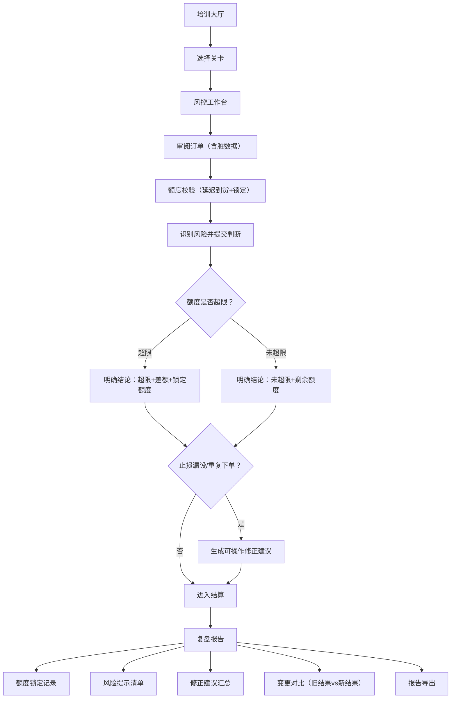

## 1. 产品概述

外汇交易风控局是一款面向银行培训场景的交互式风控实训原型，以关卡制模拟真实外汇交易风控流程。系统故意引入脏数据（缺字段订单、带备注货币对、延迟额度条），让学员在额度超限、重复下单、止损漏设等复合风险场景中做出判断与修正。额度锁定和风险提示必须参与结算，复盘阶段可导出报告并追溯订单变更前后的结果差异。

- 目标用户：银行风控培训师、新入职交易员、风控岗学员
- 核心价值：让学员在"脏数据+复合风险"的真实压力下练习风控判断，而非在干净数据上走流程

## 2. 核心功能

### 2.1 用户角色

| 角色 | 进入方式 | 核心权限 |
|------|----------|----------|
| 学员 | 直接进入 | 闯关操作、提交风控判断、查看复盘报告、导出报告 |
| 培训师 | 直接进入（同一界面） | 重置关卡、修改客户订单数据、查看学员操作差异 |

### 2.2 功能模块

1. **培训大厅**：关卡选择、进度追踪、场景简介
2. **风控工作台**：订单审阅、额度校验、风险识别、判断提交、订单修改与变更追溯
3. **复盘报告**：结算结果、额度锁定记录、风险提示清单、修正建议、报告导出、新旧结果对比

### 2.3 页面详情

| 页面名称 | 模块名称 | 功能描述 |
|----------|----------|----------|
| 培训大厅 | 关卡卡片 | 展示2个关卡卡片（基础验核 / 额度风暴），显示完成状态和得分 |
| 培训大厅 | 操作指引 | 简要说明操作流程：审单→校验→判断→复盘 |
| 风控工作台 | 订单列表 | 展示客户订单表格，含脏数据（缺字段标红、备注列可见、延迟到货的额度条有加载动画） |
| 风控工作台 | 额度仪表盘 | 实时显示各货币对已用额度/总额度，超限时变色并锁定 |
| 风控工作台 | 风险识别面板 | 学员逐条标记风险类型（额度超限/重复下单/止损漏设/缺字段），提交判断 |
| 风控工作台 | 修正建议区 | 对止损漏设和重复下单生成可操作的修正建议（如"建议设置止损位XX"、"建议撤销重复订单#XXX"） |
| 风控工作台 | 订单编辑器 | 培训师可修改客户订单，修改后系统保留旧结果，生成新结算，新旧对比可见 |
| 复盘报告 | 结算摘要 | 展示本关卡得分、扣分项、额度锁定次数、风险提示命中数 |
| 复盘报告 | 额度锁定记录 | 列出每次额度锁定的时序、锁定原因、涉及订单、解锁条件 |
| 复盘报告 | 风险提示清单 | 每条风险提示含：风险类型、涉及订单、学员判断是否正确、正确答案 |
| 复盘报告 | 修正建议汇总 | 止损漏设和重复下单的完整修正建议列表 |
| 复盘报告 | 变更对比 | 展示订单修改前后的结算差异，旧结果和新结果并排对照 |
| 复盘报告 | 报告导出 | 一键导出复盘报告为文本文件 |

## 3. 核心流程

学员从培训大厅选择关卡进入风控工作台，在脏数据环境下审阅订单、校验额度、识别风险并提交判断。系统根据判断结果结算：额度超限给出明确结论（超限/未超限+具体差额），止损漏设和重复下单给出可操作修正建议。完成后进入复盘报告，查看额度锁定记录、风险提示清单、变更对比，并可导出报告。培训师可在工作台修改订单，系统保留旧结果并生成新结算。

### 关卡设计

**关卡1：基础验核**
- 3笔订单，含1笔缺字段订单、1笔止损漏设
- 额度正常，主要训练审单和止损检查
- 风险点：缺字段识别、止损漏设修正建议

**关卡2：额度风暴**
- 5笔订单，含1笔重复下单、2笔额度超限、1笔止损漏设
- 额度条延迟3秒到货（模拟真实延迟）
- 重复下单与额度超限夹在一起
- 风险点：复合风险识别、额度锁定、修正建议优先级

## 4. 界面设计

### 4.1 设计风格

- **主色调**：深蓝灰底色（#1a1d23）搭配琥珀色警告（#f59e0b）和翠绿安全色（#10b981）
- **辅助色**：冷灰表格底（#2a2d35）、红色超限（#ef4444）、蓝色信息（#3b82f6）
- **按钮风格**：圆角矩形，主按钮实心填充，危险操作用红色边框
- **字体**：数据区域使用等宽字体 JetBrains Mono，界面文字使用 Noto Sans SC
- **布局风格**：左侧订单面板 + 右侧额度仪表盘和风险面板的双栏仪表板布局
- **图标风格**：线性图标（Lucide风格），风控告警用闪烁动画

### 4.2 页面设计概览

| 页面名称 | 模块名称 | UI元素 |
|----------|----------|--------|
| 培训大厅 | 关卡卡片 | 卡片式布局，深色卡片带左侧色条（绿色=完成，琥珀色=进行中，灰色=未开始），悬浮时微上浮+阴影加深 |
| 培训大厅 | 操作指引 | 步骤条图标，水平排列，箭头连接 |
| 风控工作台 | 订单列表 | 深色表格，缺字段单元格红色虚线边框+斜线填充，备注列用小标签展示，额度条加载时有脉冲动画 |
| 风控工作台 | 额度仪表盘 | 环形进度条，超限时从绿变红并锁定（旋转锁图标），已用/总额数字大号显示 |
| 风控工作台 | 风险识别面板 | 卡片式清单，每项可点击标记风险类型，选中后边框变色 |
| 风控工作台 | 修正建议区 | 黄色背景卡片，带操作步骤编号，修正按钮实心 |
| 风控工作台 | 订单编辑器 | 滑出式侧面板，编辑后"保存"按钮触发新旧对比 |
| 复盘报告 | 结算摘要 | 顶部大数字展示得分，下方扣分明细 |
| 复盘报告 | 额度锁定记录 | 时间轴样式，每条记录含时间和原因 |
| 复盘报告 | 风险提示清单 | 表格样式，正确判断标绿，错误判断标红 |
| 复盘报告 | 变更对比 | 左右分栏，左侧旧结果（灰色），右侧新结果（高亮差异） |
| 复盘报告 | 报告导出 | 底部固定栏，导出按钮带下载图标 |

### 4.3 响应式设计

- 桌面优先设计，主要在培训室大屏和笔记本电脑上使用
- 最小支持1280px宽度，双栏布局
- 平板端（768-1280px）订单面板和风险面板改为上下排列

### 4.4 动效设计

- 页面进入：卡片依次从下方淡入（stagger 100ms）
- 额度条加载：脉冲呼吸动画 3秒
- 额度锁定：环变红 + 锁图标旋转出现
- 风险标记：选中时边框颜色弹跳过渡
- 复盘对比：差异行高亮闪烁 2 次
