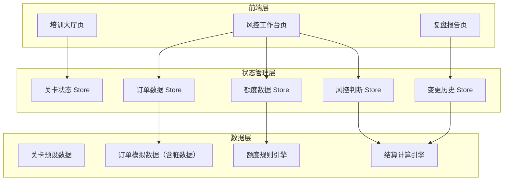
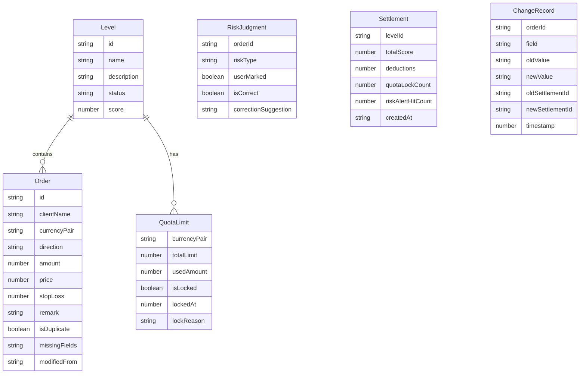

## 1. 架构设计

## 2. 技术说明

- **前端框架**：React@18 + TypeScript
- **样式方案**：Tailwind CSS@3
- **构建工具**：Vite
- **初始化工具**：vite-init（react-ts模板）
- **状态管理**：React Context + useReducer（无需Redux，原型规模足够）
- **路由**：React Router@6
- **后端**：无，纯前端模拟数据
- **数据存储**：localStorage持久化变更历史，内存中运行结算
- **报告导出**：前端生成Blob下载

## 3. 路由定义

| 路由 | 用途 |
|------|------|
| / | 培训大厅，关卡选择和进度展示 |
| /workspace/:levelId | 风控工作台，:levelId为关卡编号（1或2） |
| /review/:levelId | 复盘报告，展示结算结果和变更对比 |

## 4. 数据模型

### 4.1 数据模型定义

### 4.2 关卡数据定义

**关卡1：基础验核**

订单数据：
| 订单ID | 客户名 | 货币对 | 方向 | 金额 | 价格 | 止损 | 备注 | 缺字段 | 重复 |
|--------|--------|--------|------|------|------|------|------|--------|------|
| ORD-101 | 华通贸易 | EUR/USD | 买入 | 500000 | 1.0856 | - | "Q3套保" | 无 | 否 |
| ORD-102 | 远东实业 | USD/JPY | 卖出 | 300000 | 149.25 | - | - | "止损" | 否 |
| ORD-103 | 星辰集团 | GBP/USD | 买入 | - | 1.2634 | 1.2580 | "即期" | "金额" | 否 |

额度限制：
| 货币对 | 总额度 | 已用 |
|--------|--------|------|
| EUR/USD | 1000000 | 200000 |
| USD/JPY | 800000 | 100000 |
| GBP/USD | 600000 | 100000 |

**关卡2：额度风暴**

订单数据：
| 订单ID | 客户名 | 货币对 | 方向 | 金额 | 价格 | 止损 | 备注 | 缺字段 | 重复 |
|--------|--------|--------|------|------|------|------|------|--------|------|
| ORD-201 | 华通贸易 | EUR/USD | 买入 | 600000 | 1.0856 | - | "紧急追加" | 无 | 否 |
| ORD-202 | 远东实业 | EUR/USD | 买入 | 400000 | 1.0860 | - | - | 无 | 否 |
| ORD-203 | 星辰集团 | USD/JPY | 卖出 | 500000 | 149.25 | - | "季度对冲" | 无 | 是（与ORD-205重复） |
| ORD-204 | 明辉投资 | GBP/USD | 买入 | 450000 | 1.2634 | - | - | "止损" | 否 |
| ORD-205 | 星辰集团 | USD/JPY | 卖出 | 500000 | 149.25 | - | "重报" | 无 | 是（与ORD-203重复） |

额度限制（延迟3秒加载）：
| 货币对 | 总额度 | 已用 |
|--------|--------|------|
| EUR/USD | 800000 | 350000 |
| USD/JPY | 700000 | 400000 |
| GBP/USD | 500000 | 200000 |

### 4.3 结算规则

| 风险类型 | 正确识别得分 | 漏识别扣分 | 修正建议 |
|----------|-------------|-----------|----------|
| 额度超限 | +20 | -15 | 明确结论：超限XXX，需追加额度或拆单 |
| 重复下单 | +20 | -15 | 建议撤销重复订单#XXX，保留原始订单#XXX |
| 止损漏设 | +15 | -10 | 建议设置止损位XX（根据波动率计算建议值） |
| 缺字段 | +10 | -5 | 建议补全字段：XXX |

### 4.4 额度锁定规则

- 当某货币对已用+新增 > 总额度时，自动触发额度锁定
- 锁定后该货币对新订单不可提交
- 锁定记录包含：锁定时间、涉及订单、超额金额、解锁条件（追加额度或撤销订单）
- 额度锁定参与结算：每次锁定-5分，但正确识别超限+20分可抵消

### 4.5 变更追溯规则

- 培训师修改订单任意字段，系统生成ChangeRecord
- 修改后自动重新结算，生成新Settlement
- 复盘报告中旧Settlement和新Settlement并排展示
- 差异行高亮显示
