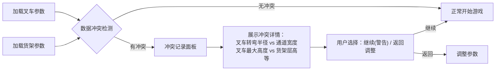

## 1. 产品概述

"3D仓库叉车赛"是一款基于浏览器的仓库安全培训游戏，专为新叉车司机和仓库安全培训师设计。游戏通过真实的3D驾驶模拟和碰撞判定系统，帮助司机练习转弯半径、货架高度判断和盲区意识，改变"只看速度"的不良驾驶习惯。

- **核心问题解决**：新司机忽视安全只追求速度，缺乏对转弯半径、货架高度和盲区的直观认知
- **目标用户**：新叉车司机（受训者）、仓库安全培训师（评估者）
- **产品价值**：将枯燥的安全培训转化为沉浸式游戏体验，通过可量化的碰撞数据和路线回放，让安全问题可视化、可追溯

## 2. 核心功能

### 2.1 用户角色

| 角色 | 注册方式 | 核心权限 |
|------|----------|----------|
| 受训司机 | 无需注册，直接进入 | 选择关卡、驾驶叉车、查看个人成绩和回放 |
| 培训师 | 无需注册，直接进入 | 查看所有训练记录、导出安全报告、调整关卡参数 |

### 2.2 功能模块

1. **关卡选择页**：训练模式选择、难度设置、叉车类型选择
2. **3D驾驶页面**：实时3D场景、叉车驾驶控制、HUD信息显示
3. **游戏控制面板**：暂停、继续、重开、退出功能
4. **碰撞检测系统**：货架碰撞、超高装载、盲区穿行检测
5. **结算页面**：成绩展示、路线回放、扣分详情
6. **安全报告页**：非技术友好的安全分析报告、冲突记录展示

### 2.3 页面详情

| 页面名称 | 模块名称 | 功能描述 |
|----------|----------|----------|
| 关卡选择页 | 模式选择 | 提供"基础训练"、"考核模式"、"自由练习"三种模式 |
| 关卡选择页 | 难度设置 | 可调节仓库复杂度、货架密度、时间限制 |
| 关卡选择页 | 叉车选择 | 不同类型叉车有不同的转弯半径和装载高度 |
| 3D驾驶页面 | 3D场景渲染 | 实时渲染仓库、货架、叉车、货物模型 |
| 3D驾驶页面 | 驾驶控制系统 | WASD/方向键控制，真实物理模拟 |
| 3D驾驶页面 | HUD显示 | 速度、高度、时间、碰撞警告、盲区提示 |
| 3D驾驶页面 | 视角切换 | 第一人称、第三人称、俯视图切换 |
| 游戏控制面板 | 状态控制 | 暂停(P键)、继续、重开(R键)、退出(Esc键) |
| 碰撞检测系统 | 货架碰撞 | 检测叉车与货架的碰撞，记录位置和严重程度 |
| 碰撞检测系统 | 超高检测 | 检测货物高度是否超过货架限制 |
| 碰撞检测系统 | 盲区检测 | 检测在盲区内的穿行行为，记录持续时间 |
| 结算页面 | 成绩展示 | 总得分、完成时间、碰撞次数、各项扣分 |
| 结算页面 | 路线回放 | 可拖拽进度条回放完整行驶路线，高亮碰撞点 |
| 结算页面 | 扣分详情 | 每条违规记录对应具体时间、位置、原因说明 |
| 安全报告页 | 数据汇总 | 用通俗语言解释安全问题，给出改进建议 |
| 安全报告页 | 冲突展示 | 明确显示叉车与货架数据合并时的冲突点 |
| 安全报告页 | 导出功能 | 可导出PDF格式报告供非技术同事查阅 |

## 3. 核心流程

### 用户训练流程

1. 用户进入游戏，选择训练模式和难度
2. 系统加载3D仓库场景和叉车模型
3. 用户驾驶叉车完成指定任务（如货物搬运）
4. 系统实时检测碰撞、超高、盲区等违规行为
5. 用户可随时暂停、重开或退出
6. 完成任务后进入结算页面，查看成绩和路线回放
7. 可生成安全报告，查看详细的安全分析和改进建议

### 数据冲突处理流程

## 4. 用户界面设计

### 4.1 设计风格

- **主色调**：工业橙(#FF6B35) + 安全黄(#FFD700) + 深灰背景(#1A1A2E)
- **辅助色**：警示红(#E63946)、安全绿(#2A9D8F)、信息蓝(#457B9D)
- **按钮风格**：工业风立体按钮，带轻微阴影和hover动效
- **字体**：标题使用"Orbitron"科技感字体，正文使用"Noto Sans SC"中文无衬线字体
- **布局风格**：深色主题、模块化卡片布局、工业仪表盘风格
- **图标风格**：使用lucide-react线性图标，配合工业风装饰元素

### 4.2 页面设计概述

| 页面名称 | 模块名称 | UI元素 |
|----------|----------|--------|
| 关卡选择页 | 主卡片区 | 大尺寸模式卡片，hover时上浮效果，渐变边框 |
| 关卡选择页 | 参数配置区 | 滑块控件、下拉选择器、实时预览数值 |
| 3D驾驶页面 | 场景区 | 全屏3D渲染，顶部HUD信息条，底部控制提示 |
| 3D驾驶页面 | 警告提示 | 碰撞时红色闪烁边框，盲区时黄色半透明遮罩 |
| 3D驾驶页面 | 控制面板 | 右上角悬浮按钮组，半透明玻璃态效果 |
| 结算页面 | 成绩卡片 | 大号数字展示，环形进度条，渐变色彩区分等级 |
| 结算页面 | 回放控制 | 进度条、播放/暂停、倍速控制、碰撞点标记 |
| 结算页面 | 违规列表 | 时间线布局，图标区分违规类型，点击定位回放 |
| 安全报告页 | 摘要区 | 交通灯式评级(绿/黄/红)，核心问题清单 |
| 安全报告页 | 冲突区 | 对比表格展示数据冲突，用通俗语言解释风险 |
| 安全报告页 | 建议区 | 条目化改进建议，配合示意图说明 |

### 4.3 响应式设计

- **桌面优先**：核心体验针对桌面端优化，支持1920x1080及以上分辨率
- **平板适配**：简化控制布局，增大触控区域
- **移动端**：仅支持查看报告和回放，不支持3D驾驶操作
- **触控优化**：所有按钮最小尺寸48x48px，重要操作有确认弹窗

### 4.4 3D场景设计

- **环境氛围**：工业仓库风格，冷色调荧光灯照明，地面有磨损纹理
- **光照设置**：主光源模拟仓库顶灯，辅以环境光和叉车前灯
- **相机设置**：默认第三人称尾随视角，可切换第一人称和俯视图
- **交互动画**：叉车启动/停止有缓动效果，碰撞时有轻微震动反馈
- **后处理效果**：轻微Bloom模拟灯光效果，碰撞时屏幕泛红
- **性能要求**：稳定60fps，几何体总数控制在5万面以内

## 5. 冲突处理机制

### 5.1 数据合并冲突展示

当叉车参数和货架参数由不同人员维护时，系统会在合并时检测以下冲突并明确展示：

| 冲突类型 | 检测条件 | 展示方式 |
|----------|----------|----------|
| 通道宽度不足 | 叉车最小转弯半径 > 通道宽度 - 安全余量 | 红色警告，显示具体数值对比 |
| 高度不匹配 | 叉车最大举升高度 < 最高货架层高度 | 黄色警告，建议调整叉车或货架 |
| 盲区重叠 | 货架盲区范围与行驶路线重叠面积 > 30% | 橙色警告，建议调整货架布局 |
| 载重超标 | 叉车载重上限 < 货物重量 | 红色警告，禁止开始游戏 |

### 5.2 违规记录追溯

每条违规记录都包含完整的可追溯信息：
- 精确时间戳（毫秒级）
- 3D空间坐标（x, y, z）
- 当时的速度、转向角度
- 碰撞物体的ID和名称
- 现场截图（自动捕获）
- 回放定位链接
