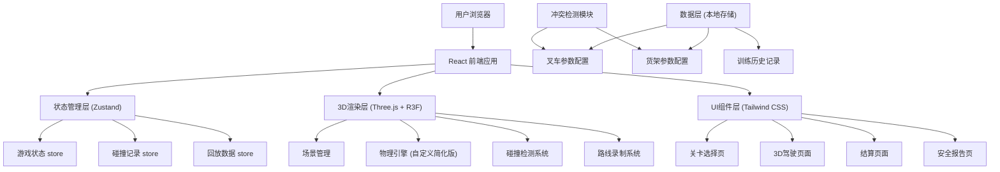
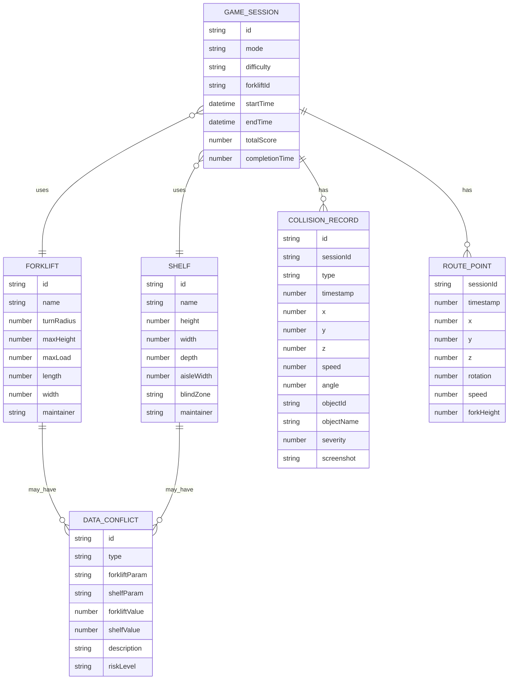

## 1. 架构设计



## 2. 技术描述

- **前端框架**：React@18 + TypeScript + Vite
- **3D引擎**：three@0.160 + @react-three/fiber@8.15 + @react-three/drei@9.88
- **状态管理**：zustand@4.4
- **样式方案**：tailwindcss@3.3
- **图标库**：lucide-react@0.294
- **路由管理**：react-router-dom@6.20
- **PDF导出**：html2canvas + jspdf
- **后端**：无后端，纯前端应用，数据存储于 localStorage

## 3. 核心目录结构

```
src/
├── components/          # 通用UI组件
│   ├── HUD.tsx         # 抬头显示
│   ├── ControlPanel.tsx # 游戏控制面板
│   ├── ViolationCard.tsx # 违规记录卡片
│   └── ConflictAlert.tsx # 冲突警告组件
├── pages/              # 页面组件
│   ├── LevelSelect.tsx # 关卡选择页
│   ├── GameScene.tsx   # 3D驾驶页面
│   ├── Settlement.tsx  # 结算页面
│   └── SafetyReport.tsx # 安全报告页
├── store/              # Zustand状态管理
│   ├── gameStore.ts    # 游戏状态
│   ├── collisionStore.ts # 碰撞记录
│   └── replayStore.ts  # 回放数据
├── hooks/              # 自定义Hooks
│   ├── useForkliftControls.ts # 叉车控制
│   ├── useCollisionDetection.ts # 碰撞检测
│   └── useRouteRecorder.ts # 路线录制
├── types/              # TypeScript类型定义
│   ├── game.ts         # 游戏相关类型
│   ├── forklift.ts     # 叉车类型
│   └── shelf.ts        # 货架类型
├── config/             # 配置数据
│   ├── forklifts.ts    # 叉车参数配置
│   ├── shelves.ts      # 货架参数配置
│   └── levels.ts       # 关卡配置
├── utils/              # 工具函数
│   ├── physics.ts      # 物理计算
│   ├── collision.ts    # 碰撞算法
│   ├── conflictCheck.ts # 冲突检测
│   └── exportReport.ts # 报告导出
└── three/              # 3D相关
    ├── Forklift.tsx    # 叉车3D组件
    ├── Shelf.tsx       # 货架3D组件
    ├── Warehouse.tsx   # 仓库场景
    └── RouteLine.tsx   # 行驶路线可视化
```

## 4. 路由定义

| 路由 | 页面 | 功能描述 |
|------|------|----------|
| `/` | 关卡选择页 | 模式选择、难度设置、叉车选择 |
| `/game` | 3D驾驶页面 | 实时3D驾驶、碰撞检测 |
| `/settlement` | 结算页面 | 成绩展示、路线回放 |
| `/report` | 安全报告页 | 安全分析、冲突展示、报告导出 |

## 5. 核心数据模型

### 5.1 数据模型定义



### 5.2 TypeScript 类型定义

```typescript
// 叉车类型
interface Forklift {
  id: string;
  name: string;
  turnRadius: number;      // 最小转弯半径(m)
  maxHeight: number;       // 最大举升高度(m)
  maxLoad: number;         // 最大载重(kg)
  length: number;          // 车身长度(m)
  width: number;           // 车身宽度(m)
  maintainer: string;      // 维护人员
}

// 货架类型
interface Shelf {
  id: string;
  name: string;
  height: number;          // 总高度(m)
  width: number;           // 宽度(m)
  depth: number;           // 深度(m)
  aisleWidth: number;      // 通道宽度(m)
  blindZone: {             // 盲区范围
    x: number;
    z: number;
    radius: number;
  }[];
  maintainer: string;      // 维护人员
}

// 碰撞记录类型
type CollisionType = 'shelf' | 'overheight' | 'blindzone';

interface CollisionRecord {
  id: string;
  sessionId: string;
  type: CollisionType;
  timestamp: number;       // 毫秒级时间戳
  position: { x: number; y: number; z: number };
  speed: number;           // 碰撞时速度(km/h)
  angle: number;           // 转向角度
  objectId: string;        // 碰撞物体ID
  objectName: string;      // 碰撞物体名称
  severity: 'minor' | 'moderate' | 'severe';
  screenshot?: string;     // 现场截图base64
}

// 路线点类型
interface RoutePoint {
  timestamp: number;
  position: { x: number; y: number; z: number };
  rotation: number;        // 车身朝向角度
  speed: number;
  forkHeight: number;      // 货叉高度
}

// 数据冲突类型
interface DataConflict {
  id: string;
  type: 'aisle_width' | 'height_mismatch' | 'blindzone_overlap' | 'load_exceed';
  forkliftParam: string;
  shelfParam: string;
  forkliftValue: number;
  shelfValue: number;
  description: string;
  riskLevel: 'warning' | 'danger';
}

// 游戏状态类型
type GameStatus = 'idle' | 'playing' | 'paused' | 'finished';

interface GameState {
  status: GameStatus;
  mode: 'training' | 'exam' | 'free';
  difficulty: 'easy' | 'normal' | 'hard';
  selectedForklift: Forklift | null;
  selectedShelf: Shelf | null;
  startTime: number | null;
  pauseTime: number;
  totalPauseDuration: number;
  score: number;
  violations: CollisionRecord[];
  route: RoutePoint[];
  conflicts: DataConflict[];
}
```

## 6. 核心技术实现

### 6.1 碰撞检测系统

使用AABB（轴对齐包围盒）算法进行碰撞检测：

```typescript
// 简化的AABB碰撞检测
interface AABB {
  minX: number; maxX: number;
  minY: number; maxY: number;
  minZ: number; maxZ: number;
}

function checkCollision(a: AABB, b: AABB): boolean {
  return (
    a.minX < b.maxX && a.maxX > b.minX &&
    a.minY < b.maxY && a.maxY > b.minY &&
    a.minZ < b.maxZ && a.maxZ > b.minZ
  );
}
```

### 6.2 冲突检测逻辑

```typescript
function checkDataConflicts(forklift: Forklift, shelf: Shelf): DataConflict[] {
  const conflicts: DataConflict[] = [];
  
  // 检测通道宽度是否足够
  const safeMargin = 0.5; // 安全余量0.5m
  if (forklift.turnRadius > shelf.aisleWidth - safeMargin) {
    conflicts.push({
      id: `conflict-aisle-${Date.now()}`,
      type: 'aisle_width',
      forkliftParam: '最小转弯半径',
      shelfParam: '通道宽度',
      forkliftValue: forklift.turnRadius,
      shelfValue: shelf.aisleWidth,
      description: `叉车转弯半径(${forklift.turnRadius}m) 接近通道宽度(${shelf.aisleWidth}m)，可能无法顺利转弯`,
      riskLevel: 'danger'
    });
  }
  
  // 检测高度是否匹配
  if (forklift.maxHeight < shelf.height) {
    conflicts.push({
      id: `conflict-height-${Date.now()}`,
      type: 'height_mismatch',
      forkliftParam: '最大举升高度',
      shelfParam: '货架总高度',
      forkliftValue: forklift.maxHeight,
      shelfValue: shelf.height,
      description: `叉车最大举升高度(${forklift.maxHeight}m) 低于货架高度(${shelf.height}m)，无法存取最高层货物`,
      riskLevel: 'warning'
    });
  }
  
  return conflicts;
}
```

### 6.3 路线录制与回放

使用requestAnimationFrame逐帧录制位置数据，回放时按时间戳插值：

```typescript
// 录制路线点
function recordRoutePoint(state: GameState): RoutePoint {
  return {
    timestamp: Date.now() - state.startTime!,
    position: { ...forkliftPosition },
    rotation: forkliftRotation,
    speed: currentSpeed,
    forkHeight: currentForkHeight
  };
}

// 回放时插值计算位置
function interpolatePosition(
  points: RoutePoint[],
  targetTime: number
): RoutePoint | null {
  // 二分查找找到前后两个点
  // 使用线性插值计算中间位置
}
```

## 7. 性能优化策略

1. **3D渲染优化**：
   - 使用InstancedMesh渲染重复的货架模型
   - 合理设置相机视锥体剔除距离
   - 使用LOD（细节层次）技术

2. **碰撞检测优化**：
   - 使用空间分区（八叉树）减少检测次数
   - 仅对移动中的物体进行碰撞检测

3. **内存管理**：
   - 及时清理Three.js资源
   - 限制路线录制的最大点数（如最多10000点）
   - 使用Web Worker处理复杂计算

4. **状态更新优化**：
   - 使用Zustand的selector避免不必要的重渲染
   - 碰撞检测使用requestIdleCallback空闲时执行
