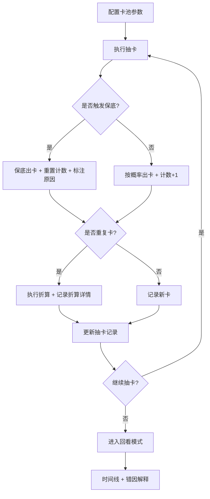

## 1. 产品概述

概率抽卡实验室——一款面向数学教学场景的交互式抽卡概率模拟游戏。玩家在可视化卡池中执行抽卡操作，系统实时计算概率、追踪保底计数、记录每一步的随机模拟结果，并在对局结束后提供回看与错因解释，帮助理解"为什么输或赢"。

- 核心目标：让卡池、保底计数、抽卡记录三者对齐可见，把保底重置与重复卡折算的数学逻辑讲清楚
- 目标用户：数学老师（教学演示）及学生（自主探索）

## 2. 核心功能

### 2.1 用户角色

| 角色 | 说明 |
|------|------|
| 操作者 | 设置卡池参数、执行抽卡、查看记录与回放 |

### 2.2 功能模块

1. **实验室主页**：卡池配置面板、抽卡操作区、保底计数器、抽卡记录
2. **回看页面**：对局时间线、每步触发原因、错因解释
3. **说明文档页**：卡池准备指南、保底重置复现方法

### 2.3 页面详情

| 页面名称 | 模块名称 | 功能描述 |
|----------|----------|----------|
| 实验室主页 | 卡池配置面板 | 配置 SSR/SR/R 稀有度及各自概率、保底阈值、重复卡折算规则 |
| 实验室主页 | 抽卡操作区 | 单抽/十连抽按钮，抽卡动画，结果展示 |
| 实验室主页 | 保底计数器 | 当前抽数、距保底剩余、保底状态指示（硬保底/软保底） |
| 实验室主页 | 抽卡记录 | 历史记录列表，标注稀有度、是否触发保底、是否重复折算 |
| 回看页面 | 对局时间线 | 每次抽卡的时序展示，高亮触发保底/折算的步骤 |
| 回看页面 | 错因解释 | 对每个关键节点解释"这一步为什么影响结果"，关联具体卡池参数 |
| 说明文档页 | 卡池准备指南 | 如何配置卡池参数、导入/导出卡池预设 |
| 说明文档页 | 保底复现方法 | 步骤化说明如何复现保底重置场景 |

## 3. 核心流程

1. 操作者配置卡池（稀有度、概率、保底阈值、重复折算规则）
2. 执行抽卡操作（单抽/十连），系统实时计算概率并记录
3. 每次抽卡更新保底计数器，若触发保底则重置并标注
4. 抽到重复卡时按规则折算，记录折算过程
5. 对局结束后可进入回看模式，逐步审视每次抽卡的随机模拟触发原因
6. 错因解释展示每一步如何影响最终成绩

## 4. 用户界面设计

### 4.1 设计风格

- 主色调：深蓝黑底 (#0a0e1a) + 金色强调 (#f5c542) + 紫色辅助 (#8b5cf6)
- 按钮风格：圆角微光按钮，抽卡按钮带脉冲光效
- 字体：标题使用 Orbitron（科技感），正文使用 Noto Sans SC
- 布局风格：三栏布局——左卡池配置、中抽卡操作区+保底计数器、右抽卡记录
- 图标风格：lucide-react 图标 + 自定义稀有度色标

### 4.2 页面设计概览

| 页面名称 | 模块名称 | UI 元素 |
|----------|----------|---------|
| 实验室主页 | 卡池配置面板 | 深色卡片式面板，滑块/输入框调概率，色标区分稀有度 |
| 实验室主页 | 抽卡操作区 | 居中大按钮（单抽/十连），结果弹出带光效动画 |
| 实验室主页 | 保底计数器 | 环形进度条 + 数字显示，闪烁提示即将触发保底 |
| 实验室主页 | 抽卡记录 | 右侧滚动列表，每条带稀有度色带和标签 |
| 回看页面 | 对局时间线 | 横向时间轴，节点可点击展开详情 |
| 回看页面 | 错因解释 | 展开面板，关联具体参数和数学公式 |
| 说明文档页 | 指南内容 | 简洁排版，步骤编号，代码块展示预设JSON |

### 4.3 响应式设计

- 桌面端优先：三栏布局
- 平板端：两栏（左配置+操作，右记录）
- 移动端：单栏 Tab 切换

### 4.4 3D 场景

不适用
