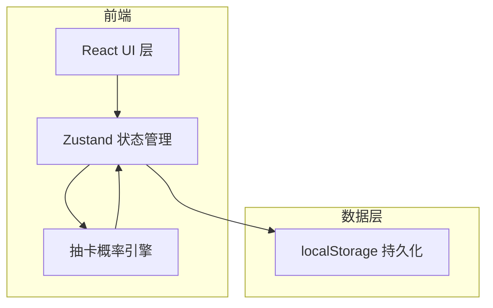
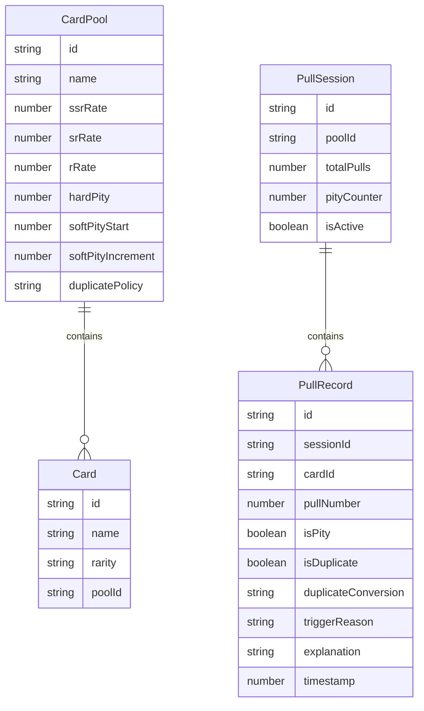

## 1. 架构设计



纯前端架构，无需后端服务。所有抽卡逻辑、概率计算、保底追踪均在前端完成。

## 2. 技术说明

- 前端：React@18 + TypeScript + Tailwind CSS@3 + Vite
- 初始化工具：vite-init
- 状态管理：Zustand
- 后端：无
- 数据库：无（使用 localStorage 持久化）

## 3. 路由定义

| 路由 | 用途 |
|------|------|
| / | 实验室主页（卡池配置 + 抽卡 + 保底 + 记录） |
| /review | 回看页面（时间线 + 错因解释） |
| /guide | 说明文档页（卡池准备 + 保底复现） |

## 4. API 定义

无后端 API。

## 5. 服务端架构

无服务端。

## 6. 数据模型

### 6.1 数据模型定义



### 6.2 数据定义语言

使用 TypeScript 接口定义：

```typescript
interface CardPool {
  id: string;
  name: string;
  ssrRate: number;       // SSR 基础概率 (0-1)
  srRate: number;        // SR 基础概率 (0-1)
  rRate: number;         // R 基础概率 (0-1)
  hardPity: number;      // 硬保底抽数
  softPityStart: number; // 软保底起始抽数
  softPityIncrement: number; // 软保底每次增量
  duplicatePolicy: 'shards' | 'currency' | 'nothing';
}

interface Card {
  id: string;
  name: string;
  rarity: 'SSR' | 'SR' | 'R';
  poolId: string;
}

interface PullSession {
  id: string;
  poolId: string;
  totalPulls: number;
  pityCounter: number;
  isActive: boolean;
}

interface PullRecord {
  id: string;
  sessionId: string;
  cardId: string;
  cardName: string;
  cardRarity: 'SSR' | 'SR' | 'R';
  pullNumber: number;
  isPity: boolean;
  isDuplicate: boolean;
  duplicateConversion: string;
  triggerReason: string;
  explanation: string;
  effectiveRate: number;
  timestamp: number;
}
```
