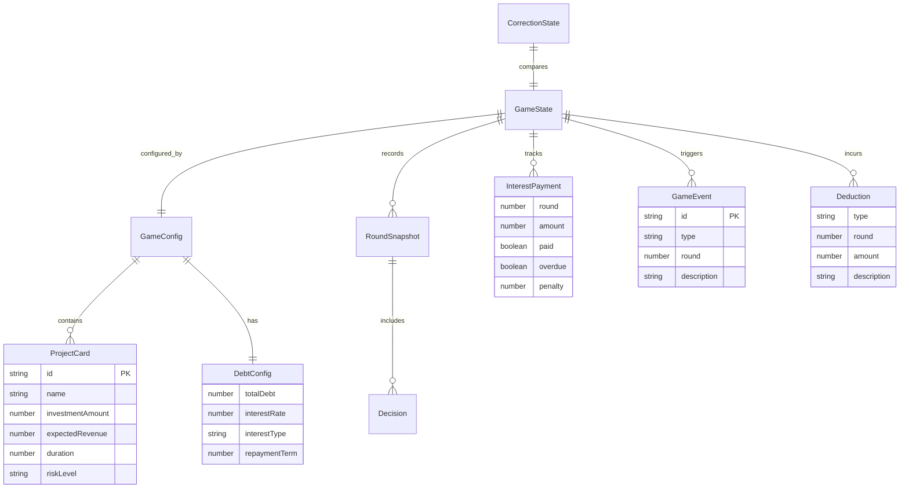

## 1. 架构设计

```mermaid
flowchart TD
    subgraph "前端层"
        "React SPA" --> "Zustand Store"
        "Zustand Store" --> "游戏引擎 (GameEngine)"
        "游戏引擎 (GameEngine)" --> "确定性随机 (SeededRandom)"
        "游戏引擎 (GameEngine)" --> "利息计算器 (InterestCalculator)"
        "游戏引擎 (GameEngine)" --> "事件调度器 (EventScheduler)"
    end
    subgraph "数据层"
        "项目卡数据" --> "Zustand Store"
        "债务配置" --> "Zustand Store"
        "游戏快照" --> "localStorage"
    end
```

纯前端SPA架构，无需后端服务。所有游戏逻辑在前端完成，数据持久化使用localStorage。

## 2. 技术说明
- **前端框架**：React@18 + TypeScript + Vite
- **样式方案**：Tailwind CSS@3
- **状态管理**：Zustand（游戏状态、配置状态、修正状态分离）
- **路由**：react-router-dom（HashRouter，兼容静态部署）
- **随机数**：自定义 SeededRandom（基于 mulberry32 算法），保证确定性
- **数据持久化**：localStorage，存储游戏快照与修正历史
- **初始化工具**：vite-init，模板 react-ts

## 3. 路由定义
| 路由 | 用途 |
|------|------|
| `/` | 开局配置页：导入项目卡、设置债务额度 |
| `/game` | 回合经营页：主游戏界面 |
| `/settlement` | 结算页：财务总览与扣分明细 |
| `/replay` | 复盘页：时间线回放 |
| `/correction` | 修正对比页：手动修正与并排对比 |

## 4. 数据模型

### 4.1 核心类型定义

```typescript
interface ProjectCard {
  id: string;
  name: string;
  investmentAmount: number;
  expectedRevenue: number;
  duration: number;
  riskLevel: 'low' | 'medium' | 'high';
  category: string;
  revenuePerRound: number[];
}

interface DebtConfig {
  totalDebt: number;
  interestRate: number;
  interestType: 'fixed' | 'floating';
  repaymentTerm: number;
  floatingRates?: number[];
}

interface InterestPayment {
  round: number;
  amount: number;
  paid: boolean;
  overdue: boolean;
  penalty: number;
}

interface GameEvent {
  id: string;
  type: 'interest_miss' | 'project_delay' | 'revenue_decline';
  round: number;
  description: string;
  impact: {
    penaltyAmount?: number;
    delayRounds?: number;
    revenueReduction?: number;
  };
  resolved: boolean;
}

interface RoundSnapshot {
  round: number;
  cash: number;
  debtBalance: number;
  totalInterestPaid: number;
  projectRevenue: number;
  netWorth: number;
  decisions: Decision[];
  events: GameEvent[];
  interestPayments: InterestPayment[];
}

interface Decision {
  round: number;
  projectIds: string[];
  repaymentAmount: number;
  repaymentType: 'minimum' | 'partial' | 'full';
}

interface GameState {
  config: GameConfig;
  currentRound: number;
  totalRounds: number;
  cash: number;
  debtBalance: number;
  interestPayments: InterestPayment[];
  activeProjects: ActiveProject[];
  completedProjects: ProjectCard[];
  events: GameEvent[];
  snapshots: RoundSnapshot[];
  isPaused: boolean;
  isGameOver: boolean;
  seed: number;
  rating: 'A' | 'B' | 'C' | 'D' | 'F' | null;
  deductions: Deduction[];
}

interface GameConfig {
  projects: ProjectCard[];
  debt: DebtConfig;
  totalRounds: number;
  difficulty: 'easy' | 'normal' | 'hard';
  seed: number;
}

interface Deduction {
  type: 'project_delay' | 'interest_miss' | 'revenue_decline' | 'bankruptcy';
  round: number;
  amount: number;
  description: string;
}

interface CorrectionState {
  originalResult: GameState;
  modifiedDebt: DebtConfig;
  modifiedResult: GameState | null;
  differences: DifferenceItem[];
}

interface DifferenceItem {
  field: string;
  originalValue: number;
  modifiedValue: number;
  delta: number;
}
```

### 4.2 数据模型图



## 5. 关键算法

### 5.1 利息计算
- 固定利率：每回合利息 = 债务余额 × 年利率 / 回合折算因子
- 浮动利率：每回合利率从 floatingRates 数组按索引取值
- 逾期罚息：未还利息 × 1.5 累加至下回合

### 5.2 评级算法
- 净资产 ≥ 0 且无逾期：A
- 净资产 ≥ 0 且逾期 ≤ 1次：B
- 净资产 ≥ 0 且逾期 ≤ 3次：C
- 净资产 < 0 但仅1-2回合：D
- 净资产 < 0 连续2回合+：F（财政破产）

### 5.3 确定性随机
- 使用 mulberry32 种子随机算法
- 种子 = 配置参数（项目卡ID + 债务额度 + 回合数）的哈希值
- 同一配置永远生成相同的事件序列

### 5.4 修正对比计算
- 修改债务额度后，以新参数重新运行完整游戏模拟
- 对比原始 GameState 与修改后 GameState 的每个字段
- 生成 DifferenceItem 数组，标记所有差异项
