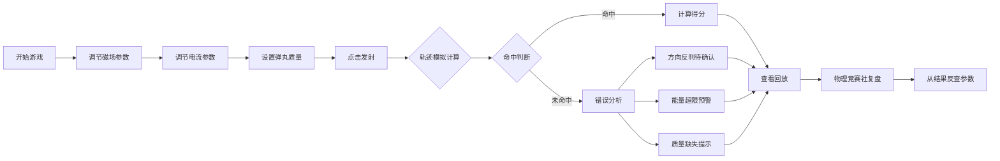

## 1. 产品概述

电磁炮靶场是一款物理教学互动游戏，帮助学生通过可视化模拟理解洛伦兹力的方向判断。玩家通过调节磁场、电流和弹丸质量参数，观察弹丸轨迹变化，学习电磁学原理。

- 核心目的：解决学生对洛伦兹力方向判断混淆的问题
- 目标用户：高中物理竞赛社学生、物理教师
- 产品价值：通过游戏化方式降低物理概念理解门槛，提供即时反馈和错误复盘

## 2. 核心功能

### 2.1 用户角色
| 角色 | 注册方式 | 核心权限 |
|------|---------|---------|
| 学生玩家 | 无需注册 | 调整参数、发射弹丸、查看结果 |
| 物理竞赛社 | 无需注册 | 查看回放、分析错误、导出记录 |

### 2.2 功能模块
1. **主游戏界面**：参数调节面板、轨迹模拟画布、靶位显示
2. **参数控制系统**：磁场板（方向/强度）、电流条（方向/大小）、弹丸质量调节
3. **轨迹模拟引擎**：实时物理计算、轨迹渲染、碰撞检测
4. **错误判断系统**：方向反判待确认、能量超限预警、质量缺失提示
5. **回放分析系统**：操作步骤回溯、错因回放、成绩影响分析

### 2.3 页面详情
| 页面名称 | 模块名称 | 功能描述 |
|---------|---------|---------|
| 主游戏页 | 参数控制面板 | 磁场方向选择、电流调节滑块、质量输入框 |
| 主游戏页 | 轨迹模拟画布 | Canvas绘制弹丸运动轨迹、磁场线、靶位目标 |
| 主游戏页 | 发射控制区 | 发射按钮、重置按钮、当前状态显示 |
| 结果弹窗 | 成绩展示 | 得分、命中情况、误差分析 |
| 结果弹窗 | 错因分析 | 方向错误提示、能量超限说明、下一步找谁核实 |
| 回放面板 | 步骤回溯 | 时间轴展示每一步操作、触发轨迹模拟的节点 |

## 3. 核心流程

玩家操作流程：调节磁场→调节电流→设置质量→发射→观看轨迹→查看结果→回放分析。

## 4. 用户界面设计

### 4.1 设计风格
- **主色调**：深蓝科技风（#0A1628）+ 电磁蓝（#00D4FF）+ 警告橙（#FF6B35）
- **按钮风格**：霓虹发光效果，圆角矩形，hover时有电流脉冲动画
- **字体**：标题使用Orbitron（科技感），正文使用Roboto Mono（等宽清晰）
- **布局风格**：暗黑模式，左右分栏（左侧参数控制，右侧模拟画布）
- **图标风格**：线性科技图标，配合磁场线和电流动画效果

### 4.2 页面设计概述
| 页面名称 | 模块名称 | UI元素 |
|---------|---------|--------|
| 主游戏页 | 参数面板 | 磁场方向选择器（上下左右按钮）、电流滑块、质量数字输入 |
| 主游戏页 | 模拟画布 | 渐变背景、磁场线网格、移动的弹丸粒子、靶心圆环 |
| 主游戏页 | 状态提示 | 实时显示：当前速度、预计能量、洛伦兹力方向指示器 |
| 结果弹窗 | 错因卡片 | 不同错误类型用不同颜色边框，配物理公式说明 |
| 回放面板 | 时间轴 | 可拖动的进度条，标记关键操作点 |

### 4.3 响应式
- 桌面端优先：左侧30%参数区 + 右侧70%画布区
- 平板端：上下布局，参数区在上，画布区在下
- 移动端：简化参数控制，优先保证画布显示

### 4.4 动效设计
- 弹丸发射时有加速粒子拖尾效果
- 磁场变化时背景磁场线会有波动动画
- 错误提示时边框有呼吸灯闪烁效果
- 轨迹绘制采用逐帧渐进式渲染
