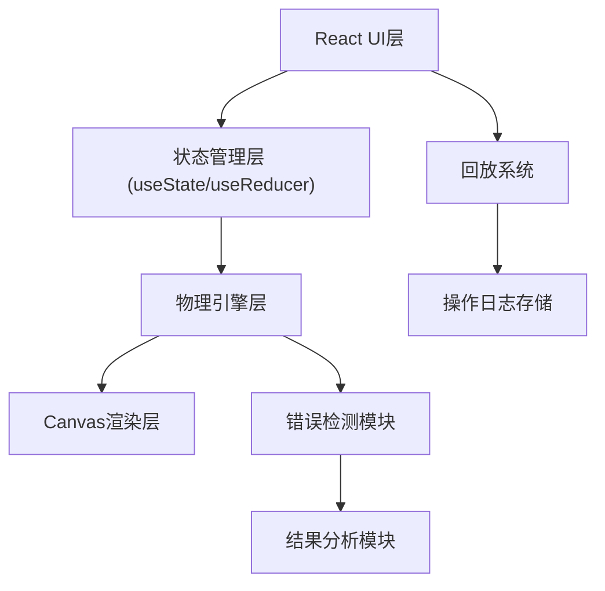

## 1. 架构设计



## 2. 技术描述

- **前端**：React@18 + TypeScript + Vite
- **样式**：TailwindCSS@3 + CSS自定义属性
- **渲染**：HTML5 Canvas API（2D物理模拟）
- **状态管理**：React Hooks + useContext
- **物理计算**：自定义物理引擎（洛伦兹力公式实现）
- **数据存储**：LocalStorage（保存回放记录）

## 3. 目录结构

```
src/
├── components/
│   ├── ControlPanel/      # 参数控制面板
│   ├── GameCanvas/        # 游戏画布
│   ├── ResultModal/       # 结果弹窗
│   ├── ReplayPanel/       # 回放面板
│   └── StatusBar/         # 状态栏
├── hooks/
│   ├── usePhysics.ts      # 物理计算hook
│   ├── useReplay.ts       # 回放控制hook
│   └── useGameState.ts    # 游戏状态管理
├── physics/
│   ├── lorentzForce.ts    # 洛伦兹力计算
│   ├── trajectory.ts      # 轨迹模拟
│   └── collision.ts       # 碰撞检测
├── types/
│   └── index.ts           # 类型定义
├── utils/
│   └── errorAnalysis.ts   # 错误分析工具
└── App.tsx
```

## 4. 核心类型定义

```typescript
// 游戏参数
interface GameParams {
  magneticField: {
    direction: 'up' | 'down' | 'left' | 'right';
    strength: number; // 0-10 T
  };
  current: {
    direction: 'positive' | 'negative';
    magnitude: number; // 0-100 A
  };
  projectile: {
    mass: number; // kg
    charge: number; // C
  };
}

// 轨迹点
interface TrajectoryPoint {
  x: number;
  y: number;
  velocity: { x: number; y: number };
  force: { x: number; y: number };
  timestamp: number;
}

// 操作日志
interface OperationLog {
  id: string;
  type: 'magneticField' | 'current' | 'mass' | 'fire';
  prevValue: any;
  newValue: any;
  timestamp: number;
  triggeredSimulation: boolean;
}

// 游戏结果
interface GameResult {
  hit: boolean;
  score: number;
  deviation: number;
  errors: {
    type: 'direction' | 'energy' | 'mass';
    severity: 'warning' | 'error';
    message: string;
    nextStep: string;
  }[];
  trajectory: TrajectoryPoint[];
  operations: OperationLog[];
}
```

## 5. 物理引擎核心公式

### 洛伦兹力公式
```
F = q(v × B)
其中:
- F: 洛伦兹力 (N)
- q: 电荷量 (C)
- v: 速度矢量 (m/s)
- B: 磁感应强度 (T)
```

### 运动方程
```
a = F/m
v = v₀ + aΔt
x = x₀ + vΔt
```

### 能量计算
```
E_k = ½mv²
E_limit = 最大允许能量
```

## 6. 错误检测逻辑

| 错误类型 | 检测条件 | 处理方式 |
|---------|---------|---------|
| 方向反判 | 计算方向与预期方向相反 | 待确认分支，提示学生复核左手定则 |
| 能量超限 | 动能 > 安全阈值 | 预警，提示联系竞赛社核实参数 |
| 质量缺失 | 质量为0或负数 | 错误提示，说明下一步找谁核 |
| 参数异常 | 磁场/电流超出范围 | 实时警告，阻止发射 |
