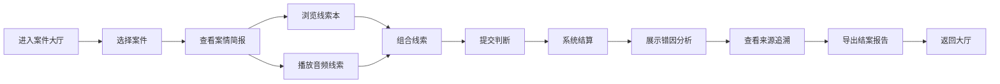

## 1. 产品概述

"乐理和弦侦探"是一款面向音乐教师的互动式训练原型，通过游戏化的"侦探破案"模式帮助学习者辨析音频线索、识别和弦与调式。系统解决的核心问题是：音乐教学中缺乏能将音频线索、线索本和线索重复逻辑清晰呈现的训练工具，导致学习者对和弦转位、同名调混淆等易错点理解不深。

- **目标用户**：音乐教师（课堂/培训演示）、音乐学习者
- **核心价值**：每条判断可追溯原始来源，线索组合和错因提示直接参与结算，让乐理学习过程透明可复盘

## 2. 核心功能

### 2.1 用户角色
| 角色 | 注册方式 | 核心权限 |
|------|----------|----------|
| 音乐教师/学习者 | 无需注册，直接使用 | 浏览案件、进行侦探推理、查看复盘报告、导出结案报告 |

### 2.2 功能模块
1. **案件大厅**：展示可用案件列表，每个案件对应一个乐理训练主题
2. **侦探推理**：接收案件、查看线索本、播放音频线索、组合线索、提交判断
3. **结算复盘**：显示得分、错因提示、线索组合追溯、来源追溯
4. **报告导出**：生成可导出的结案报告，包含完整推理链路

### 2.3 页面详情
| 页面名称 | 模块名称 | 功能描述 |
|----------|----------|----------|
| 案件大厅 | 案件卡片列表 | 展示案件名称、难度、标签，点击进入案件 |
| 案件大厅 | 侦探状态栏 | 显示当前得分、已破案件数 |
| 侦探推理 | 案情简报 | 展示案件背景、目标和弦/调式 |
| 侦探推理 | 线索本 | 展示所有可用文字线索（乐理知识点） |
| 侦探推理 | 音频线索区 | 播放/暂停音频，标记已听过的线索 |
| 侦探推理 | 线索组合区 | 拖拽/点击组合多条线索形成推理链 |
| 侦探推理 | 判断提交区 | 选择答案（和弦类型/调式）并提交 |
| 结算复盘 | 得分面板 | 显示本次得分、正确率 |
| 结算复盘 | 错因分析 | 展示错误原因（如：转位误判、同名调混淆、线索重复） |
| 结算复盘 | 来源追溯 | 每条判断关联到具体的音频线索或线索本条目 |
| 结算复盘 | 线索组合可视化 | 展示用户组合的线索链与正确线索链的对比 |
| 报告导出 | 结案报告 | 生成包含完整推理过程的可下载报告 |

## 3. 核心流程

用户进入案件大厅 → 选择一个案件 → 查看案情简报 → 浏览线索本和播放音频线索 → 组合线索形成推理 → 提交判断答案 → 系统结算并展示错因 → 查看复盘和来源追溯 → 导出结案报告 → 返回大厅继续其他案件

## 4. 用户界面设计

### 4.1 设计风格
- **主色调**：深靛蓝（#1E3A5F）代表专业与深度，搭配琥珀金（#D4AF37）作为推理正确的强调色
- **辅助色**：暗红（#B33A3A）用于错误提示，墨绿（#2E7D32）用于正确确认
- **字体**：标题用"Noto Serif SC"（衬线体，侦探/学术感），正文用"Noto Sans SC"
- **按钮风格**：圆角8px，带轻微阴影，hover时有浮起效果
- **整体风格**：侦探推理游戏风格，带有羊皮纸质感的背景，复古放大镜、卷宗等元素
- **图标**：使用 lucide-react 图标，偏向复古侦探风格

### 4.2 页面设计概述
| 页面名称 | 模块名称 | UI元素 |
|----------|----------|--------|
| 案件大厅 | 案件卡片 | 羊皮纸质感卡片，悬停微动画，标签徽章 |
| 侦探推理 | 线索卡片 | 可拖拽，音频波形可视化，已读/已听状态标记 |
| 侦探推理 | 组合区 | 虚线连接的推理链，可增删节点 |
| 结算复盘 | 错因面板 | 彩色标签标记错误类型，时间线展示推理过程 |
| 结算复盘 | 来源追溯 | 点击高亮对应原始线索，跨页面锚点跳转 |

### 4.3 响应式
- 桌面端优先设计，主内容区最大宽度1200px
- 平板端适配：双栏变单栏，线索卡片堆叠
- 移动端：简化交互，音频播放按钮放大

## 5. 测试样例要求

系统预置4条测试样例，覆盖核心逻辑分支：

1. **正常记录**：C大三和弦原位，线索清晰无重复，用于验证基础流程
2. **转位误判**：C大三和弦第一转位，用户容易误判为原位，测试转位识别逻辑
3. **同名调混淆**：C大调 vs c小调，测试同名调（同主音大小调）区分逻辑
4. **线索重复**：同一音频线索出现两次，测试系统是否正确识别重复而非合并

每种样例都需要在复盘时清晰展示：
- 线索组合是否被正确识别
- 错误原因是否准确标注
- 来源是否可追溯到原始线索
- 重复线索是否被单独标记而非错误合并
