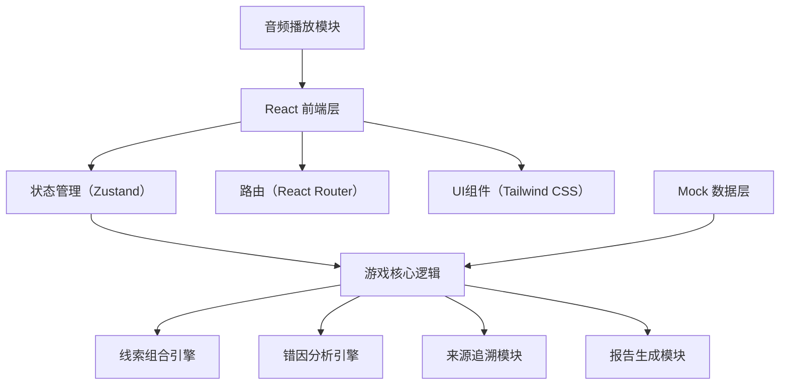
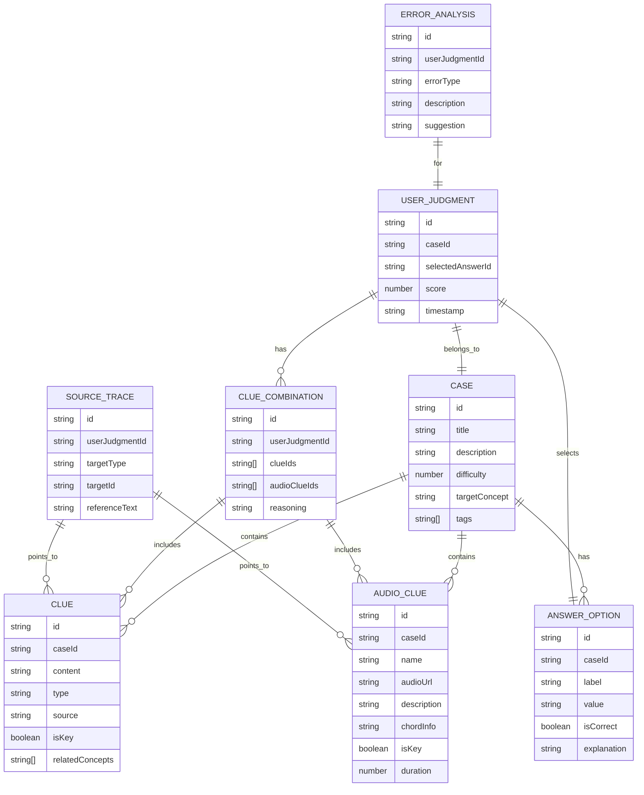

## 1. 架构设计



## 2. 技术描述
- **前端**：React@18 + TypeScript + Vite
- **状态管理**：Zustand
- **路由**：react-router-dom@6
- **样式**：Tailwind CSS@3
- **图标**：lucide-react
- **后端**：无后端，纯前端Mock数据
- **数据库**：无数据库，使用TypeScript定义数据模型，Mock数据内置

## 3. 路由定义
| Route | 用途 |
|-------|------|
| / | 案件大厅首页 |
| /case/:id | 侦探推理页面 |
| /case/:id/review | 结算复盘页面 |

## 4. 数据模型

### 4.1 数据模型定义


### 4.2 核心数据结构（TypeScript）
```typescript
// 案件
interface Case {
  id: string;
  title: string;
  description: string;
  difficulty: 1 | 2 | 3;
  targetConcept: string;
  tags: string[];
  brief: string;
  correctReasoning: string[];
}

// 文字线索
interface Clue {
  id: string;
  caseId: string;
  content: string;
  type: 'theory' | 'hint' | 'trap';
  source: string;
  isKey: boolean;
  relatedConcepts: string[];
  fingerprint: string; // 用于检测重复
}

// 音频线索
interface AudioClue {
  id: string;
  caseId: string;
  name: string;
  audioUrl: string; // 使用Web Audio API生成或Mock
  description: string;
  chordInfo: string;
  isKey: boolean;
  duration: number;
  fingerprint: string; // 用于检测重复
}

// 答案选项
interface AnswerOption {
  id: string;
  caseId: string;
  label: string;
  value: string;
  isCorrect: boolean;
  explanation: string;
}

// 用户判断
interface UserJudgment {
  id: string;
  caseId: string;
  selectedAnswerId: string;
  selectedClueIds: string[];
  selectedAudioClueIds: string[];
  isCorrect: boolean;
  score: number;
  timestamp: number;
}

// 错因分析
interface ErrorAnalysis {
  type: 'inversion_misjudgment' | 'enharmonic_confusion' | 'duplicate_clue' | 'wrong_combination' | 'other';
  description: string;
  suggestion: string;
  sourceTrace: {
    type: 'clue' | 'audio_clue';
    id: string;
    reference: string;
  }[];
}

// 结案报告
interface CaseReport {
  caseId: string;
  caseTitle: string;
  userJudgment: UserJudgment;
  correctAnswer: AnswerOption;
  errorAnalysis?: ErrorAnalysis;
  clueCombinationAnalysis: {
    userCombination: string[];
    correctCombination: string[];
    missingClues: string[];
    redundantClues: string[];
    duplicateClues: string[];
  };
  timestamp: number;
}
```

## 5. 核心模块设计

### 5.1 线索组合引擎
- 功能：验证用户选择的线索组合是否合理
- 检测：重复线索检测（基于fingerprint）、必要线索缺失检测、冗余线索检测
- 输出：组合得分 + 组合分析

### 5.2 错因分析引擎
- 功能：根据用户答案和线索组合，精准定位错误类型
- 错误类型：
  - `inversion_misjudgment`: 转位误判
  - `enharmonic_confusion`: 同名调混淆
  - `duplicate_clue`: 线索重复（系统检测到重复但用户未识别）
  - `wrong_combination`: 线索组合错误
- 输出：错误原因 + 改进建议 + 来源追溯

### 5.3 来源追溯模块
- 功能：为每条判断建立与原始线索的关联
- 实现：每个错因点都带有sourceTrace数组，可跳转至对应原始线索

### 5.4 报告生成模块
- 功能：生成结构化结案报告
- 导出格式：Markdown格式，包含完整推理链、错因分析、来源追溯
