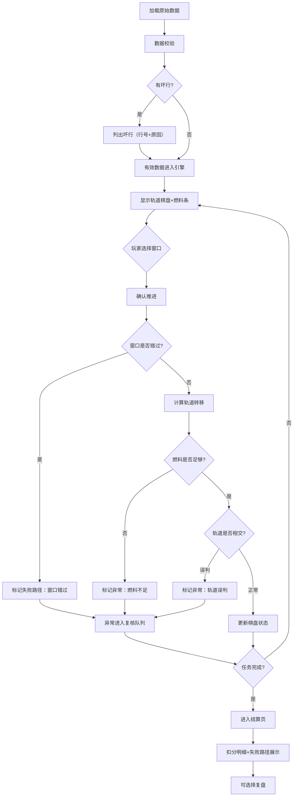

## 1. 产品概述

"航天器轨道转移棋"是一款面向科普馆讲解员和访客的浏览器策略棋盘游戏。玩家扮演航天任务指挥官，在行星轨道间规划转移轨道、管理燃料、把握发射窗口，最终完成轨道转移任务。核心解决的问题是：让航天轨道转移这一抽象概念通过博弈化方式变得可触可感，同时保留真实物理约束带来的决策张力。

- 目标用户：科普馆讲解员（用于演示和教学）、科普馆访客（自主体验）
- 核心价值：在真实轨道力学约束下体验决策博弈，窗口错过有明确的失败路径可追溯

## 2. 核心功能

### 2.1 用户角色
| 角色 | 进入方式 | 核心权限 |
|------|----------|----------|
| 指挥官（玩家） | 直接开始游戏 | 执行轨道转移决策、暂停/重开/复盘 |
| 讲解员（复核者） | 同一界面切换复核模式 | 查看异常筛选结果、坏行列表、失败路径追溯 |

### 2.2 功能模块
1. **游戏主界面**：轨道可视化棋盘、燃料条、任务日志、操控面板
2. **结算页**：窗口选择扣分明细、燃料消耗分析、失败路径展示
3. **复盘页**：逐步回放棋局、标注关键决策点与异常

### 2.3 页面详情
| 页面名称 | 模块名称 | 功能描述 |
|----------|----------|----------|
| 游戏主界面 | 轨道棋盘 | 用Canvas绘制行星轨道环、航天器位置、转移轨迹预览；轨道推进后航天器实时移动 |
| 游戏主界面 | 燃料条 | 垂直/水平燃料指示条，推进时实时扣减，不足时红色警示；支持从原始数据（含空行/备注/缺列）解析 |
| 游戏主界面 | 任务日志 | 侧栏滚动日志，记录每步操作及结果；窗口错过、燃料不足等异常标红并归类 |
| 游戏主界面 | 操控面板 | 发射窗口选择（下拉/按钮组）、推进确认、暂停、重开按钮 |
| 游戏主界面 | 坏行提示面板 | 解析燃料条/任务日志原始数据时发现的坏行单独列出，标注行号和原因 |
| 结算页 | 扣分明细 | 按窗口选择逐条列出扣分原因（窗口偏移量→燃料浪费→扣分） |
| 结算页 | 失败路径 | 窗口错过时展示完整失败链：错过窗口→轨道偏移→燃料耗尽/轨道相交 |
| 结算页 | 异常筛选 | 燃料不足事件、轨道相交误判事件可按类型筛选，供讲解员复核 |
| 复盘页 | 棋局回放 | 可逐步前进/后退，每步显示轨道状态和决策点标注 |
| 复盘页 | 决策标注 | 在回放中标记窗口选择点、燃料警戒线、轨道交叉风险点 |

## 3. 核心流程

玩家进入游戏后，系统加载行星轨道数据和燃料配置（原始数据可能含空行、备注行、缺列）。数据经过校验后，有效行进入游戏引擎，坏行列出供讲解员确认。玩家在每一轮选择发射窗口并确认推进，引擎计算轨道变化和燃料消耗。若窗口错过，结果不混入正常轨道而是标记为"窗口错过"失败路径。燃料不足或轨道相交时，异常被筛出进入复核队列。游戏结束后进入结算页，详细展示窗口选择造成的扣分和失败路径。

## 4. 用户界面设计

### 4.1 设计风格
- 主色调：深空黑（#0a0e1a）+ 星云蓝（#1e3a5f）+ 轨道金（#f0c040）作为强调色
- 次要色：燃料绿（#22c55e）→ 燃料红（#ef4444）渐变
- 按钮风格：圆角矩形，hover时发光边框，轨道金按钮为主要操作
- 字体：显示字体用 Orbitron（科技感），正文用 Noto Sans SC（中文可读性）
- 布局：左侧大区域为轨道棋盘Canvas，右侧为操控面板+日志，底部燃料条
- 图标：lucide-react 图标集

### 4.2 页面设计概览
| 页面名称 | 模块名称 | UI元素 |
|----------|----------|--------|
| 游戏主界面 | 轨道棋盘 | Canvas绘制深空背景+行星轨道环+航天器图标+转移轨迹虚线；轨道推进动画 |
| 游戏主界面 | 燃料条 | 垂直渐变条，顶部绿底红，实时下降动画，低于30%闪烁 |
| 游戏主界面 | 操控面板 | 窗口选择按钮组（高亮最优窗口）、推进按钮（金色大按钮）、暂停/重开图标按钮 |
| 游戏主界面 | 坏行提示 | 可折叠面板，表格列出坏行号和原因，琥珀色背景 |
| 游戏主界面 | 任务日志 | 深色半透明侧栏，条目带时间戳，异常条目标红 |
| 结算页 | 扣分明细 | 分组卡片，每组=一个窗口选择，显示窗口偏移→燃料浪费→扣分链条 |
| 结算页 | 失败路径 | 红色虚线流程图，展示从窗口错过到任务失败的完整链路 |
| 结算页 | 异常筛选 | 标签页切换：燃料不足/轨道误判/窗口错过，表格列出事件详情 |
| 复盘页 | 回放控制 | 底部进度条+前进/后退按钮，当前位置时间戳 |
| 复盘页 | 决策标注 | 轨道棋盘上叠加标记点，点击显示决策详情浮层 |

### 4.3 响应式
- 桌面优先设计（科普馆大屏为主场景）
- 最小支持 1280px 宽度，轨道棋盘自适应缩放
- 触控兼容：按钮足够大，支持科普馆触控一体机

### 4.4 3D场景指引
- 不适用，使用2D Canvas绘制轨道（俯视图），保持科普馆环境下的可读性和性能
