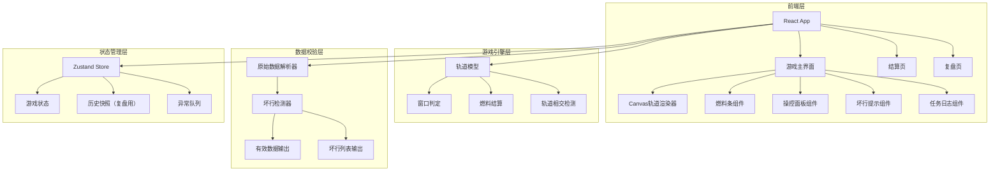
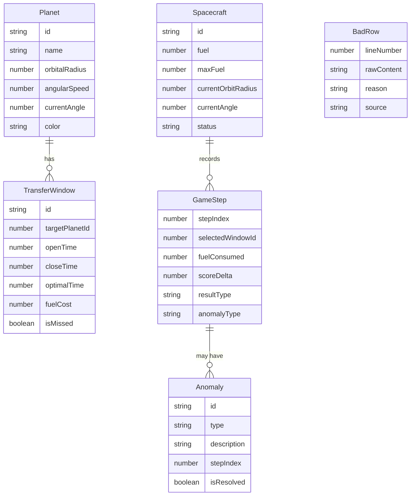

## 1. 架构设计



## 2. 技术说明
- 前端：React@18 + TypeScript + Tailwind CSS@3 + Vite
- 初始化工具：vite-init
- 后端：无（纯前端，数据内嵌）
- 状态管理：Zustand
- 轨道渲染：Canvas 2D API
- 路由：react-router-dom

## 3. 路由定义
| 路由 | 用途 |
|------|------|
| / | 游戏主界面：轨道棋盘+操控面板+燃料条+日志 |
| /settlement | 结算页：扣分明细+失败路径+异常筛选 |
| /replay | 复盘页：棋局逐步回放+决策标注 |

## 4. API定义
无后端API。所有游戏逻辑在前端计算，数据以JSON内嵌。

## 5. 服务器架构图
不适用，纯前端项目。

## 6. 数据模型

### 6.1 数据模型定义



### 6.2 核心类型定义

```typescript
interface Planet {
  id: string;
  name: string;
  orbitalRadius: number;
  angularSpeed: number;
  currentAngle: number;
  color: string;
}

interface Spacecraft {
  id: string;
  fuel: number;
  maxFuel: number;
  currentOrbitRadius: number;
  currentAngle: number;
  status: 'idle' | 'transferring' | 'stranded' | 'arrived';
}

interface TransferWindow {
  id: string;
  targetPlanetId: string;
  openTime: number;
  closeTime: number;
  optimalTime: number;
  fuelCost: number;
  isMissed: boolean;
}

interface GameStep {
  stepIndex: number;
  selectedWindowId: string;
  fuelConsumed: number;
  scoreDelta: number;
  resultType: 'success' | 'window_missed' | 'fuel_insufficient' | 'orbit_intersect';
  anomalyType: string | null;
}

interface Anomaly {
  id: string;
  type: 'fuel_insufficient' | 'orbit_intersect' | 'window_missed';
  description: string;
  stepIndex: number;
  isResolved: boolean;
}

interface BadRow {
  lineNumber: number;
  rawContent: string;
  reason: string;
  source: 'fuel_bar' | 'mission_log' | 'orbit_data';
}

interface GameState {
  phase: 'playing' | 'paused' | 'finished';
  currentStep: number;
  score: number;
  planets: Planet[];
  spacecraft: Spacecraft;
  steps: GameStep[];
  anomalies: Anomaly[];
  badRows: BadRow[];
  history: GameStateSnapshot[];
}
```
