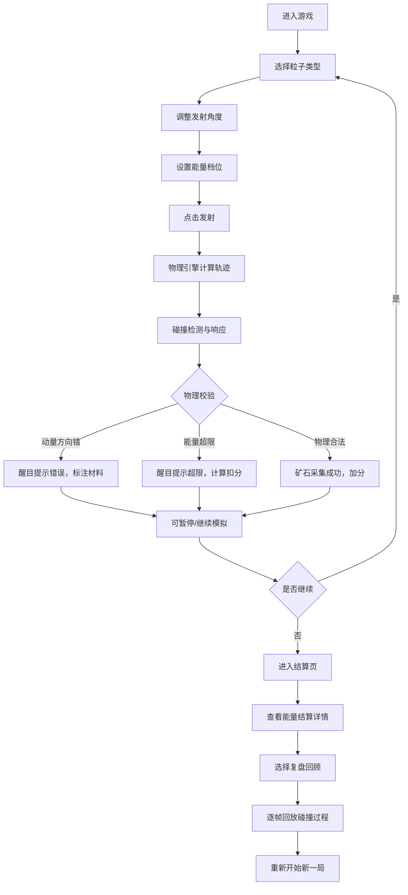

## 1. 产品概述

"粒子碰撞采矿场"是一款面向物理科普教育的浏览器游戏，玩家通过操作粒子炮发射不同类型的粒子，与矿石块发生碰撞来采集矿石。游戏核心在于模拟真实的物理碰撞过程，强调动量守恒和能量守恒定律，让玩家在游戏中理解并应用这些物理概念。

- **核心目标**：通过真实物理模拟让玩家理解动量守恒和能量守恒
- **目标用户**：学生、物理爱好者、科普教育工作者
- **解决问题**：将抽象的物理概念转化为直观可操作的游戏体验，解决物理教学中动量方向错误和能量超限等常见误区

## 2. 核心特性

### 2.1 用户角色

| 角色 | 注册方式 | 核心权限 |
|------|----------|----------|
| 玩家 | 无需注册，直接进入 | 游戏操作、参数调整、查看复盘 |

### 2.2 功能模块

1. **游戏主界面**：粒子炮控制面板、碰撞模拟区域、能量条显示、矿石块阵列
2. **参数选择**：粒子类型选择、发射角度调整、能量档位设置
3. **游戏控制**：开始发射、暂停模拟、重新开始、复盘回顾
4. **错误提示**：动量方向错误提示、能量超限警告、材料问题定位
5. **结算页面**：碰撞结果展示、能量结算详情、扣分原因分析、物理公式对照

### 2.3 页面详情

| 页面名称 | 模块名称 | 功能描述 |
|----------|----------|----------|
| 游戏主界面 | 粒子炮控制 | 选择粒子类型、调整发射角度、设置发射能量 |
| 游戏主界面 | 碰撞模拟区 | Canvas实时渲染粒子飞行轨迹、碰撞过程、矿石破碎效果 |
| 游戏主界面 | 状态显示 | 能量条、当前得分、矿石采集进度 |
| 游戏主界面 | 控制按钮 | 发射、暂停、重开、复盘四个核心操作按钮 |
| 游戏主界面 | 错误提示层 | 醒目显示动量方向错误、能量超限等问题，标注具体材料 |
| 结算页面 | 结果总览 | 展示本局得分、采集矿石数、碰撞次数统计 |
| 结算页面 | 能量结算 | 逐条展示每次碰撞的能量守恒校验、超限扣分详情 |
| 结算页面 | 物理对照 | 显示动量公式、能量公式，与本次碰撞数据对照 |
| 复盘页面 | 时间轴回放 | 可逐帧回放碰撞过程，标注关键物理节点 |

## 3. 核心流程

## 4. 用户界面设计

### 4.1 设计风格

**复古科学实验风**：
- **主色调**：深蓝底色（#0a1628）+ 荧光绿（#39ff14）+ 警示红（#ff3b30）+ 矿石橙（#ff9500）
- **按钮风格**：粗边框、轻微立体感、按下凹陷效果，类似实验室设备按钮
- **字体**：显示字体用 "Press Start 2P"（像素复古风），正文字体用 "JetBrains Mono"（等宽科技感）
- **布局风格**：模块化面板、网格化布局、类似示波器/控制面板的分区设计
- **图标风格**：线条简约的物理示意图、粒子轨迹图标、能量波形图标

### 4.2 页面设计概述

| 页面名称 | 模块名称 | UI元素 |
|----------|----------|---------|
| 游戏主界面 | 粒子炮面板 | 左侧竖向面板，粒子类型按钮、角度滑块、能量旋钮 |
| 游戏主界面 | 碰撞模拟区 | 中央大区域，深色背景带网格线，矿石块排列成阵列 |
| 游戏主界面 | 能量条 | 右侧竖向能量条，分段显示，超限部分红色闪烁 |
| 游戏主界面 | 控制栏 | 底部横向按钮栏，发射/暂停/重开/复盘 |
| 游戏主界面 | 错误提示 | 顶部或碰撞点附近弹出醒目红色边框提示框 |
| 结算页面 | 结算卡片 | 半透明深色卡片，数据逐行显现动画 |
| 复盘页面 | 时间轴 | 底部可拖动时间轴，关键帧标记点 |

### 4.3 响应式

- 桌面端优先，采用固定布局保证游戏体验
- 移动端自适应缩放，保证核心操作区域可触控
- 最小支持宽度：768px（平板以上设备）

### 4.4 视觉动效

- 粒子发射：尾焰拖影效果、炮口闪光
- 碰撞瞬间：爆炸粒子效果、屏幕轻微震动
- 能量超限：红色脉冲动画、警示条纹闪烁
- 错误提示：从碰撞点弹出、抖动动画
- 数据显示：数字滚动效果、渐入动画
