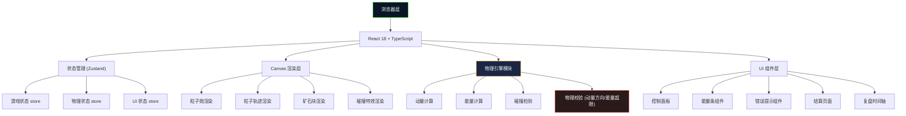

## 1. 架构设计



## 2. 技术描述

- **前端**：React@18 + TypeScript + Vite
- **状态管理**：Zustand (轻量、简洁，适合游戏状态管理)
- **样式**：TailwindCSS@3 + 自定义 CSS 变量
- **渲染**：HTML5 Canvas API (2D 物理模拟渲染)
- **图标**：Lucide React
- **后端**：无（纯前端游戏，数据存储在 localStorage）
- **数据库**：LocalStorage（存储历史游戏记录和高分）

## 3. 路由定义

| 路由 | 页面 | 用途 |
|------|------|------|
| `/` | 游戏主界面 | 核心游戏玩法区域 |
| `/result` | 结算页面 | 展示本局结果、能量结算、物理对照 |
| `/replay` | 复盘页面 | 逐帧回放碰撞过程 |

## 4. 数据模型

### 4.1 核心类型定义

```typescript
// 粒子类型
interface ParticleType {
  id: string;
  name: string;
  mass: number;      // 质量 (kg)
  charge: number;    // 电荷
  color: string;     // 显示颜色
  description: string;
}

// 矿石类型
interface OreType {
  id: string;
  name: string;
  mass: number;      // 质量 (kg)
  hardness: number;  // 硬度（决定碰撞所需最小能量）
  scoreValue: number; // 采集得分
  color: string;
  energyThreshold: number; // 能量采集阈值
}

// 粒子实例
interface Particle {
  id: string;
  type: ParticleType;
  x: number;
  y: number;
  vx: number;        // x方向速度
  vy: number;        // y方向速度
  energy: number;    // 动能
  trail: { x: number; y: number }[];
}

// 矿石块实例
interface OreBlock {
  id: string;
  type: OreType;
  x: number;
  y: number;
  width: number;
  height: number;
  health: number;    // 剩余耐久
  collected: boolean;
}

// 碰撞记录
interface CollisionRecord {
  id: string;
  timestamp: number;
  frameIndex: number;
  particleId: string;
  oreId: string;
  position: { x: number; y: number };
  
  // 碰撞前数据
  beforeCollision: {
    particleMomentum: { x: number; y: number };
    particleEnergy: number;
    oreVelocity: { x: number; y: number };
  };
  
  // 碰撞后数据
  afterCollision: {
    particleMomentum: { x: number; y: number };
    particleEnergy: number;
    oreVelocity: { x: number; y: number };
  };
  
  // 物理校验结果
  physicsCheck: {
    momentumConserved: boolean;
    momentumError: { x: number; y: number };
    momentumDirectionWrong: boolean;
    wrongDirectionMaterial?: string;
    
    energyConserved: boolean;
    energyDifference: number;
    energyOverLimit: boolean;
    energyLimit: number;
    overLimitAmount: number;
  };
  
  // 游戏结果
  scoreChange: number;
  penaltyReason?: string;
  oreCollected: boolean;
}

// 游戏状态
interface GameState {
  status: 'idle' | 'playing' | 'paused' | 'finished';
  currentRound: number;
  totalScore: number;
  energyUsed: number;
  maxEnergy: number;
  selectedParticle: ParticleType | null;
  launchAngle: number;     // 发射角度（度）
  launchPower: number;     // 发射功率 0-100
  particles: Particle[];
  oreBlocks: OreBlock[];
  collisionHistory: CollisionRecord[];
  frameHistory: GameFrame[]; // 用于复盘
  currentFrame: number;
  errors: GameError[];
}

// 游戏帧（用于复盘）
interface GameFrame {
  frameIndex: number;
  particles: Particle[];
  oreBlocks: OreBlock[];
  timestamp: number;
}

// 游戏错误
interface GameError {
  id: string;
  type: 'momentum_direction' | 'energy_over_limit' | 'other';
  message: string;
  materialName?: string;  // 相关材料名称
  position: { x: number; y: number };
  collisionId: string;
  timestamp: number;
}
```

### 4.2 物理常量

```typescript
const PHYSICS_CONSTANTS = {
  MAX_ENERGY_PER_LAUNCH: 100,      // 单次发射最大能量 (J)
  TOTAL_ENERGY_BUDGET: 500,        // 总能量预算 (J)
  ENERGY_CONSERVATION_TOLERANCE: 0.05, // 能量守恒容差 5%
  MOMENTUM_CONSERVATION_TOLERANCE: 0.05, // 动量守恒容差 5%
  GRAVITY: 0,                      // 本游戏忽略重力
  FRICTION: 0,                     // 无摩擦
  ELASTIC_COEFFICIENT: 0.8,        // 弹性系数
};
```

## 5. 目录结构

```
src/
├── components/
│   ├── game/
│   │   ├── Canvas.tsx           # 游戏画布主组件
│   │   ├── ParticleCannon.tsx   # 粒子炮控制组件
│   │   ├── EnergyBar.tsx        # 能量条组件
│   │   ├── OreBlockDisplay.tsx  # 矿石显示组件
│   │   └── ControlBar.tsx       # 控制按钮栏
│   ├── ui/
│   │   ├── ErrorToast.tsx       # 错误提示组件
│   │   ├── Button.tsx           # 通用按钮
│   │   └── Slider.tsx           # 通用滑块
│   ├── pages/
│   │   ├── GamePage.tsx         # 游戏主页面
│   │   ├── ResultPage.tsx       # 结算页面
│   │   └── ReplayPage.tsx       # 复盘页面
├── hooks/
│   ├── useGameLoop.ts           # 游戏循环 hook
│   ├── usePhysicsEngine.ts      # 物理引擎 hook
│   └── useReplay.ts             # 复盘功能 hook
├── store/
│   ├── useGameStore.ts          # 游戏状态 store
│   └── useUIStore.ts            # UI 状态 store
├── utils/
│   ├── physics/
│   │   ├── momentum.ts          # 动量计算
│   │   ├── energy.ts            # 能量计算
│   │   ├── collision.ts         # 碰撞检测
│   │   └── validator.ts         # 物理校验
│   ├── constants.ts             # 游戏常量
│   └── types.ts                 # 类型定义
├── data/
│   ├── particles.ts             # 粒子类型数据
│   └── ores.ts                  # 矿石类型数据
├── App.tsx
├── main.tsx
└── index.css
```

## 6. 物理引擎核心算法

### 6.1 动量守恒校验

```
碰撞前总动量: p_before = m1*v1 + m2*v2
碰撞后总动量: p_after = m1*v1' + m2*v2'
动量误差: Δp = |p_after - p_before| / |p_before|
如果 Δp > 容差 或 方向与预期不符 → 动量方向错误
```

### 6.2 能量守恒校验

```
碰撞前总动能: E_before = 0.5*m1*v1² + 0.5*m2*v2²
碰撞后总动能: E_after = 0.5*m1*v1'² + 0.5*m2*v2'²
能量损失: ΔE = E_before - E_after (非弹性碰撞允许)
能量超限: 如果 E_after > E_before * (1 + 容差) → 能量超限
```

### 6.3 碰撞响应（弹性碰撞）

```
一维弹性碰撞公式:
v1' = ((m1-m2)*v1 + 2*m2*v2) / (m1+m2)
v2' = ((m2-m1)*v2 + 2*m1*v1) / (m1+m2)

二维碰撞需要分解为法向和切向分量分别计算
```
