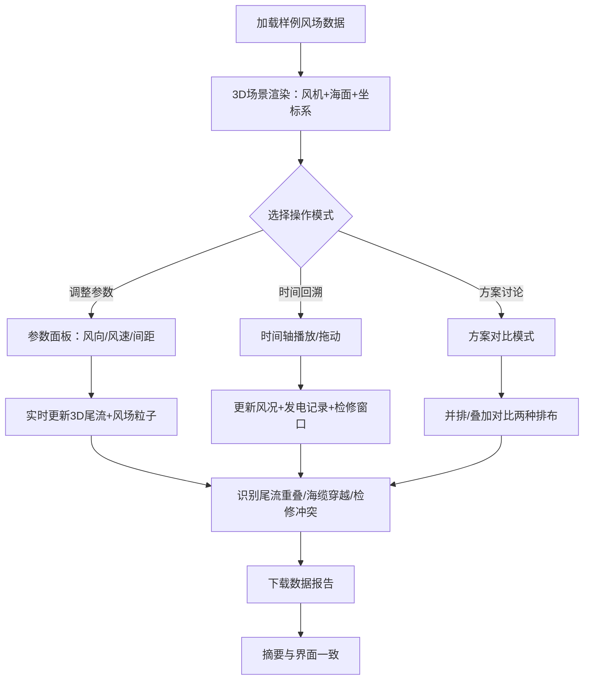

## 1. 产品概述

海上风电尾流沙盘——面向新能源工程师的3D交互式风电场可视化与方案讨论工具。解决风机排布讨论总靠二维图、项目会上无法直观看到尾流/海缆/检修船路径立体关系的痛点。拖动参数或切换方案后，3D画面、风场尾流可视说明、方案对比同步更新，确保"所见即所算"。

- 目标用户：海上风电项目工程师、运维团队、项目评审会参与者
- 核心价值：将风机坐标、海缆路径、发电记录统一到同一3D空间，让尾流重叠、海缆穿越、检修窗口冲突等尴尬情况一目了然

## 2. 核心功能

### 2.1 用户角色
| 角色 | 使用方式 | 核心权限 |
|------|----------|----------|
| 工程师 | 直接打开使用 | 浏览3D场景、调整参数、对比方案、下载数据 |
| 评审人员 | 同上 | 查看方案、播放时间轴、阅读摘要 |

### 2.2 功能模块
1. **沙盘主页面**：3D风场场景 + 参数面板 + 尾流/海缆/检修船可视化 + 时间轴 + 方案对比 + 发电记录面板

### 2.3 页面详情
| 页面名称 | 模块名称 | 功能描述 |
|----------|----------|----------|
| 沙盘主页面 | 3D风场场景 | 渲染海面、风机模型（带坐标标注）、风场粒子流，支持旋转/缩放/平移 |
| 沙盘主页面 | 尾流可视化 | 根据风向和风机排布实时计算并渲染尾流锥体，高亮尾流重叠区域 |
| 沙盘主页面 | 海缆路径 | 3D空间绘制海底电缆走向，标注穿越/交叉点，高亮冲突段 |
| 沙盘主页面 | 检修船路径 | 显示检修船航行路线，结合时间轴展示检修窗口与冲突 |
| 沙盘主页面 | 参数面板 | 风向、风速、风机型号、排布间距等参数滑块/选择器，拖动后3D场景同步更新 |
| 沙盘主页面 | 时间轴 | 播放/暂停/拖动，随时间变化更新风场、尾流方向、发电数据、检修窗口 |
| 沙盘主页面 | 方案对比 | 左右或叠加对比两种排布方案的尾流、海缆、发电差异 |
| 沙盘主页面 | 发电记录面板 | 时间轴联动显示各风机发电量，高亮异常/对账差异 |
| 沙盘主页面 | 数据下载与摘要 | 导出CSV/JSON，终端摘要与界面数据一致 |

## 3. 核心流程

工程师打开沙盘后，默认加载样例风场数据。通过参数面板调整风向/风速/排布参数，3D场景实时更新尾流分布。拖动时间轴回溯历史风况与发电记录，发现尾流重叠导致的发电损失。切换到海缆视角检查穿越冲突，或在检修模式下查看窗口冲突。需讨论时开启方案对比，并排或叠加两种排布方案。最后下载数据报告，摘要与界面所见一致。

## 4. 用户界面设计

### 4.1 设计风格
- **主色调**：深海蓝 (#0A1628) + 航海青 (#00D4AA) + 警告橙 (#FF6B35) + 数据白 (#E8ECF1)
- **按钮风格**：圆角矩形，hover时发光边框，半透明毛玻璃质感
- **字体**：数据/数字用 JetBrains Mono，标题/正文用 Noto Sans SC
- **布局**：左侧参数面板(可折叠) + 中央3D场景(全屏沉浸) + 底部时间轴 + 右侧数据面板
- **图标**：Lucide图标，线条风格，与航海/工程主题呼应

### 4.2 页面设计概览
| 页面名称 | 模块名称 | UI元素 |
|----------|----------|--------|
| 沙盘主页面 | 3D风场场景 | 深色海面+天空渐变背景，风机白色圆柱+叶片，坐标标注浮标，风场粒子流(青色) |
| 沙盘主页面 | 尾流可视化 | 半透明锥体(渐变从青到橙)，重叠区域高亮(红色脉冲)，风向箭头 |
| 沙盘主页面 | 海缆路径 | 黄色管线(3D管道)，穿越点红色标记球，管线上标注电压等级 |
| 沙盘主页面 | 检修船路径 | 绿色虚线航线，船只图标(时间轴联动移动)，窗口色块(绿=可修/红=冲突) |
| 沙盘主页面 | 参数面板 | 毛玻璃背景侧栏，滑块+数值输入，风向罗盘小部件，实时数值反馈 |
| 沙盘主页面 | 时间轴 | 底部横条，可拖动游标，风速/发电量迷你波形图叠加，播放/暂停按钮 |
| 沙盘主页面 | 方案对比 | 双视口切换按钮，差异高亮闪烁，尾流面积/发电量数值对比 |
| 沙盘主页面 | 发电记录面板 | 右侧可折叠，风机编号+柱状图，异常值标红，与时间轴联动高亮 |
| 沙盘主页面 | 数据下载 | 右上角下载按钮，下拉菜单选格式，下载后toast提示摘要 |

### 4.3 响应式
- 桌面优先设计，最小支持1280px宽度
- 参数面板和记录面板可折叠以适应较小屏幕
- 3D场景始终占据最大可视面积

### 4.4 3D场景指引
- **环境/氛围**：黄昏海面，深蓝天空到地平线暖橙渐变，营造海上风电场景氛围
- **光照**：方向光(模拟太阳，暖白色) + 环境光(深蓝冷光) + 点光源(风机顶部航空灯)
- **相机**：透视相机，默认45°俯视视角，OrbitControls允许自由旋转缩放，限制最大/最小距离
- **构图与焦点**：风机阵列居中，海面网格线提供空间参考
- **交互与动画**：风机叶片旋转(速度随风速变)，尾流锥体呼吸脉动，海面波浪shader动画，粒子随风向流动
- **后处理**：轻微Bloom效果(航空灯/尾流重叠高亮)，环境雾(远处风机渐隐)
- **资源与性能**：风机用程序化几何体(无需外部模型)，InstancedMesh批量渲染，粒子系统不超过5000，保持60fps

## 5. 样例数据设计

样例需同时包含风机坐标、海缆路径、发电记录，能展示：
- **顺利场景**：正常排布、无尾流重叠、海缆无穿越、检修窗口充裕
- **尴尬场景**：尾流重叠(前排风机遮挡后排)、海缆交叉(不同回路穿越)、检修窗口冲突(多台同时待修但只有一条船)

样例规模：6-9台风机，2条海缆回路，12小时时间序列数据(1小时间隔)
