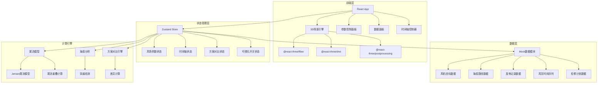
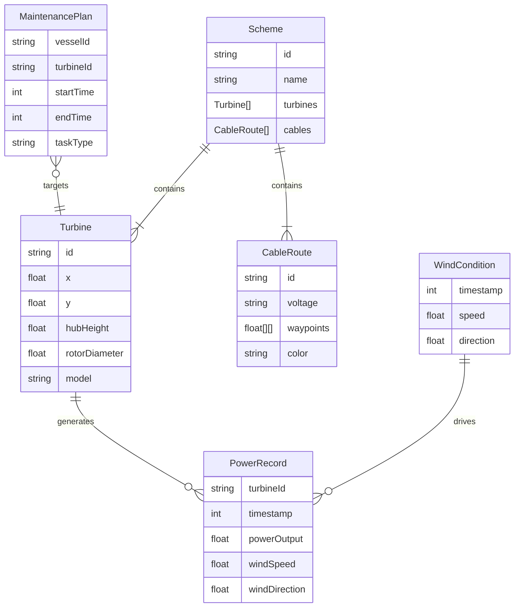

## 1. 架构设计



## 2. 技术说明

- **前端**：React@18 + TypeScript + TailwindCSS@3 + Vite
- **初始化工具**：vite-init (react-ts 模板)
- **3D渲染**：three + @react-three/fiber + @react-three/drei + @react-three/postprocessing
- **状态管理**：Zustand
- **后端**：无（纯前端，Mock数据）
- **数据导出**：前端生成CSV/JSON下载

## 3. 路由定义

| 路由 | 用途 |
|------|------|
| / | 沙盘主页面（单页应用，所有功能集成在一个页面） |

## 4. 数据模型

### 4.1 数据模型定义



### 4.2 数据定义

**风机数据**：
```typescript
interface Turbine {
  id: string;
  x: number;
  y: number;
  hubHeight: number;
  rotorDiameter: number;
  model: string;
}
```

**海缆路径数据**：
```typescript
interface CableRoute {
  id: string;
  voltage: string;
  waypoints: [number, number][];
  color: string;
}
```

**发电记录数据**：
```typescript
interface PowerRecord {
  turbineId: string;
  timestamp: number;
  powerOutput: number;
  windSpeed: number;
  windDirection: number;
}
```

**检修计划数据**：
```typescript
interface MaintenancePlan {
  vesselId: string;
  turbineId: string;
  startTime: number;
  endTime: number;
  taskType: string;
}
```

**风况时间序列**：
```typescript
interface WindCondition {
  timestamp: number;
  speed: number;
  direction: number;
}
```

## 5. 尾流计算模型

采用Jensen（Park）尾流模型，简化计算：
- 尾流锥角：约5.7°（典型值）
- 尾流风速衰减：ΔV/V₀ = (1 - √(1 - Ct)) / (1 + k·x/R)²
- 尾流重叠：多台风机尾流叠加取平方和开根号

## 6. 核心组件结构

```
src/
├── components/
│   ├── Scene3D/              # 3D场景容器
│   │   ├── OceanSurface.tsx   # 海面shader
│   │   ├── TurbineModel.tsx   # 风机模型(程序化)
│   │   ├── WakeCone.tsx       # 尾流锥体
│   │   ├── WakeOverlap.tsx    # 尾流重叠区域
│   │   ├── CableLine.tsx      # 海缆3D管道
│   │   ├── CableCrossing.tsx  # 海缆穿越标记
│   │   ├── VesselPath.tsx     # 检修船路径
│   │   ├── WindParticles.tsx  # 风场粒子
│   │   └── GridHelper.tsx     # 坐标网格
│   ├── Panels/
│   │   ├── ParameterPanel.tsx  # 参数面板
│   │   ├── PowerPanel.tsx      # 发电记录面板
│   │   ├── ComparisonPanel.tsx # 方案对比面板
│   │   └── SummaryPanel.tsx    # 摘要面板
│   ├── Timeline/
│   │   └── Timeline.tsx        # 时间轴组件
│   └── UI/
│       ├── WindCompass.tsx     # 风向罗盘
│       ├── DownloadButton.tsx  # 数据下载
│       └── ViewToggle.tsx      # 视图切换
├── store/
│   └── useStore.ts            # Zustand全局状态
├── data/
│   └── mockData.ts            # 样例数据
├── utils/
│   ├── wakeModel.ts           # Jensen尾流计算
│   ├── cableAnalysis.ts       # 海缆穿越检测
│   ├── schemeComparison.ts    # 方案差异计算
│   └── dataExport.ts          # 数据导出
├── pages/
│   └── Sandbox.tsx            # 沙盘主页面
└── App.tsx
```
