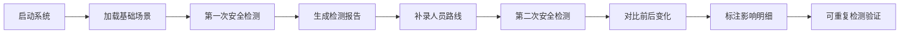

## 1. 产品概述
矿洞安全支护模型演示系统是一款面向矿山安全员的3D可视化工具，用于展示巷道结构、支护状态、传感器数据及人员路线，帮助快速识别安全隐患和坐标偏移。

- 解决问题：人员路线补录滞后导致的安全状态判断困难，3D模型缺乏明确标注导致沟通效率低下
- 目标用户：矿山安全员、安全培训讲师、技术管理人员
- 核心价值：通过清晰的3D标注和对比功能，提高安全隐患识别效率和沟通准确性

## 2. 核心功能

### 2.1 用户角色
| 角色 | 注册方式 | 核心权限 |
|------|----------|----------|
| 安全员 | 无需注册 | 查看3D模型、运行检测、导出截图 |
| 培训讲师 | 无需注册 | 演示场景切换、控制播放流程 |

### 2.2 功能模块
1. **主界面**：3D巷道视图、场景控制面板、检测结果面板
2. **场景管理**：支持两次导入对比（基础模型 + 补录数据）
3. **剖切查看**：多平面剖切，显示内部结构和标注
4. **安全检测**：坐标偏移检测、支护缺失检测、传感器离线检测
5. **结果对比**：前后两次检测结果对比，高亮变化项
6. **标注系统**：坐标标注、状态标注、影响范围标注

### 2.3 页面详情
| 页面名称 | 模块名称 | 功能描述 |
|----------|----------|----------|
| 主界面 | 3D视口 | 显示巷道3D模型，支持旋转、缩放、平移 |
| 主界面 | 场景控制 | 切换演示场景、运行/暂停检测、剖切控制 |
| 主界面 | 检测面板 | 显示检测明细列表、统计数据、状态图例 |
| 主界面 | 对比视图 | 前后两次检测结果并排对比，高亮差异 |
| 主界面 | 标注层 | 坐标偏移标注、支护状态标注、传感器状态标注 |

## 3. 核心流程

### 3.1 演示流程
1. 打开系统 → 加载基础场景（巷道+支护点+传感器）
2. 运行第一次安全检测 → 生成检测报告
3. 点击"补录人员路线" → 加载人员轨迹数据
4. 自动运行第二次检测 → 高亮显示新增/变化项
5. 标注受人员路线影响的检测明细
6. 可重复运行检测，结果保持一致

### 3.2 流程图

## 4. 用户界面设计

### 4.1 设计风格
- **主色调**：工业蓝 (#1E3A5F) - 代表专业、安全
- **辅助色**：警示红 (#E53935)、警告橙 (#FB8C00)、正常绿 (#43A047)、信息蓝 (#1E88E5)
- **按钮风格**：直角、轻微阴影、悬停变色
- **字体**：使用思源黑体，标题18-24px，正文14px，标注12px
- **布局风格**：左侧控制面板、中间3D视口、右侧检测面板
- **图标风格**：线性图标，统一24px尺寸

### 4.2 3D场景设计
- **环境**：深色背景，模拟矿洞环境，轻微雾化效果
- **光照**：主光源+环境光，突出巷道结构和支护点
- **材质**：巷道使用灰色金属质感，支护点使用发光材质便于识别
- **相机**：默认透视视角，支持第一人称漫游
- **标注**：使用带引线的3D标签，始终面向相机，文字清晰可读

### 4.3 页面设计概览
| 页面名称 | 模块名称 | UI元素 |
|----------|----------|--------|
| 主界面 | 3D视口 | 巷道模型、支护点、传感器、人员路线、剖切平面、3D标注 |
| 主界面 | 左侧面板 | 场景切换、检测控制、剖切设置、视图操作 |
| 主界面 | 右侧面板 | 检测统计、问题列表、对比视图、图例说明 |
| 主界面 | 底部状态栏 | 当前场景、检测时间、坐标信息 |

### 4.4 响应式
- 桌面端优先设计，支持1920×1080及以上分辨率
- 面板可折叠，适应不同屏幕尺寸
- 触摸设备支持手势操作

### 4.5 3D场景指引
- **环境**：深色背景 (#0a0f1a)，指数雾化增强深度感
- **光照**：两盏方向光 + 环境光，重点照亮支护点和传感器
- **相机**：初始位置在巷道入口上方45度，支持轨道控制
- **交互**：点击高亮，悬停显示详情，双击聚焦
- **动画**：检测时扫描线动画，问题点脉动效果
