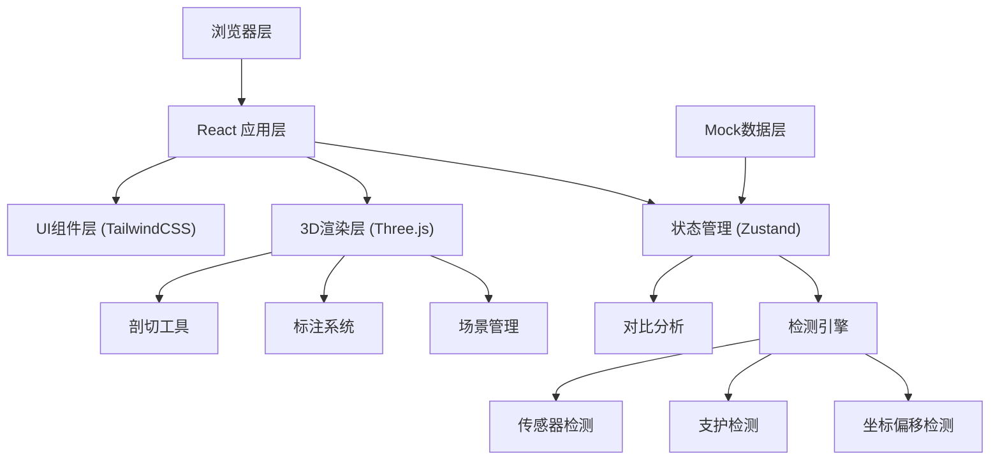
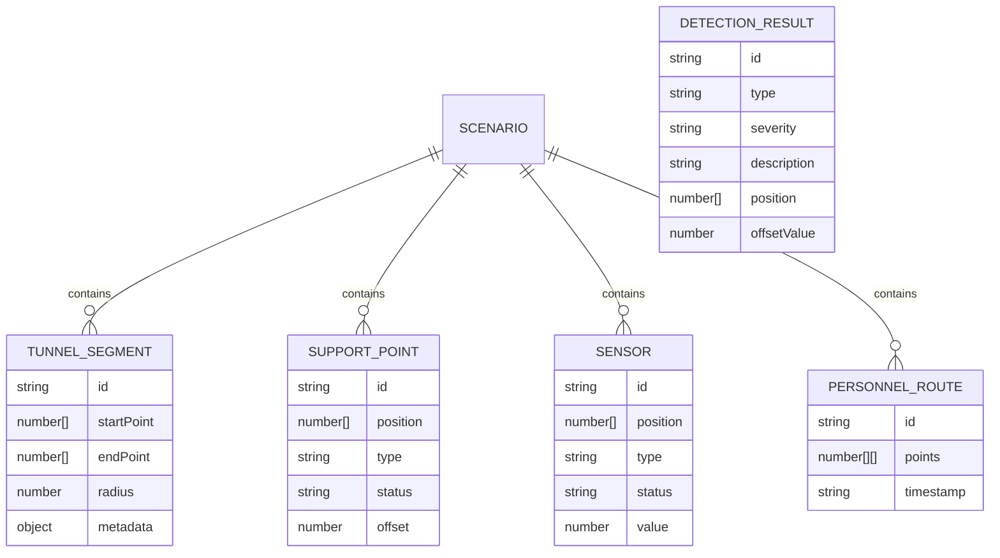

## 1. 架构设计



## 2. 技术描述

- **前端框架**: React@18 + TypeScript + Vite
- **3D渲染**: Three.js + @react-three/fiber + @react-three/drei
- **状态管理**: Zustand
- **样式**: TailwindCSS@3
- **图表**: recharts
- **图标**: lucide-react
- **后端**: 无（纯前端应用）
- **数据**: 内置Mock数据，支持场景切换

## 3. 目录结构

```
src/
├── components/
│   ├── ControlPanel/      # 左侧控制面板
│   ├── DetectionPanel/    # 右侧检测面板
│   ├── Scene3D/           # 3D场景组件
│   └── Common/            # 通用组件
├── store/
│   └── useStore.ts        # Zustand状态管理
├── engine/
│   ├── DetectionEngine.ts # 检测引擎
│   └── ComparisonEngine.ts# 对比引擎
├── data/
│   ├── scenarios/         # 场景数据
│   └── mock.ts            # Mock数据
├── types/
│   └── index.ts           # 类型定义
└── utils/
    └── three-helpers.ts   # Three.js辅助工具
```

## 4. 数据模型

### 4.1 核心数据结构



### 4.2 场景数据示例

```typescript
interface Scenario {
  id: string;
  name: string;
  description: string;
  tunnelSegments: TunnelSegment[];
  supportPoints: SupportPoint[];
  sensors: Sensor[];
  personnelRoute?: PersonnelRoute;
}

interface DetectionResult {
  id: string;
  type: 'offset' | 'missing_support' | 'sensor_offline' | 'route_conflict';
  severity: 'high' | 'medium' | 'low';
  description: string;
  position: [number, number, number];
  offset?: {
    expected: [number, number, number];
    actual: [number, number, number];
    distance: number;
  };
  affectedByRoute?: boolean;
}
```

## 5. 核心算法

### 5.1 坐标偏移检测算法
```typescript
function detectOffset(
  expected: Point3D,
  actual: Point3D,
  threshold: number
): OffsetResult | null {
  const distance = calculateDistance(expected, actual);
  if (distance > threshold) {
    return {
      distance,
      direction: calculateDirection(expected, actual),
      offsetVector: subtract(actual, expected)
    };
  }
  return null;
}
```

### 5.2 人员路线影响分析
```typescript
function analyzeRouteImpact(
  route: PersonnelRoute,
  detections: DetectionResult[]
): DetectionResult[] {
  return detections.map(d => {
    const distance = minDistanceToRoute(d.position, route.points);
    return {
      ...d,
      affectedByRoute: distance < IMPACT_THRESHOLD
    };
  });
}
```

## 6. 检测可重复性保证

- 所有检测算法使用确定性计算，无随机因素
- 使用固定阈值配置，避免浮点误差累积
- 检测结果按ID排序，确保输出顺序一致
- 提供"重置检测"功能，恢复初始状态
